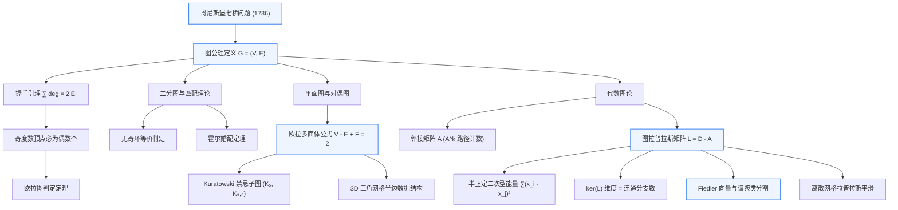

import GraphTopologyDemo from "../../../components/demos/GraphTopologyDemo";
import {
  KonigsbergBridgesDiagram,
  BipartiteColoringDiagram,
  RenderGraphDagDiagram,
  FiedlerPartitionDiagram,
  GraphClassificationDiagram,
} from "../../../components/diagrams/GraphTheoryVisuals";

在计算机科学与应用数学的广袤版图上，几乎没有任何一种离散结构能如 **图（Graph）** 这般普适而深邃。从三维网格（Triangle Mesh）的半边拓扑链接、现代 GPU 渲染管线（Render Graph / Frame Graph）的资源依赖调度，到物理引擎中的刚体约束接触图，乃至谱几何处理中的流形曲面离散微分算子——“图”不仅是组织离散实体的终极容器，更是连接组合拓扑与连续几何的决定性代数桥梁。

上一篇 [集合论与二元关系](/posts/discrete-math/set-theory-relations-and-partitions) 奠定了关系的公理体系：二元关系 $R \subseteq A \times B$ 在直观上正是一个有向图。本文将打破单纯的集合论抽象，深入图论的几何直觉与代数核心：从欧拉开创拓扑学先河的七桥思考出发，跨越欧拉图、二分图匹配与平面图欧拉公式，直抵现代代数图论的核心王冠——**图拉普拉斯算子（Graph Laplacian）与谱图理论（Spectral Graph Theory）**。

---

## 一、图论的起源与形式化定义

### 1.1 哥尼斯堡七桥问题：拓扑学的黎明

1736 年，欧拉（Leonhard Euler）面对普鲁士哥尼斯堡的一个市民谜题：普列戈利亚河穿城而过，形成了两个岛屿，河岸与两岛之间由七座桥梁连结。市民们试图寻找一条散步路线：**能否从某个地点出发，恰好走过每一座桥一次且仅一次，最后回到出发点？**

<KonigsbergBridgesDiagram client:visible />

欧拉做出了数学史上极具革命性的抽象跃迁：**他将所有陆地的大小、河流的形状、桥梁的长度与几何弯曲全数剥离，仅将其抽象为四个“顶点”（陆地）以及连结这些顶点的七条“连边”（桥梁）**。

这种“抹去几何刚性度量、保留内在连通拓扑关系”的思维，不仅孕育了现代 **图论（Graph Theory）**，更直接催生了 **拓扑学（Topology）**。

欧拉敏锐地观察到：如果散步者途经一个中间顶点，他必须“通过一座桥进入该点”，并且“通过另一座桥离开该点”。换言之，**每一个中间顶点所关联的桥梁数目，必然成对消耗**。由此，欧拉证明了哥尼斯堡七桥问题绝无可能实现。

### 1.2 图的严格公理定义

一个 **图（Graph）** 形式化地定义为一个二元组：

$$
G = (V, E)
$$

其中：

1. $V = \{v_1, v_2, \dots, v_n\}$ 是非空的有限集合，称为 **顶点集（Vertex Set）**。
2. $E$ 是边的有限集合，称为 **边集（Edge Set）**。

根据边的代数性质（方向性、重数、自环与度量权值），图可以划分为以下核心体系：

1. **无向图（Undirected Graph）**：边是无序顶点对构成的二元多重子集：

   $$
   e = \{u, v\} \in E \quad (u, v \in V)
   $$

   在无向图中，边没有方向性，$\{u, v\} = \{v, u\}$。对应邻接矩阵必然是 **实对称矩阵（$A = A^T$）**。
   - **现实示例**：社交网络中互为好友的关系、三维未定向网格（Undirected Mesh）中相邻顶点的刚性连边、未加权的电路电阻网络。

2. **有向图（Directed Graph / Digraph）**：边是有序对（笛卡尔积 $V \times V$ 的子集）：

   $$
   e = (u, v) \in E \quad (u \text{ 为起点 / Source}，v \text{ 为终点 / Target})
   $$

   有向边具备单向流动性，$(u, v) \ne (v, u)$。每个顶点区分 **入度（In-degree, $\deg^-(v)$）** 与 **出度（Out-degree, $\deg^+(v)$）**。对应邻接矩阵通常是 **非对称的（$A \ne A^T$）**。
   - **现实示例**：现代 GPU 渲染管线（Render Graph / Frame Graph）的通道依赖调度、编译器控制流图（CFG）、网页间的超链接引用网络。

3. **简单图（Simple Graph）**：严格满足 **“无自环、无多重边”** 的图：
   - **无自环（No Self-loops）**：不存在起点终点重合的边，即 $\forall v \in V, \{v, v\} \notin E$（在邻接矩阵中体现为对角元 $A_{ii} = 0$）。
   - **无多重边（No Parallel Edges）**：任意两点之间最多只存在一条边（邻接矩阵元素 $A_{ij} \in \{0, 1\}$）。
   - 在不加特殊说明时，代数图论默认讨论简单连通图。

4. **多重图（Multigraph）**：允许同一对顶点之间存在多条平行的连边（称为平行边或重边）：
   - 边集 $E$ 形式化为多重集（Multiset），或通过关联映射 $f: E \to \{\{u, v\} \mid u, v \in V\}$ 描述。在邻接矩阵中，元素 $A_{ij} \ge 2$ 对应重数计数。
   - **经典示例**：哥尼斯堡七桥问题本质上正是一个多重图（北岸与西岛之间存在 2 条平行桥梁，南岸与西岛之间同样存在 2 条平行桥梁）。

5. **伪图与自环（Pseudograph & Self-loops）**：允许顶点自身到自身连接边的图结构：
   - 边 $e = (v, v)$ 称为自环。在邻接矩阵中，自环将导致对角元 $A_{ii} > 0$。
   - **计算示例**：马尔可夫链随机游走中“留在当前状态”的自转移概率；三维多边形网格拓扑修复中识别退化塌缩三角形的特征标记。

6. **带权图（Weighted Graph / Network）**：为每条边赋予实数权值 $w: E \to \mathbb{R}$：
   - 结构表示为三元组 $G = (V, E, w)$。此时由二值邻接矩阵跃迁为实对称权重矩阵 $W$，其中 $W_{ij} = w(\{v_i, v_j\})$。
   - **图形学示例**：流形网格离散微分中的 **余切权重拉普拉斯算子（Cotangent Laplacian）**，通过几何面角余切值作为边权重，从而将离散图完美拟合为光滑曲面的泊松微分方程。

为了在直觉上深刻把握各类图在几何连通与代数矩阵（对称性、对角元、平行边计数、权重矩阵）上的结构分野，请在下方交互对比探针中切换查看对应的拓扑形态与代数刻画：

<GraphClassificationDiagram client:load />

### 1.3 顶点的度与握手引理

在无向图 $G$ 中，与顶点 $v$ 关联的边数称为顶点 $v$ 的 **度（Degree）**，记作 $\deg(v)$。

代数图论中第一个优美而恒真的基石定理是 **握手引理（Handshaking Lemma）**：

> **定理 1.1（握手引理）**：对于任意有限无向图 $G = (V, E)$，所有顶点的度数之和严格等于边数的两倍：
>
> $$
> \sum_{v \in V} \deg(v) = 2|E|
> $$

**证明直觉**：
考察边-点关联。每一条无向边 $e = \{u, v\}$ 恰好拥有两个端点 $u$ 与 $v$。当我们对图中所有顶点的度数进行代数累加时，每条边都在两个端点的度数中被各自计数了一次，因此总和必然是边数的整两倍。 $\blacksquare$

握手引理带来了一个极其深刻而锋利的推论：

> **推论 1.1**：在任意有限无向图中，**度数为奇数的顶点个数必然是偶数个**。

**证明**：
将顶点集 $V$ 按照度的奇偶性划分为两个互斥子集 $V_{odd}$ 与 $V_{even}$：

$$
\sum_{v \in V_{odd}} \deg(v) + \sum_{v \in V_{even}} \deg(v) = \sum_{v \in V} \deg(v) = 2|E|
$$

由于 $2|E|$ 为偶数，而 $\sum_{v \in V_{even}} \deg(v)$ 作为偶数之和必然为偶数，因此差值 $\sum_{v \in V_{odd}} \deg(v) = 2|E| - \sum_{v \in V_{even}} \deg(v)$ 必须为偶数。若干个奇数的和为偶数，当且仅当奇数的个数 $|V_{odd}|$ 是偶数。 $\blacksquare$

回看哥尼斯堡七桥的四个陆地顶点度数：北岸 $A$ 度数为 3，南岸 $D$ 度数为 3，岛屿 $B$ 度数为 5，岛屿 $C$ 度数为 3。四个顶点 **全为奇数度**，这不仅违反了奇度数必须不超过 2 的单笔画路径准则，更在代数层面上直接锁死了无回头回路的可能。

---

## 二、图拓扑结构、力导向排布与代数矩阵探针

为了在直觉上建立对图的连通拓扑、欧拉性以及代数矩阵的透彻洞察，请在下方的交互探针中切换经典图预设，观察物理斥力-弹簧模型的实时自适应布局，并检查对应的邻接矩阵 $A$、度数矩阵 $D$ 与拉普拉斯矩阵 $L$。

<GraphTopologyDemo client:load />

---

## 三、连通性、路径与欧拉图 vs 哈密顿图

### 3.1 路径谱系：Walk、Trail 与 Path

在图论中，序列描述有着极其严格的层级划分：

1. **游走（Walk）**：顶点与边的交替序列 $v_0, e_1, v_1, e_2, \dots, e_k, v_k$，边与点均可重复出现。
2. **迹（Trail）**：**边不重复** 的游走。
3. **路 / 简单路径（Path）**：**顶点不重复**（从而边也绝不重复）的游走。
4. **回路（Circuit）与环（Cycle）**：起点与终点重合的封闭迹称为回路；除了起点与终点重合外不包含其他重复顶点的封闭路径称为 **简单环（Simple Cycle）**。

### 3.2 欧拉图定理：边遍历的温顺世界

> **定义（欧拉迹与欧拉回路）**：
>
> - 包含图中 **每一条边恰好一次** 的迹称为 **欧拉迹（Eulerian Trail）**（即一笔画开路径）。
> - 起点与终点重合的欧拉迹称为 **欧拉回路（Eulerian Circuit）**。
> - 具有欧拉回路的图称为 **欧拉图（Eulerian Graph）**。

欧拉在其论文中给出了判定定理，后由层次构造算法（Hierholzer 算法）给出完全构造性证明：

> **定理 2.1（欧拉定理）**：
>
> 1. 一个无向连通图是欧拉图（存在欧拉回路），**当且仅当所有顶点的度数均为偶数**。
> 2. 一个无向连通图存在欧拉通路（半欧拉图），**当且仅当奇度数顶点的数量恰好为 0 或 2**。当为 2 时，欧拉通路必然以这两个奇度数顶点分别为起点与终点。

**直觉与证明精粹**：
回路经过任意中间节点时，必然一进一出，因此消耗该节点的度数必然是偶数。若图连通且所有顶点均为偶数度，我们从任意一点出发走简单闭回路，若还有剩余边，由于连通性必与当前回路相交于某点，在该点继续延伸新的闭回路拼接，由于每个局部顶点的出入度始终平衡，必然能够穷尽所有边。

### 3.3 哈密顿图：点遍历的 NP 完全性鸿沟

与欧拉图仅仅一词之差，图论在此展现了计算复杂性理论中最震撼人心的非对称性深渊：

> **定义（哈密顿回路）**：
> 包含图中 **每一个顶点恰好一次** 且最终返回起点的简单环，称为 **哈密顿环 / 回路（Hamiltonian Cycle）**。具备哈密顿回路的图称为 **哈密顿图**。

| 拓扑问题                     | 核心要求                 | 判定判定条件                                | 时间复杂度                           |
| :--------------------------- | :----------------------- | :------------------------------------------ | :----------------------------------- |
| **欧拉回路 (Eulerian)**      | 遍历所有 **边** 恰好一次 | 所有顶点度数为偶数且连通                    | $O(\|V\| + \|E\|)$（多项式线性时间） |
| **哈密顿回路 (Hamiltonian)** | 遍历所有 **点** 恰好一次 | 无充要局部代数条件，仅有 Dirac/Ore 充分条件 | **NP-Complete**（指数级搜索困境）    |

为什么“经过每条边一次”极其简单，而“经过每个点一次”却如此极端困难？

- **欧拉问题的局部性**：度数是纯粹的 **局部性质（Local Property）**。判断一个点的进出度数只需数一下身边的连边；欧拉图的充要条件完全建立在局部的奇偶守恒上。
- **哈密顿问题的全局记忆性**：访问每一个顶点一次是一个高度具备 **历史依赖（Path History Dependency）** 的全局约束。每走一步，未访问顶点的集合就发生改变，局部度数无法提供任何可传递的充要判据。

著名的 **彼得森图（Petersen Graph）**（可在上方探针中查看）正是图论研究中的经典反例：它是 3-正则无桥图，高度对称，却 **不含任何哈密顿回路**。

---

## 四、二分图与匹配理论

### 4.1 二分图的形式化定义与奇环等价定理

> **定义（二分图 Bipartite Graph）**：
> 一个图 $G = (V, E)$ 称为二分图，若其顶点集 $V$ 可以划分为两个不相交的非空子集 $V_1$ 与 $V_2$（即 $V = V_1 \cup V_2, V_1 \cap V_2 = \emptyset$），使得图中的每一条边的一个端点属于 $V_1$，另一个端点属于 $V_2$。

二分图具有一个极其精妙的拓扑判别准则，它将代数二染色与图的环结构彻底锁定：

> **定理 3.1（二分图与奇环等价定理）**：
> 一个图 $G$ 是二分图，**当且仅当 $G$ 中不包含任何奇数长度的简单环（Odd Cycles）**。

<BipartiteColoringDiagram client:visible />

**证明概要**：

- **必要性**：假设 $G$ 是二分图，任何回路都必须在 $V_1$ 与 $V_2$ 之间反复交替穿梭。回到起点时，穿梭的边数必然为偶数步，因此任何环的长度必为偶数，绝不存在奇环。
- **充分性**：若 $G$ 无奇环，任选一点 $v_0$，将距离 $d(v_0, u)$ 为偶数的点归入 $V_1$，为奇数的点归入 $V_2$。若同侧两点间存在边，则立即与这两点到 $v_0$ 的最短路径构成一个奇数长度环，引发矛盾。因此同侧无边，$G$ 必为二分图。 $\blacksquare$

### 4.2 霍尔婚配定理（Hall's Marriage Theorem）

在二分图 $G = (V_1 \cup V_2, E)$ 中，若存在一个边子集 $M \subseteq E$，使得任意两条边都不共用同一个端点，则称 $M$ 为一个 **匹配（Matching）**。若 $|M| = |V_1|$（假设 $|V_1| \le |V_2|$），则称 $M$ 为饱和 $V_1$ 的 **完全匹配**。

> **定理 3.2（霍尔婚配定理 Hall's Condition）**：
> 二分图 $G = (V_1 \cup V_2, E)$ 存在饱和 $V_1$ 的匹配，当且仅当对于 $V_1$ 的任意子集 $S \subseteq V_1$，其在 $V_2$ 中的邻域集合 $N(S) = \{v \in V_2 \mid \exists u \in S, \{u, v\} \in E\}$ 满足：
>
> $$
> |N(S)| \ge |S|
> $$

霍尔定理是组合数学与网络流（Max-Flow Min-Cut）的灵魂纽带。在现代实时渲染器中，当需要将若干计算任务分派给多个异构执行单元（Compute Queue / Direct Queue）时，任务依赖与硬件阶段的相容性正是通过霍尔条件判断是否存在无冲突的最大并行流派发。

---

## 五、树、最小生成树与有向无环图（DAG）

### 5.1 树的等价特征刻画

树（Tree）是图论中最轻量、最优雅但结构最严整的连通分支。对于一个包含 $n$ 个顶点的无向图 $T = (V, E)$，以下六条性质彼此 **完全等价**：

1. $T$ 是 **树**（连通且无回路）。
2. $T$ 中任意两个顶点之间 **有且仅有一条简单路径**。
3. $T$ 是连通的，且边数恰好为 $|E| = |V| - 1$。
4. $T$ 是无回路的，且边数恰好为 $|E| = |V| - 1$。
5. $T$ 是极小连通图（删去任意一条边，图必不连通）。
6. $T$ 是极大无回路图（在任意不相邻的两点间添加一条新边，必产生唯一简单回路）。

### 5.2 最小生成树与贪心拟阵

在一个带权连通图 $G = (V, E, w)$ 中，包含 $G$ 的所有顶点且边权和 $\sum_{e \in T} w(e)$ 最小的生成子图 $T$ 称为 **最小生成树（Minimum Spanning Tree, MST）**。

经典算法包括：

- **Kruskal 算法**：按边权由小到大排序，利用并查集（Disjoint Set Union）贪心挑选不形成环的边，本质是拟阵（Matroid）上的贪心最优基选择。
- **Prim 算法**：从单点出发，利用优先队列维护割边集合（Cutset），逐步扩张生成树边界。

### 5.3 有向无环图（DAG）与渲染管线调度

**有向无环图（Directed Acyclic Graph, DAG）** 是没有有向回路的有向图。它是偏序集（Poset）在有限离散世界中的直接具象化。

在现代 AAA 游戏引擎渲染架构中，**Render Graph / Frame Graph** 彻底淘汰了传统的单体硬编码渲染管线：

- **节点（Node）**：代表独立的 Render Pass（如 Shadow Pass、GBuffer Pass、SSAO、Deferred Lighting、Tone Mapping）。
- **有向边（Directed Edge）**：代表资源的读写时序依赖（如 Lighting Pass 必须读取 GBuffer 的 Normal/Depth 纹理，因此存在 $GBuffer \to Lighting$ 的有向边）。

<RenderGraphDagDiagram client:visible />

调度器利用 **Kahn 算法（拓扑排序 Topological Sort）**：

1. 统计所有节点的入度（In-degree）。
2. 将入度为 0 的节点推入就绪队列（如 ShadowPass 与 GeometryPass 可在多线程异步并发录制 Command Buffer）。
3. 节点执行完毕后，将其出边依赖的下游节点入度减 1。
4. 递归直至所有 Pass 调度完成。

若图中出现环路，拓扑排序立即报错，从而在编译期静态掐死资源死锁或读写时序危害（Write-After-Read Hazards）。

---

## 六、平面图、对偶图与欧拉示性数公式

### 6.1 平面嵌入与欧拉多面体公式

若一个图能够画在二维平面上，使得它的任何两条边除了在顶点处外互不相交，则称该图为 **平面图（Planar Graph）**。这种画法称为该图的一个 **平面嵌入（Planar Embedding）**。

平面嵌入将二维平面分割成若干个连通开集，每一个开集称为一个 **面（Face）**，包含一个无限延展的外部面（Unbounded Outer Face）。

> **定理 4.1（欧拉平面示性数公式）**：
> 对于任意连通平面图的平面嵌入，若其顶点数为 $V$，边数为 $E$，面数为 $F$，则恒有：
>
> $$
> V - E + F = 2
> $$

**归纳证明精要**：

- **基步**：若图为树（$E = V - 1$），树不含任何回路，无法封闭任何内部面，因此只有 1 个外部面（$F = 1$）。此时 $V - E + F = V - (V - 1) + 1 = 2$ 恒成立。
- **归纳步**：若图中含有回路，任选回路中的一条边将其移除。由于边属于某两个面的公共边界（或内外面交界），移除该边后，边数变为 $E - 1$，同时相邻的两个面合并为一个面，面数变为 $F - 1$。此时：

  $$
  V - (E - 1) + (F - 1) = V - E + F
  $$

  示性数差值代数抵消，保持为 2 不变。通过反复拆环，最终退化为树，命题得证。 $\blacksquare$

### 6.2 极大平面图与边数极限

在平面图中，每一个面至少由 3 条边围成（若无重边与自环），且每条边最多作为两个面的边界。由此导出面的边界不等式：

$$
2E = \sum_{f \in \text{Faces}} \operatorname{deg}(f) \ge 3F \implies F \le \frac{2}{3}E
$$

代入欧拉公式 $V - E + F = 2$：

$$
2 = V - E + F \le V - E + \frac{2}{3}E = V - \frac{1}{3}E
$$

整理即得平面图最核心的度量约束：

> **定理 4.2（平面图边数上限）**：
> 在任意顶点数 $V \ge 3$ 的简单平面图中，边数严格受限于：
>
> $$
> E \le 3V - 6
> $$

这一不等式立即可证 $K_5$（5 个顶点的完全图）**绝非平面图**：因为 $K_5$ 拥有 $V=5, E=\binom{5}{2}=10$，而 $3(5) - 6 = 9 < 10$！

### 6.3 Kuratowski 禁忌子图定理与图形学三角网格

> **定理 4.3（Kuratowski 定理）**：
> 一个图是平面图，**当且仅当它不包含与 $K_5$（完全图）或 $K_{3,3}$（完全二分图）同胚的子图**。

在三维计算机图形学中，任意紧致二维流形表面在几何管线中都由 **三角网格（Triangle Mesh）** 离散化表示。欧拉公式在闭合网格上的拓扑不变量扩展为：

$$
V - E + F = 2(1 - g) = \chi(M)
$$

其中 $g$ 为流形表面的 **亏格（Genus，即洞的个数）**，$\chi(M)$ 为 **欧拉示性数（Euler Characteristic）**。对于没有洞的闭合网格（如立方体、球体），$\chi = 2$；对于环面（Torus），$g = 1 \implies \chi = 0$。

网格数据结构中的 **半边结构（Half-Edge Data Structure）** 与三角面重构算法，其底层的拓扑有效性验证完全基于欧拉示性数的守恒检测。

---

## 七、代数图论核心：从邻接矩阵到图拉普拉斯算子

当我们将图论从纯粹的组合学推进到线性代数的世界，图便不再只是一张抽象的点边网络，而是一个拥有丰富特征频谱与振动模式的 **线性微分算子**。

### 7.1 邻接矩阵及其幂次的路径计数定理

设图 $G = (V, E)$ 拥有 $n$ 个顶点，其 **邻接矩阵（Adjacency Matrix）** $A \in \mathbb{R}^{n \times n}$ 定义为：

$$
A_{ij} = \begin{cases}
1, & \text{若 } \{v_i, v_j\} \in E \\
0, & \text{其它}
\end{cases}
$$

对无向图，$A$ 显然为对称矩阵（$A = A^T$）。

邻接矩阵最令人着迷的代数性质在于它的矩阵乘幂：

> **定理 5.1（路径计数定理）**：
> 邻接矩阵的 $k$ 次幂 $A^k$ 中，第 $i$ 行第 $j$ 列的元素 $(A^k)_{ij}$，**严格等于从顶点 $v_i$ 到顶点 $v_j$ 长度恰好为 $k$ 的游走（Walk）的总数量**。

**数学归纳法证明**：

- 当 $k = 1$ 时，$(A^1)_{ij} = A_{ij}$，若有边相连则为 1 条长为 1 的走法，无边则为 0，命题显然成立。
- 假设命题对 $k-1$ 成立，即 $(A^{k-1})_{im}$ 代表从 $v_i$ 到 $v_m$ 长度为 $k-1$ 的走法数。由矩阵乘法定义：

  $$
  (A^k)_{ij} = \sum_{m=1}^n (A^{k-1})_{im} A_{mj}
  $$

  从 $v_i$ 走 $k$ 步到达 $v_j$，必然是在前 $k-1$ 步先到达某个与 $v_j$ 相邻的中间点 $v_m$，然后再走最后一步 $(v_m, v_j)$。根据加法与乘法原理，所有中间转移途径的累加和恰好等于 $(A^k)_{ij}$。 $\blacksquare$

这个结论极其优雅地解释了为什么矩阵迹 $\operatorname{tr}(A^2) = \sum_{i} \deg(v_i) = 2|E|$（从自身出发走两步回到自身，只能先走出去再退回来，总数为度数之和），以及 $\operatorname{tr}(A^3) = 6 \times (\text{图中三角形的数目})$！

### 7.2 度数矩阵与图拉普拉斯矩阵

定义图的 **度数矩阵（Degree Matrix）** 为对角矩阵 $D \in \mathbb{R}^{n \times n}$：

$$
D_{ij} = \begin{cases}
\deg(v_i), & i = j \\
0, & i \ne j
\end{cases}
$$

**未归一化图拉普拉斯矩阵（Graph Laplacian Matrix）** 定义为度数矩阵与邻接矩阵的代数差：

$$
L = D - A
$$

显式展开每一个分量：

$$
L_{ij} = \begin{cases}
\deg(v_i), & i = j \\
-1, & i \ne j \text{ 且 } \{v_i, v_j\} \in E \\
0, & \text{其它}
\end{cases}
$$

由于每行中非对角元为所有相连邻居的 $-1$，对角元为邻居总数 $\deg(v_i)$，因此 **拉普拉斯矩阵的每一行之和与每一列之和都严格恒等于 0**：

$$
\sum_{j=1}^n L_{ij} = \deg(v_i) - \sum_{j \ne i} A_{ij} = 0
$$

### 7.3 二次型能量与半正定性

设 $x = (x_1, x_2, \dots, x_n)^T \in \mathbb{R}^n$ 为分配在各个顶点上的实数值信号（可以理解为每个顶点的高度、温度或电势）。考察矩阵 $L$ 诱导的二次型：

$$
x^T L x = x^T (D - A) x = \sum_{i=1}^n \deg(v_i) x_i^2 - \sum_{i=1}^n \sum_{j=1}^n A_{ij} x_i x_j
$$

由于 $\deg(v_i) = \sum_{j} A_{ij}$，代数重组可得图论中最核心的调和能量恒等式：

$$
x^T L x = \frac{1}{2} \sum_{i=1}^n \sum_{j=1}^n A_{ij} (x_i^2 - 2x_i x_j + x_j^2) = \sum_{\{v_i, v_j\} \in E} (x_i - x_j)^2
$$

由于平方和非负，对于任意非零向量 $x \in \mathbb{R}^n$：

$$
x^T L x = \sum_{\{v_i, v_j\} \in E} (x_i - x_j)^2 \ge 0
$$

> **定理 5.2**：无向图的拉普拉斯矩阵 $L$ 必定是 **实对称半正定矩阵（Symmetric Positive Semi-Definite）**，其所有特征值皆为实数且非负：
>
> $$
> 0 \le \lambda_1 \le \lambda_2 \le \dots \le \lambda_n
> $$

二次型 $x^T L x$ 被称为图信号的 **狄利克雷能量（Dirichlet Energy）**。能量越小，意味着相邻顶点之间的数值差异 $(x_i - x_j)$ 越平缓，信号越“光滑”。

### 7.4 零特征值与连通分支维度

取全 1 向量 $\mathbf{1} = (1, 1, \dots, 1)^T$。由行和为 0 的性质立即得到：

$$
L \mathbf{1} = \mathbf{0} = 0 \cdot \mathbf{1}
$$

这证明：**全 1 向量始终是拉普拉斯矩阵对应特征值 $\lambda_1 = 0$ 的特征向量**！

更进一步，零特征值的代数重数（与几何重数一致，因对称可对角化）精确反映了图的宏观拓扑割裂：

> **定理 5.3（连通分支与零空间维度）**：
> 图拉普拉斯矩阵 $L$ 的零特征值的重数 $\dim \ker(L)$，**严格等于图 $G$ 中连通分支（Connected Components）的数量**。

**证明直觉**：
若 $x \in \ker(L)$，则 $x^T L x = 0 \implies \sum_{\{u, v\} \in E} (x_u - x_v)^2 = 0$。这意味着只要 $u$ 与 $v$ 之间存在边，就必然有 $x_u = x_v$。在同一个连通分支内部，所有顶点的取值必须完全相等（为同一个常数）。若图包含 $c$ 个互不连通的子图，每个分支可以独立赋予一个常数值，因此零空间的基底维数恰好为 $c$。 $\blacksquare$

### 7.5 Fiedler 向量与代数连通度

对于连通图，最小特征值 $\lambda_1 = 0$ 且重数为 1。**第二小特征值 $\lambda_2$ 称为图的代数连通度（Algebraic Connectivity / Fiedler Value）**，其对应的特征向量 $v_2$ 称为 **Fiedler 向量**。

$$
\lambda_2 = \min_{x \perp \mathbf{1}, x \ne 0} \frac{x^T L x}{x^T x}
$$

- $\lambda_2 > 0$ 当且仅当图连通。
- $\lambda_2$ 越大，说明要将该图切断成两部分所需的边数代价越大，图越“紧密结实”。
- **谱图分割（Spectral Bisection）**：根据 Fiedler 向量每个分量 $(v_2)_i$ 的正负号（$\ge 0$ 归为一组，$< 0$ 归为另一组），可以直接以极高的质量将一个复杂网络或三维几何网格从瓶颈处划分为两半！

<FiedlerPartitionDiagram client:visible />

### 7.6 几何应用：三维流形网格拉普拉斯平滑

在计算机图形学中，三角多边形网格正是嵌入在三维欧几里得空间中的无向图 $G = (V, E)$，每个顶点具备三维空间坐标 $p_i = (x_i, y_i, z_i) \in \mathbb{R}^3$。

连续曲面上的拉普拉斯-贝尔特拉米算子（Laplace-Beltrami Operator）$\Delta$ 描述了局部几何平均曲率。在离散三角网格上，其最直接的离散化正是通过图拉普拉斯算子实现：

$$
(\Delta p)_i = \frac{1}{\deg(v_i)} \sum_{j \in N(i)} (p_j - p_i) = - \frac{1}{\deg(v_i)} (L p)_i
$$

在三维网格去噪与光顺处理中，经典的 **拉普拉斯网格平滑（Laplacian Smoothing）** 迭代公式为：

$$
p_i^{(t+1)} = p_i^{(t)} + \lambda \sum_{j \in N(i)} w_{ij} (p_j^{(t)} - p_i^{(t)})
$$

矩阵形式即为沿负能量梯度的扩散扩散过程：

$$
P^{(t+1)} = (I - \lambda D^{-1} L) P^{(t)}
$$

通过将噪声高频扰动（对应于拉普拉斯矩阵的高频大特征值空间）迅速衰减，而保留由低频特征空间所决定的低频全局形状，现代数字几何处理完成了从离散图拓扑向高阶流形微分方程的华丽统一。

---

## 八、总结与知识网络

图论不仅是一门研究点与线的离散组合数学，它更是一套跨越有限与无限、离散拓扑与连续几何的通用语言：

从集合论的二元关系出发，我们见证了图如何通过简单的点边关系构造出欧拉回路、霍尔匹配与平面拓扑；更见证了线性代数如何赋予定理以度量之魂——通过拉普拉斯算子 $L = D - A$，离散图的连通性、分割线与几何光顺化作了特征值与特征向量的跳跃音符。无论是在渲染引擎底层调度繁杂的渲染通道，还是在几何处理中抚平三维模型的粗粝网格，图论与代数图论的光芒始终照亮着现代计算机图形学的深处。
