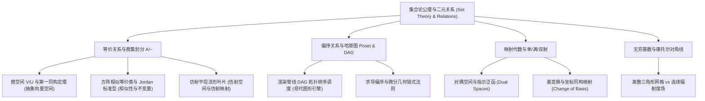

import SetOperationsVennDemo from "../../../components/demos/SetOperationsVennDemo";
import SetTheoryRelationsDemo from "../../../components/demos/SetTheoryRelationsDemo";

在学习线性代数、多变量微积分、乃至现代图形学与编译器架构时，我们时常惊叹于各种抽象结构的精妙：从公理化向量空间的直和分解、商空间 $V/U$ 的纤维聚合，到方阵相似分类的 Jordan 标准型，再到渲染管线中资源依赖的拓扑排序调度。

然而，所有这些绚烂纷繁的代数与几何体系，在底层究竟栖息于何处？答案是：**集合论（Set Theory）与二元关系（Binary Relations）**。

集合论绝非初等数学中简单的韦恩图画圈，它是十九世纪末现代数学为了摆脱直觉危机、重铸绝对严密大厦而确立的 **“母理论”**。本文将作为全站离散数学、抽象代数与分析几何的最底层公理基石，深入剖析朴素集合论到 ZFC 公理体系的演进、笛卡尔积与二元关系、等价划分与商集基本定理、偏序集哈斯图与图形依赖管线、映射公理化，以及揭示离散网格与连续几何边界的康托尔超限基数论证。

---

## 一、从朴素集合论到 ZFC 公理化体系

### 1.1 朴素集合论的直觉及其致命危机

在 19 世纪末，数学家格奥尔格·康托尔（Georg Cantor）创立了 **朴素集合论（Naive Set Theory）**。在最初的朴素直觉中，人们认为：**任何能在语言上明确描述的性质 $P(x)$，都可以唯一确定一个集合**：

$$
S = \{ x \mid P(x) \}
$$

这种“把所有满足某一条件的实体抓在一起打包”的观念称为 **无限制概括公理（Unrestricted Comprehension Axiom）**。然而，这一看似天经地义的直觉，在 1901 年被伯特兰·罗素（Bertrand Russell）用一把代数剃刀彻底割裂，引发了震撼数学界的 **第三次数学危机**。

### 1.2 罗素悖论与理发师悖论

罗素提出了一个极其致命的自我指涉集合：**“所有不以自身为元素的集合组成的集合”**：

$$
R = \{ X \mid X \notin X \}
$$

我们只需问一个最简单的问题：**集合 $R$ 自身是否属于 $R$？**

1. 若假定 $R \in R$，根据 $R$ 的准入条件，必须满足 $R \notin R$，产生矛盾；
2. 若假定 $R \notin R$，则 $R$ 满足了条件，根据集合定义必须有 $R \in R$，同样产生矛盾。

逻辑体系在这一瞬间全面崩溃：无论 $R \in R$ 为真还是为假，都导出其逆命题（即 $R \in R \iff R \notin R$）。这就是著名的 **罗素悖论（Russell's Paradox）**。在通俗语言中，它等价于著名的 **“理发师悖论”**：

> “一位小镇理发师立誓：他只给、且一定要给小镇上所有‘不给自己刮胡子的人’刮胡子。请问理发师该不该给自己刮胡子？”

### 1.3 ZFC 公理体系的救赎之道

罗素悖论表明：“所有集合构成的集合”本身在逻辑上无法成立；**集合不能无休止、自指性地任意膨胀**。为了拯救数学地基，策梅洛（Ernst Zermelo）与弗兰克尔（Abraham Fraenkel）确立了现代数学的标准公理体系 —— **ZFC 公理体系（Zermelo-Fraenkel Set Theory with Axiom of Choice）**。

ZFC 的核心破局直觉在于用 **受限分类公理模式（Axiom Schema of Specification）** 替代了危险的无限制概括：

$$
\{ x \in A \mid P(x) \}
$$

新集合只能从一个 **已经存在的合法母集合 $A$** 内部通过性质过滤筛选出来，严禁无中生有凭空构造全局怪物；再配合 **正则公理（Axiom of Regularity / 基础公理）**，彻底斩断了包含自身（$A \in A$）的无限循环链。从此，集合论浴火重生，成为整个现代数学最可信赖的安全容器。

---

## 二、集合代数、笛卡尔积与幂集

### 2.1 集合的基本运算与对偶律

设全集为 $U$，子集 $A, B, C \subseteq U$。集合论最核心的初等代数运算包括：

1. **并集（Union）**：$A \cup B = \{ x \mid x \in A \lor x \in B \}$，对应逻辑“或（OR）”；
2. **交集（Intersection）**：$A \cap B = \{ x \mid x \in A \land x \in B \}$，对应逻辑“与（AND）”；
3. **差集（Difference / 相对补）**：$A \setminus B = \{ x \mid x \in A \land x \notin B \}$；
4. **对称差（Symmetric Difference / 异或 XOR）**：$A \triangle B = (A \setminus B) \cup (B \setminus A) = \{ x \mid x \in A \oplus x \in B \}$；
5. **绝对补集（Complement）**：$A^c = U \setminus A$，对应逻辑“非（NOT）”。

#### 1. 德·摩根定律（De Morgan's Laws）与对偶性本质

集合运算体系构成了布尔代数（Boolean Algebra）的原型。最著名的对偶原理便是 **德·摩根定律（De Morgan's Laws）**：

$$
(A \cup B)^c = A^c \cap B^c, \qquad (A \cap B)^c = A^c \cup B^c
$$

对于任意有限或无限指标集族 $\{A_i\}_{i \in I}$，德·摩根定律具备极其普适的对偶形式：

$$
\left( \bigcup_{i \in I} A_i \right)^c = \bigcap_{i \in I} A_i^c, \qquad \left( \bigcap_{i \in I} A_i \right)^c = \bigcup_{i \in I} A_i^c
$$

从几何直觉与对偶理论来看：**补操作（Complement）反转了集合包含的格序方向（Order-reversing Duality）**。当从并集取补时，原先“只要属于其中任意一个”的条件，被翻转为“必须同时排除在每一个之外”。

#### 2. 基本析取项（极小项 Minterms）与全集划分

任意 $n$ 个独立子集 $A_1, A_2, \dots, A_n$ 会将全集 $U$ 精确切割为 $2^n$ 个两两互不相交的原子区域，称为 **基本析取项（极小项，Minterms）**。每个极小项形式为：

$$
m = \tilde{A}_1 \cap \tilde{A}_2 \cap \dots \cap \tilde{A}_n, \quad \tilde{A}_i \in \{ A_i, A_i^c \}
$$

例如在 2 集合系统中，$4$ 个两两互斥的极小项构成了全集 $U$ 的一个完备划分：

- $m_0 = A^c \cap B^c = (A \cup B)^c$（两集合之外的全域背景）；
- $m_1 = A \cap B^c = A \setminus B$（仅属于 $A$ 的月牙形独占区）；
- $m_2 = A^c \cap B = B \setminus A$（仅属于 $B$ 的月牙形独占区）；
- $m_3 = A \cap B$（两集合的核心公共重叠区）。

任意布尔集合表达式（如对称差 $A \triangle B$）都可以唯一表示为若干极小项的不交并（主析取范式）：$A \triangle B = m_1 \cup m_2$。这正是现代图形学模板缓冲测试（Stencil Testing）、位平面掩码（Bitmasking）以及 CSG 构造实体几何（Constructive Solid Geometry）的底层数学机制。

#### 3. 交互探索：集合运算、极小项与德·摩根律可视化

下方交互探索器支持自由拖拽圆心调整交叠状态，支持 2 集合与 3 集合实时切换、预设运算选择、以及点击任意独立区域查看其极小项代数式与特征位向量：

<SetOperationsVennDemo client:visible />

### 2.2 笛卡尔积与高维坐标空间的几何母港

对于任意两个集合 $A$ 与 $B$，它们的 **笛卡尔积（Cartesian Product）** 定义为所有有序对（Ordered Pairs）的集合：

$$
A \times B = \{ (a, b) \mid a \in A \land b \in B \}
$$

在公理化集合论中，库拉托夫斯基（Kuratowski）将有序对严格编码为无序集合：$(a, b) = \{ \{a\}, \{a, b\} \}$，从而保证了 $(a, b) = (c, d) \iff a = c \land b = d$。

笛卡尔积直接孕育了多维几何空间：

- 二维平面点集 $\mathbb{R}^2 = \mathbb{R} \times \mathbb{R}$；
- 三维物理世界与图形学网格空间 $\mathbb{R}^3 = \mathbb{R} \times \mathbb{R} \times \mathbb{R}$；
- 任意 $n$ 维向量空间的基础点集 $\mathbb{R}^n$。

基数守恒满足经典乘法原理：若 $A$ 和 $B$ 为有限集，则 $|A \times B| = |A| \cdot |B|$。

### 2.3 幂集与指示向量编码

集合 $A$ 的所有子集构成的集合称为 $A$ 的 **幂集（Power Set）**，记作 $\mathcal{P}(A)$ 或 $2^A$：

$$
\mathcal{P}(A) = \{ S \mid S \subseteq A \}
$$

当集合有限且 $|A| = n$ 时，每个元素只有“选入（$1$）”与“不选入（$0$）”两种二值状态。因此，每个子集唯一对应一个长为 $n$ 的二进制位串（**特征函数 / 指示向量 Indicator Vector**）。子集总数严格满足：

$$
|\mathcal{P}(A)| = 2^n
$$

---

## 三、二元关系的代数与性质图谱

### 3.1 二元关系的本质

有了笛卡尔积，数学家终于可以精准定义实体之间的“联系”。设 $A$ 与 $B$ 为集合，从 $A$ 到 $B$ 的一个 **二元关系（Binary Relation）** $R$，在本质上 **就是笛卡尔积的一个任意子集**：

$$
R \subseteq A \times B
$$

若 $(a, b) \in R$，我们记作 $a R b$，表示元素 $a$ 与 $b$ 具有关系 $R$。特别地，当 $A = B$ 时，称 $R$ 是定义在集合 $A$ 上的二元关系。

### 3.2 关系的四大基本性质

对于集合 $A$ 上的二元关系 $R \subseteq A \times A$，有四种最为关键的代数性质：

1. **自反性（Reflexive）**：每个元素都与自身发生关系：
   $$
   \forall x \in A, \quad x R x
   $$
2. **对称性（Symmetric）**：关系的方向可以随意调换：
   $$
   \forall x, y \in A, \quad x R y \implies y R x
   $$
3. **反对称性（Antisymmetric）**：两个不同的元素绝不可能互为逆向关系（双向关系只能在自身发生）：
   $$
   \forall x, y \in A, \quad (x R y \land y R x) \implies x = y
   $$
4. **传递性（Transitive）**：关系具备链式传导能力：
   $$
   \forall x, y, z \in A, \quad (x R y \land y R z) \implies x R z
   $$

### 3.3 关系的双重表达：0-1 矩阵与有向图

对于有限集合 $A = \{x_1, \dots, x_n\}$，关系 $R$ 可以无损地表征为一个 $n \times n$ 的布尔方阵（**关系矩阵 $M_R$**）与一个有向图 $G = (A, E)$：

- **关系矩阵**：$(M_R)_{ij} = 1 \iff x_i R x_j$；
- **自反性判据**：关系矩阵的主对角线元素全为 $1$；在有向图中，每个节点都带有自环；
- **对称性判据**：关系矩阵是对称阵 $M_R = M_R^T$；在有向图中，凡是有边相连的两个节点必有双向弧；
- **传递性判据**：布尔矩阵乘法满足 $M_R^2 \le M_R$；在有向图中，任意两步路径必有直达捷径边。

---

## 四、等价关系与商集划分基本定理

在二元关系的万千变体中，最璀璨耀眼、统领现代代数半壁江山的当属 **等价关系（Equivalence Relation）**。

### 4.1 等价关系与等价类的代数构造

一个定义在集合 $A$ 上的关系 $\sim$，若 **同时满足自反性、对称性与传递性**，则称 $\sim$ 为 $A$ 上的一个 **等价关系（Equivalence Relation）**。

一旦确立了等价关系，我们就可以将“所有与元素 $a$ 等价的元素”全部收集打包为一个子集，称为由 $a$ 生成的 **等价类（Equivalence Class / 陪集）**：

$$
[a] = \{ x \in A \mid x \sim a \}
$$

### 4.2 集合划分基本定理（Fundamental Theorem）

集合论中最为优美的定理之一，揭示了“等价关系”与“集合划分”之间的一一对应双射：

设 $\mathcal{P}$ 是集合 $A$ 的一个 **划分（Partition）**，满足：

1. 划分中的每个块非空：$\forall C \in \mathcal{P}, C \neq \emptyset$；
2. 互不相交（互斥性）：若 $C_1 \neq C_2$，则 $C_1 \cap C_2 = \emptyset$；
3. 完备覆盖（遍历性）：$\bigcup_{C \in \mathcal{P}} C = A$。

> **集合划分基本定理**：
> 集合 $A$ 上的任意一个等价关系 $\sim$，其所有的等价类集合构成 $A$ 的一个严格划分；反之，集合 $A$ 的任意一个划分，都唯一对应一个等价关系 $x \sim y \iff x, y \text{ 属于同一划分块}$。

由所有等价类构成的集合，称为 $A$ 关于 $\sim$ 的 **商集（Quotient Set）**，记作：

$$
A / {\sim} \;=\; \{ [a] \mid a \in A \}
$$

### 4.3 为什么说商集是全站一切商结构的母理论？

商集是抽象代数与现代几何最强有力的“降维过滤器”。当我们在复杂系统中希望 **“把某些方向或内部差异彻底无视、视为没有区别”** 时，本质上都是在构造商集：

1. **线性代数中的商空间 $V / U$**：
   在向量空间 $V$ 中，子空间 $U$ 诱导了向量差等价关系 $\mathbf{x} \sim \mathbf{y} \iff \mathbf{x} - \mathbf{y} \in U$。所有平行于 $U$ 的仿射直线/平面构成等价类，商集 $V/{\sim}$ 赋予自然加法后便诞生了 [《抽象向量空间与线性映射》](/posts/linear-algebra/abstract-vector-spaces-and-linear-maps#73-空间商结构与第一同构定理first-isomorphism-theorem) 中的 **商空间 $V/U$**；
2. **矩阵相似分类与特征谱**：
   方阵空间 $\mathcal{M}_n$ 上的相似变换 $A \sim B \iff B = P^{-1}AP$ 是严格的等价关系。相似等价类对应算子在不同坐标系下的化身，而 Jordan 标准型就是该等价类在商集中的规范代表元（详见 [《矩阵相似性与不变量》](/posts/linear-algebra/matrix-similarity-and-invariants#22-相似性是严格的等价关系)）；
3. **仿射平坦流形（Flats）**：
   商集中的每一个抽象等价类，在几何空间展开后对应一条无曲率的仿射平行平坦叶片（详见 [《仿射空间与仿射映射》](/posts/linear-algebra/affine-spaces-and-affine-maps#62-仿射子空间与商空间-vu-陪集的几何同构)）。

---

## 五、交互体验：二元关系矩阵、等价商集聚类与哈斯图

下面通过实时交互组件，直观感受有限集合上的等价关系矩阵、商集打包收缩过程，以及偏序关系的哈斯图结构：

<SetTheoryRelationsDemo client:visible />

---

## 六、偏序集、全序集与哈斯图（Order Theory）

如果说等价关系刻画了系统内部的“对称与相同”，那么 **偏序关系（Partial Order）** 则刻画了系统内部的“层级、依赖与先后”。

### 6.1 偏序关系的公理化

集合 $A$ 上的二元关系 $\le$，若同时满足以下三条公理，则称 $\le$ 为 $A$ 上的一个 **非严格偏序关系（Partial Order）**，带序集合 $(A, \le)$ 称为 **偏序集（Poset）**：

1. **自反性**：$\forall a \in A, a \le a$；
2. **反对称性**：$\forall a, b \in A, (a \le b \land b \le a) \implies a = b$；
3. **传递性**：$\forall a, b, c \in A, (a \le b \land b \le c) \implies a \le c$。

> **偏序 vs 全序（Total Order / Chain）**：
> 偏序允许某些元素之间 **“不可比（Incomparable）”**（例如子集包含关系中 $\{a\}$ 与 $\{b\}$ 既非包含也非被包含）；若偏序集中任意两个元素都可比（$\forall a, b$ 必有 $a \le b$ 或 $b \le a$），则称其为 **全序集（Total Order / 线性序 / 链 Chain）**。

### 6.2 哈斯图（Hasse Diagram）的化简原理

如果在图上把偏序关系的所有连边画出来，庞大的自反自环与由传递性诱导的漫天斜线会使图像杂乱不堪。数学家哈斯（Helmut Hasse）提出了一套极致的无损化简原则：

1. **剔除所有自反环**：根据自反公理，每个节点必然 $\le$ 自身，无需画圈；
2. **剔除所有传递冗余边**：若 $a \le b$ 且 $b \le c$，则不再额外画连接 $a \to c$ 的长边；
3. **垂直层级布局**：若 $a \le b$ 且 $a \neq b$，将 $b$ 绘制在 $a$ 的上方，因此连线全部隐式朝上，连箭头的方向符号都可以彻底省略！

化简后保留下来的边称为 **覆盖关系（Covering Relation）**：即 $a < b$ 且二者之间不存在任何中间元素 $c$ 使得 $a < c < b$。

### 6.3 极端元素与格（Lattice）

在偏序集 $(A, \le)$ 中，有几个至关重要的元素概念：

- **极大元（Maximal Element）**：没有元素比它更大（上方无出边）；
- **极小元（Minimal Element）**：没有元素比它更小（下方无入边）；
- **最大元（Greatest / Top $\top$）**：所有元素都 $\le$ 它（若存在必唯一）；
- **最小元（Least / Bottom $\bot$）**：它 $\le$ 所有元素（若存在必唯一）。

若偏序集中的任意两个元素 $a, b$ 都存在 **唯一的最小上界（Least Upper Bound / 最小公倍 / 析取 $\lor$）** 与 **唯一的最大家下界（Greatest Lower Bound / 最大公约 / 合取 $\land$）**，则称该偏序集为一个 **格（Lattice）**。

### 6.4 计算机图形学实战：渲染图（Render Graph）与拓扑排序

在现代计算机图形渲染引擎（如 Vulkan、DirectX 12、Unreal Engine 5、Frostbite）中，帧管线包含成百上千个复杂的渲染遍（Render Passes：G-Buffer、Shadow Pass、SSAO、Ray Tracing Lighting、Post-Processing）。

各 Pass 对 GPU 资源（深度缓冲区、色彩附件、纹理采样器）的读写构成了天然的 **依赖偏序集 $(Passes, \prec)$**：

- $Pass_A \prec Pass_B$ 意味着 Pass B 的输入依赖 Pass A 的产出；
- 这是一个典型的 **有向无环图（DAG）**；
- 引擎的调度器所执行的 **拓扑排序（Topological Sort）**，在代数本质上就是 **寻找该偏序集的一个相容全序扩展（Linear Extension）**，并在此基础上插入最精细的管线屏障（Pipeline Barriers）与内存屏障，彻底榨干 GPU 并行吞吐！

---

## 七、映射的公理化与范畴视野

在日常编程中，我们把函数看作“输入参数并返回计算结果的一段代码”。在公理化集合论中，映射有着更为基石的严格定义。

### 7.1 映射作为特殊的二元关系

设 $A, B$ 是集合。从 $A$ 到 $B$ 的一个 **映射（Mapping / Function）** $f: A \to B$，在本质上是一个满足特殊约束的二元关系子集 $f \subseteq A \times B$：

1. **左全性（Every Element Mapped）**：$\forall a \in A, \exists b \in B, (a, b) \in f$（定义域中每个点都有出路）；
2. **单值性（Well-Defined / Single-Valued）**：$\forall a \in A, (a, b_1) \in f \land (a, b_2) \in f \implies b_1 = b_2$（每个点只能映射到唯一的像，严禁一箭双雕）。

### 7.2 单射、满射与双射

映射的形态直接决定了代数系统之间的结构保真度：

- **单射（Injective / 1对1 / Monomorphism）**：
  $$
  f(x_1) = f(x_2) \implies x_1 = x_2
  $$
  不同输入必定产生不同输出，映射不丢失信息。左逆映射存在的充要条件；
- **满射（Surjective / 映上 / Epimorphism）**：
  $$
  \forall y \in B, \exists x \in A, f(x) = y
  $$
  值域覆盖整个陪域，映射不留死角。右逆映射存在的充要条件（依赖选择公理 AC）；
- **双射（Bijective / 一一对应 / 同构 Isomorphism）**：
  既是单射又是满射。存在唯一的严格逆映射 $f^{-1}: B \to A$。在集合论中，双射意味着两个集合具有 **完全相同的大小（等势）**。

### 7.3 特征函数与对偶空间

对集合 $X$ 的任意子集 $S \subseteq X$，定义其 **特征函数（Characteristic Function）** $\chi_S: X \to \{0, 1\}$：

$$
\chi_S(x) = \begin{cases} 1, & x \in S \\ 0, & x \notin S \end{cases}
$$

特征函数建立了子集空间 $\mathcal{P}(X)$ 与函数空间 $\{0, 1\}^X$ 之间的天然双射同构。当集合 $X$ 是离散有限点时，$\chi_S$ 就是一组指示向量，它正是 [《对偶空间与线性泛函》](/posts/linear-algebra/dual-spaces-and-linear-functionals) 中提取离散分量的狄拉克泛函的离散原型！

---

## 八、超限视野：集合的势与康托尔对角线

现代图形学处理的三维网格（Mesh）是离散有限的（顶点数 $|V|$ 为有限整数），而渲染方程所处的连续物理世界（光线传播、连续辐射度）是实数域 $\mathbb{R}$ 上的连续介质。这两者之间有一道无法逾越的数理鸿沟 —— **集合的势（Cardinality / 基数）**。

### 8.1 势与无限集合的比较

有限集合比大小只需计数；但对于无限集合，如何判断谁“更大”？康托尔提出了革命性的准则：**如果两个集合之间存在一个双射，则称它们具有相同的“势（Cardinality）”（记作 $|A| = |B|$ 或 $A \approx B$）**。

由此产生了一系列打破直觉的奇迹：

- **偶数集合与自然数集合一样大**：双射 $f(n) = 2n$；
- **有理数集合 $\mathbb{Q}$ 与自然数集合 $\mathbb{N}$ 一样大**：通过二维网格的蛇形遍历（Diagonal Traversal），可以将所有正有理数毫无遗漏地排成一列。所有能与自然数集建立双射的无限集，称为 **可数无穷（Countably Infinite）**，其基数记作阿列夫零（$\aleph_0$）。

### 8.2 康托尔对角线论证法（实数不可数）

那么，实数区间 $(0, 1)$ 也是可数的吗？康托尔用一段无可挑剔的反证法永远改变了数学：

假设 $(0, 1)$ 内的实数可数，则它们可以被排成一个无穷清单 $r_1, r_2, r_3, \dots$。将每个实数展开为无限二进制小数：

$$
\begin{aligned}
r_1 &= 0.\mathbf{d_{11}} d_{12} d_{13} d_{14} \dots \\
r_2 &= 0.d_{21} \mathbf{d_{22}} d_{23} d_{24} \dots \\
r_3 &= 0.d_{31} d_{32} \mathbf{d_{33}} d_{34} \dots \\
r_4 &= 0.d_{41} d_{42} d_{43} \mathbf{d_{44}} \dots
\end{aligned}
$$

现在，我们通过 **对角线求反法则** 构造一个全新的实数 $x = 0.x_1 x_2 x_3 x_4 \dots$：

$$
x_k = \begin{cases} 1, & \text{若 } d_{kk} = 0 \\ 0, & \text{若 } d_{kk} = 1 \end{cases}
$$

问：实数 $x$ 在清单里吗？

- 它不可能是 $r_1$，因为第 1 位小数不同（$x_1 \neq d_{11}$）；
- 它不可能是 $r_2$，因为第 2 位小数不同（$x_2 \neq d_{22}$）；
- 依此类推，对任意正整数 $k$，$x$ 的第 $k$ 位与 $r_k$ 的第 $k$ 位都不相等，因此 $x \neq r_k$！

实数 $x$ 绝对不存在于原清单中！与“清单罗列了全部实数”产生不可调和的矛盾。因此：**实数区间是不可数的（Uncountable）**。其实数集的势记为连续统的势 $\mathfrak{c} = 2^{\aleph_0}$。

> **对角线思想的深远回响**：
> 康托尔这一神奇的“对角线构造”日后衍生出了数理逻辑史上最震撼的三大丰碑：
>
> 1. 哥德尔不完备性定理（Gödel's Incompleteness Theorems）；
> 2. 图灵停机问题（Turing's Halting Problem）；
> 3. 柯尔莫哥洛夫复杂度不可计算性。

---

## 九、总结：全站数学大厦知识网络图谱

集合论就像整座数学森林底部的广袤土壤，从它坚实的根系中，向上生长出了一切现代几何与计算科学的参天大树：

无论是研究向量空间中核与像的对偶维数，还是在 Shader 编译器中优化中间表示（IR）的依赖图，抑或在屏幕重心坐标中理解仿射不变性，当我们追根溯源至最纯粹的起点时，所面对的永远是集合论赋予我们的两把终极利剑 —— **等价划分的聚合与偏序结构的传递**。
