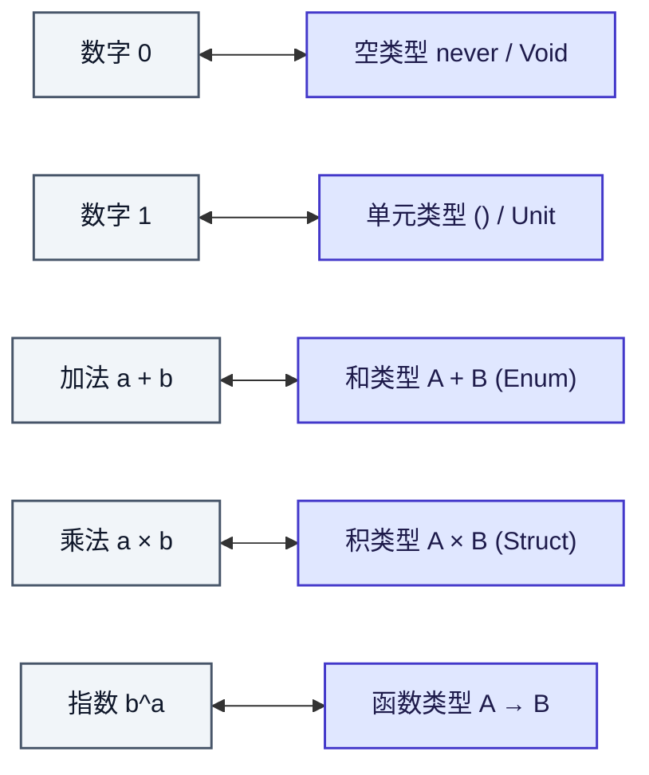
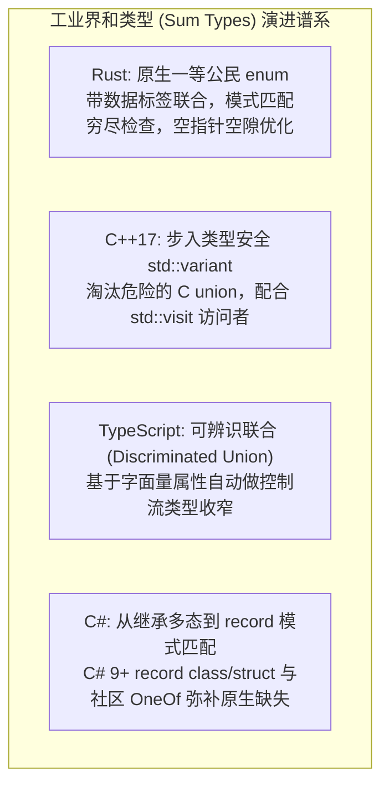
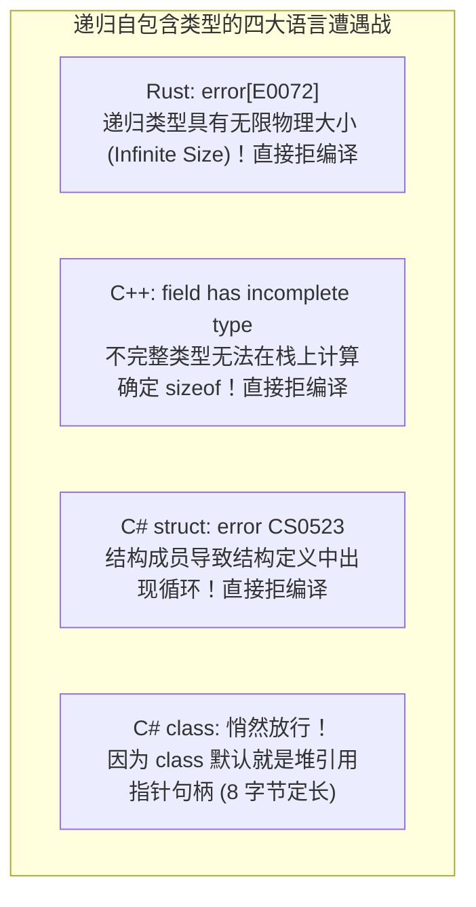

import AdtRecursiveTypesDiagram from "../../../components/diagrams/AdtRecursiveTypesDiagram";
import CodePlayground from "../../../components/framework/CodePlayground";

export const adtTsResponseSnippet = `// TypeScript 乘法分配律消除非法状态实战
// ❌ 错误做法：积类型产生 2 * 2 * 2 = 8 种可能组合（含非法状态）
interface BadResponse {
  status: "success" | "error";
  data?: string;
  errorMessage?: string;
}

// ✅ 正确做法：利用 A × (B + C) ≅ (A × B) + (A × C) 和类型严格收敛为 2 种合法状态
type ApiResponse<T> =
  | { readonly success: true; readonly data: T }
  | { readonly success: false; readonly error: string };

function renderResponse(res: ApiResponse<string>): string {
  if (res.success) {
    // 此时类型自动收窄为成功分支，data 必然存在！
    return \`[SUCCESS] 接收到数据: \${res.data}\`;
  } else {
    // 此时类型自动收窄为失败分支，error 必然存在！
    return \`[ERROR] 接口错误: \${res.error}\`;
  }
}

const ok: ApiResponse<string> = { success: true, data: "用户 Token: abc-123" };
const fail: ApiResponse<string> = { success: false, error: "404 Not Found" };

console.log(renderResponse(ok));
console.log(renderResponse(fail));
`;

export const adtRustBoxSnippet = `// Rust 递归数据类型与 Box 堆指针定长化实战
use std::mem::size_of;

#[derive(Debug)]
enum List<T> {
    Nil,
    Cons(T, Box<List<T>>),
}

impl<T> List<T> {
    fn new() -> Self {
        List::Nil
    }

    fn push(self, elem: T) -> Self {
        List::Cons(elem, Box::new(self))
    }

    fn len(&self) -> usize {
        match self {
            List::Nil => 0,
            List::Cons(_, next) => 1 + next.len(),
        }
    }
}

fn main() {
    println!("=== 递归类型内存大小探测 ===");
    println!("Box<List<i32>> 堆指针大小: {} 字节", size_of::<Box<List<i32>>>());
    println!("List<i32> 栈上枚举大小: {} 字节 (定长收敛)", size_of::<List<i32>>());

    let list = List::new().push(10).push(20).push(30);
    println!("构造的链表: {:?}", list);
    println!("链表长度为: {}", list.len());
}
`;

在日常软件工程中，我们每天都在定义结构体（Struct）、元组（Tuple）、枚举（Enum）并使用 `switch` 或 `match` 进行模式匹配。在直觉上，它们只是编译器组织内存与区分分支的语法糖。

然而，在程序语言理论（PLT）与数学视角下，类型世界拥有极其宏伟而优美的代数对称性：<strong>类型并不是被动堆砌的字节块，而是一个严谨的初等半环（Semiring）代数系统</strong>！我们所熟知的加法、乘法、零、一与指数运算法则，不仅在离散数字上成立，在类型系统上同样天衣无缝地运作。

更令人震撼的是：
- 当把初等代数方程拓展为自指的<strong>多项式不动点方程（Polynomial Fixed-Point Equations）</strong>时，递归数据结构（自然数、链表、二叉树）应运而生；
- 当对类型表达式进行形式微积分求导 $\frac{d}{dX} T(X)$ 时，居然精准推导出了纯函数式领域著名的局部光标导航结构 —— <strong>Huet 拉链（Zipper）</strong>；
- 当递归类型从数学降临到物理计算机的栈内存时，立刻撞上了 `sizeof` 必须定长的物理铁律，引发了令 Rust 报出 `E0072`、C++ 报出 `incomplete type`、C# `struct` 引爆循环死锁的经典<strong>物理内存陷阱</strong>。

本文将从最亲切的初等代数加乘法则出发，揭开代数数据类型（ADT）与递归类型的深邃物理图景。

---

## 一、为什么叫“代数”数据类型：类型的初等半环运算

所谓<strong>代数数据类型（Algebraic Data Types, 简称 ADT）</strong>，名字里的“代数”绝非故弄玄虚。在集合论中，一个类型可以被视为其所有可能合法值的集合。考虑类型的<strong>基数（Cardinality，即合法可能值的数量）</strong>：

- <strong>空类型（Void / Empty / `never`）</strong>：不包含任何值，基数为 $0$；
- <strong>单元类型（Unit / `()`）</strong>：仅包含唯一的一个平庸值，基数为 $1$；
- <strong>布尔类型（Bool）</strong>：包含 $\text{true}$ 与 $\text{false}$，基数为 $2$。

### 1.1 加法：和类型（Sum Type）

<strong>和类型（Sum Type / 标签联合 / Rust `enum` / TypeScript 联合类型）</strong>对应集合的不相交并集（Disjoint Union）：

$$
\text{Card}(A + B) = \text{Card}(A) + \text{Card}(B)
$$

例如：$\text{Bool} \cong 1 + 1$。一个和类型的值，在任意时刻<strong>要么是 $A$ 要么是 $B$</strong>，两者的可能状态相加。

### 1.2 乘法：积类型（Product Type）

<strong>积类型（Product Type / 元组 Pair / 结构体 Struct）</strong>对应笛卡尔积（Cartesian Product）：

$$
\text{Card}(A \times B) = \text{Card}(A) \times \text{Card}(B)
$$

要构造一个积类型的值，必须同时给出 $A$ 的值<strong>且</strong>给出 $B$ 的值。字段越多，状态空间呈乘法级爆炸。

### 1.3 指数：函数类型（Exponential / Function Type）

从类型 $A$ 到类型 $B$ 的<strong>函数类型 $A \to B$</strong>，其可能存在的纯映射数量等于以目标为底、以源为幂的指数：

$$
B^A \triangleq A \to B, \quad \text{Card}(B^A) = \text{Card}(B)^{\text{Card}(A)}
$$

例如：从 $\text{Bool}$（基数 2）到包含 3 个枚举值的类型，其纯函数映射组合恰好等于 $3^2 = 9$ 种。

### 1.4 半环恒等式与代码重构同构

初等代数中的经典公式，在编程语言中直接对应着<strong>完全保真的代码重构同构（Isomorphism $\cong$）</strong>：

| 初等代数恒等式 | 类型论同构式 | 编程语言工程含义与重构启示 |
| :--- | :--- | :--- |
| $A + 0 = A$ | $A + \text{Void} \cong A$ | 与不可达的 `never` 分支合并，编译器可无缝剪枝消除 |
| $A \times 1 = A$ | $A \times \text{Unit} \cong A$ | 结构体中携带空元组 `()` 不增减任何状态，等价于原类型 |
| $A \times 0 = 0$ | $A \times \text{Void} \cong \text{Void}$ | 只要结构体某一字段是不可构造的空类型，整个结构体永远无法实例化 |
| $A \times (B + C) = AB + AC$ | $A \times (B + C) \cong (A \times B) + (A \times C)$ | <strong>乘法分配律：消除非法状态（Make Illegal States Unrepresentable）的核心武器</strong> |
| $(C^B)^A = C^{A \times B}$ | $(A \to (B \to C)) \cong ((A \times B) \to C)$ | <strong>柯里化同构（Currying Isomorphism）</strong>：单参函数链与元组传参的数学等价性 |



#### 乘法分配律实战：如何消灭业务代码中的非法状态
假设我们在开发一个网络请求模块，常常有人写出包含潜在非法状态的积类型结构体。利用分配律 $A \times (B + C) \cong AB + AC$，我们将其重构成和类型，将状态严格收敛为合法的两种互斥分支：

<CodePlayground
  client:visible
  lang="ts"
  title="TypeScript 乘法分配律与非法状态消除"
  description="利用可辨识联合类型将 8 种积类型状态精简为 2 种严格互斥的和类型状态"
  initialCode={adtTsResponseSnippet}
/>

### 1.5 四大现代主流语言对和类型的支持度大比拼

在所有现代语言中，积类型（`struct` / `class`）早已普及。<strong>而对“和类型”的原生支持程度，则是衡量一门现代语言类型系统成熟度的真正试金石</strong>：



#### Rust：和类型的工业天花板与空指针优化（Niche Optimization）
在 Rust 中，`enum` 天然就是类型安全的带数据和类型：
```rust
enum WebEvent {
    PageLoad,
    KeyPress(char),
    Paste(String),
}
```
Rust 编译器甚至利用内存对齐的空隙进行<strong>空指针优化（Null Pointer Optimization）</strong>：对于 `Option<Box<T>>` 或 `Option<&T>`，编译器将 `None` 编码为虚拟内存中的空地址 `0x0`，使得 `Option<Box<T>>` 的大小与裸指针完全一模一样（仅占 8 个字节），不仅绝对类型安全，而且实现了真正的零内存开销！

#### C++17：告别危险的裸 union，迎来 std::variant
早期 C++ 继承了 C 语言的 `union`，但由于没有类型标签（Discriminant Tag），读取错误字段会直接导致内存踩踏。C++17 终于引入了安全的和类型 `std::variant`：
```cpp
#include <variant>
#include <iostream>

using Shape = std::variant<double, std::pair<double, double>>; // 圆半径 或 矩形长宽

void printArea(const Shape& s) {
    std::visit([](auto&& arg) {
        using T = std::decay_t<decltype(arg)>;
        if constexpr (std::is_same_v<T, double>) {
            std::cout << "Circle area: " << 3.14159 * arg * arg << '\n';
        } else {
            std::cout << "Rect area: " << arg.first * arg.second << '\n';
        }
    }, s);
}
```

#### TypeScript：灵活轻盈的可辨识联合（Discriminated Union）
TypeScript 没有内置特殊的关键字，而是通过普通对象的字面量属性（如 `kind` 或 `type`）配合控制流分析实现优雅的和类型：
```typescript
type Shape =
    | { kind: "circle"; radius: number }
    | { kind: "rectangle"; width: number; height: number };

function getArea(s: Shape): number {
    switch (s.kind) {
        case "circle": return Math.PI * s.radius ** 2; // 自动收窄为圆
        case "rectangle": return s.width * s.height;   // 自动收窄为矩形
    }
}
```

#### C#：从面向对象继承到模式匹配 record
C# 历史上缺乏原生和类型，通常定义一个 `abstract class` 并派生多个子类来模拟。C# 9+ 引入了 `record` 和增强模式匹配，使这一体验大幅改观：
```csharp
public abstract record Shape;
public record Circle(double Radius) : Shape;
public record Rectangle(double Width, double Height) : Shape;

double GetArea(Shape s) => s switch {
    Circle c => Math.PI * c.Radius * c.Radius,
    Rectangle r => r.Width * r.Height,
    _ => throw new UnreachableException()
};
```

---

## 二、类型微积分：Huet Zipper 是数据结构的形式导数

如果在类型多项式上运用微积分求导法则，会发生什么？

法国计算机科学家热拉尔·于埃（Gérard Huet）在 1997 年发明了著名的<strong>拉链数据结构（Zipper）</strong>，用于在不可变数据结构中以 $O(1)$ 时间复杂度移动聚焦光标并局部更新。随后，数学家康拉德·麦克布莱德（Conor McBride）发现了令人震撼的秘密：<strong>数据结构的 Zipper 光标上下文，在数学上严格等价于该数据结构多项式的一阶形式导数（Formal Derivative $\frac{d}{dX} T(X)$）！</strong>

### 2.1 形式导数的物理几何意义

对类型多项式求导 $\frac{d}{dX} T(X)$ 的几何意义极其直观：<strong>在复合数据结构中，恰好扣掉一个元素 $X$（留出一个“洞” Hole），所剩下的外部环绕上下文（Context）</strong>。

### 2.2 链表的求导与 List Zipper

链表的多项式级数展开为：
$$
\text{List } X = 1 + X + X^2 + X^3 + \dots = \frac{1}{1 - X}
$$

对该分式运用微积分商法则求一阶导数：
$$
\frac{d}{dX} (\text{List } X) = \frac{d}{dX} \left( \frac{1}{1 - X} \right) = \frac{1}{(1 - X)^2} = \text{List } X \times \text{List } X
$$

求导结果为<strong>两个链表的乘积</strong>！
这与 Huet 定义的 List Zipper 严丝合缝：一个聚焦在某个元素上的链表光标，周围的上下文恰好就是<strong>当前元素左侧的前缀元素列表与右侧的后缀元素列表</strong>：
$$
\text{Zipper } X \cong \text{List } X \times X \times \text{List } X
$$
向左移动光标只需将左侧弹出压入右侧，向右移动光标只需将右侧弹出压入左侧，完全无需重新遍历分配整条链表！

### 2.3 二叉树的求导与 Tree Zipper

二叉树的单步节点多项式为 $T(X) = 1 + A \cdot X^2$（其中 $X$ 代表子树）。对 $X$ 求偏导数：
$$
\frac{d}{dX} (1 + A \cdot X^2) = 2 \cdot A \cdot X = 2 \times A \times \text{Tree } A
$$

展开式中的每一项都具备完美的物理对应：
- 因子 $2 \cong 1 + 1$：代表一个二选一的布尔分支 —— 当前究竟是步入了<strong>左子树</strong>还是<strong>右子树</strong>；
- 因子 $A$：代表当前分叉父节点上存储的数据载荷；
- 因子 $\text{Tree } A$：代表<strong>留在身后、未被访问的另一半兄弟子树</strong>！
这三者的组合，正是树遍历导航中著名的<strong>面包屑（Breadcrumb）</strong>。

---

## 三、多项式不动点方程：自指构造任意规模数据

有限的代数加乘只能表达定长结构（如二元组、三元枚举）。为了表达任意长度的集合数据（自然数、链表、树、图），我们必须引入<strong>自指与自递归</strong>。

### 3.1 经典数据结构的不动点方程

1. <strong>自然数（Peano Nat）</strong>：一个自然数要么是零（$1$），要么是另一个自然数的后继（$X$）：
   $$
   X \cong 1 + X
   $$
2. <strong>链表（List）</strong>：一个列表要么是空链表（$1$），要么是一个元素与剩余列表的配对（$A \times X$）：
   $$
   X \cong 1 + A \times X
   $$
3. <strong>二叉树（Tree）</strong>：一棵树要么是空叶子（$1$），要么是一个根节点和两棵子树（$A \times X^2$）：
   $$
   X \cong 1 + A \times X^2
   $$

### 3.2 形式化类型绑定器 $\mu X.\, T$

为了在类型系统中严格刻画这种自指方程的最小解，逻辑学界引入了<strong>类型级不动点绑定器 $\mu$（Mu-binder）</strong>：

$$
T ::= X \mid T_1 \to T_2 \mid T_1 \times T_2 \mid T_1 + T_2 \mid \mu X.\, T
$$

符号 $\mu$ 宣布：<strong>变量 $X$ 在整个类型表达式 $T$ 的有效范围内递归指代自身</strong>。
- 自然数类型：$\text{Nat} \triangleq \mu X.\, 1 + X$
- 泛型链表类型：$\text{List } A \triangleq \mu X.\, 1 + A \times X$
- 泛型二叉树类型：$\text{Tree } A \triangleq \mu X.\, 1 + A \times X^2$

---

## 四、递归类型的两大家族：Iso-recursive vs Equi-recursive

类型系统如何判断一个带有 $\mu$ 的递归类型与它的展开形式之间的关系？类型理论由此分化为两大流派：

1. <strong>等构递归（Iso-recursive Types）</strong>：
   - 规则：递归类型与其单步展开形式<strong>在数学上并不严格相等，而是互相同构（Isomorphic）</strong>：
     $$
     \mu X.\, F \not\equiv [X \mapsto \mu X.\, F]F \quad \text{但} \quad \mu X.\, F \cong [X \mapsto \mu X.\, F]F
     $$
   - 语言必须在项层显式提供两个互逆的打字算子：`fold`（将展开形式包装为抽象类型）与 `unfold`（将抽象类型解包为展开形式）；
   - 代表：Rust、C++、Haskell 的具名结构体包装，类型比对是确定高效的一阶语法匹配。
2. <strong>等价递归（Equi-recursive Types）</strong>：
   - 规则：编译器认为递归类型与它的无限展开形式<strong>在语义上是完全同一的真理（Identical）</strong>：
     $$
     \mu X.\, F \equiv [X \mapsto \mu X.\, F]F
     $$
   - 程序员无需在代码中手写任何 `fold` 或 `unfold`；类型被看作一棵拥有有限个不同子树的<strong>无限正则树（Infinite Regular Trees）</strong>；
   - 代表：TypeScript 递归类型别名。编译器内部依靠循环检测算法进行终止判断。

---

## 五、图灵完备的回归：为 Y 组合子赋予类型

我们在讨论简单类型 $\lambda$ 演算（STLC）时曾得出一个沉重的结论：由于强规范化定理，STLC 必然在有限步内停机，无法编写自复制项 $\omega = \lambda x.\, x \; x$，也无法编写通用的无类型 $Y$ 组合子。

其根本卡点在于：为了对自复制子项 $x \; x$ 进行类型检查，形参 $x$ 必须同时满足：
- 作为函数：$x : T_1 \to T_2$；
- 作为实参：$x : T_1$；
- 从而导致不可解的自引用循环方程：$T_1 = T_1 \to T_2$。

### 5.1 递归类型如何解救自引用方程

现在，我们拥有了递归类型！方程 $X = X \to R$ 在递归类型系统中拥有精确的解：

$$
T \triangleq \mu X.\, (X \to R)
$$

利用等构递归的 $\text{unfold}$ 算子：
1. 设变量 $x$ 具有类型 $T$（即 $x : \mu X.\, (X \to R)$）；
2. 对 $x$ 进行展开得到：$\text{unfold} \; x : T \to R$；
3. 此时，$\text{unfold} \; x$ 是一个接收类型为 $T$ 的函数，而实参 $x$ 本身恰好就是类型 $T$！
4. 因此，应用表达式：
   $$
   (\text{unfold} \; x) \; x : R
   $$
   <strong>顺利、无可争议地通过了类型检查！</strong>

递归类型的引入打破了类型的强规范化封印。<strong>它在赋予语言定义链表与树等递归数据结构能力的同时，不可避免地伴随着通用图灵机停机不可判定性（Halting Problem）的重临人间</strong>。

---

## 六、交互探针：代数数据结构与递归演进模拟器

通过下方交互图表，你可以直观调试与单步观察 ADT 的三维视角：在 <strong>Iso-recursive 模式</strong>下单步验证展开与折叠解构；在 <strong>Zipper 模式</strong>下查看多项式一阶形式导数；在 <strong>Memory 模式</strong>下观测物理内存无限内联与定长收敛的对比：

<AdtRecursiveTypesDiagram client:load />

---

## 七、现代工业语言的工程落地与内存陷阱

从抽象的代数公理下沉到真实的物理计算机内存时，递归类型立即撞上了最严苛的物理限制：<strong>计算机内存指针寻址与定长栈帧（Stack Frame）</strong>。

### 7.1 为什么不能在结构体里直接放自己？

考虑一个链表节点结构。四大主流语言在面对“结构体内部直接包含自身”时，产生了极其戏剧性的编译器反应大碰撞：



#### Rust 的无限大小死锁（error[E0072]）
在 Rust 这类追求零运行时开销、数据默认完全在栈上扁平排布的语言中：
```rust
// ❌ 编译报错：error[E0072]: recursive type `List` has infinite size
enum List {
    Nil,
    Cons(i32, List),
}
```
Rust 编译器必须在编译期计算每个类型的确定物理字节大小 `sizeof(List)`。根据和类型的内存法则：
$$
\text{sizeof}(\text{List}) = \text{Tag} + \max(0, \; \text{sizeof}(i32) + \text{sizeof}(\text{List})) = 8 + 8 + \text{sizeof}(\text{List})
$$
方程的解是 $\text{sizeof}(\text{List}) = \infty$！要在栈上为无穷大内存分配空间是物理不可能的。

#### 引入堆指针间接层（Box Indirection）破局
解决方案是引入<strong>指针间接层（Indirection）</strong>。指针（`Box`）在 64 位机器上无论指向的目标数据有多庞大，其本身的宽度固定是 $8$ 个字节。递归结构的内存占用从而由栈上无限展开，解耦为<strong>栈上定长句柄 + 堆上动态链式节点</strong>：

<CodePlayground
  client:visible
  lang="rust"
  title="Rust 递归数据类型与 Box 堆指针定长化实战"
  description="以 Box 指针解决 Rust E0072 无限大小死锁，并验证栈上定长收敛大小与链表操作"
  initialCode={adtRustBoxSnippet}
/>

#### C++ 的 incomplete type 报错
C++ 同样要求栈上变量必须在编译期确定大小：
```cpp
// ❌ 编译报错：error: field 'next' has incomplete type 'Node'
struct Node {
    int val;
    Node next; 
};

// ✅ 编译通过：指针大小固定为 8 字节
struct Node {
    int val;
    std::unique_ptr<Node> next;
};
```

#### C# 的戏剧性反差：class 悄然放行，struct 瞬间引爆
很多 C# 程序员经常写出如下链表代码，并且从未见过任何“无限大小”报错：
```csharp
// ✅ C# 编译器平静放行：
class ListNode {
    public int Val;
    public ListNode Next;
}
```
为什么 C# 可以直接放自己？
因为 C# 中的 `class` 是<strong>引用类型（Reference Type）</strong>！变量 `Next` 在底层本质上就是一个存放在托管堆上的 8 字节指针句柄。

然而，如果你把 `class` 改为值类型的 `struct`：
```csharp
// ❌ 编译当即爆出红字灾难：
// error CS0523: 结构成员“ListNode.Next”导致结构定义中出现循环
struct ListNode {
    public int Val;
    public ListNode Next;
}
```
此时 C# 试图在栈上扁平分配连续内存，瞬间触发了与 Rust 完全相同的无限大小死锁！这个鲜活的案例直接穿透语法表象，揭示了值类型与引用类型的物理分水岭。

#### TypeScript 的递归别名与递归深度防护
在 TypeScript 中定义递归结构非常轻盈：
```typescript
type JSONValue =
  | string
  | number
  | boolean
  | null
  | { [key: string]: JSONValue }
  | JSONValue[];
```
因为 JavaScript 运行时一切对象皆为堆引用指针，物理内存不存在栈内联死锁。但为了防止程序员写出的类型体操让编译器本身的类型检查器陷入死循环，`tsc` 内部设立了<strong>递归推导深度保护阈值</strong>，一旦超标立即报出 `Type instantiation is excessively deep and possibly infinite (2589)`。

---

## 八、总结：代数数据类型的统一全景

从简单的初等代数到现代类型论，代数数据类型构筑了一条令人叹为观止的理性长廊：

1. <strong>代数半环基石</strong>：加法是互斥分支（和类型），乘法是属性组合（积类型），指数是函数变换；分配律 $A(B + C) \cong AB + AC$ 是消除工程非法状态的最高设计准则；
2. <strong>微积分形式导数</strong>：对类型表达式求一阶导数 $\frac{d}{dX} T(X)$，在几何上自然诞生了维护光标与上下文的 Huet Zipper，赋予不可变数据结构局部修改的超能力；
3. <strong>多项式不动点</strong>：引入类型级不动点 $\mu X.\, T$，形式化表达自然数、链表与树；
4. <strong>图灵完备回归</strong>：通过解自引用方程，递归类型为 $Y$ 组合子赋予了良类型，彻底跨过强规范化停机限制，重获通用计算能力；
5. <strong>物理内存定律</strong>：计算机栈帧定长分配的物理法则，逼迫所有现代工业语言（Rust、C++、C#）通过指针间接层（`Box`、`unique_ptr`、引用类型）将无限展开的抽象正则树降解为离散平稳的堆内存链表。

数据结构不再是随意的字节拼凑，它是数学宇宙在计算机逻辑世界中最优美的一首代数交响诗。

---

### 相关延伸阅读

- 探索从简单类型到逻辑同构的演进，可参阅：[《简单类型 λ 演算（STLC）与 Curry–Howard 同构》](/posts/type-systems/simply-typed-lambda-calculus)；
- 探讨参数多态与泛型四范式，可参阅：[《参数多态与 System F：从全称量化到免费定理》](/posts/type-systems/parametric-polymorphism-system-f)；
- 探讨包含多态、型变与 Rust 生命周期协变，可参阅：[《子类型与型变：从包含规则到生命周期协变》](/posts/type-systems/subtyping-and-variance)。
