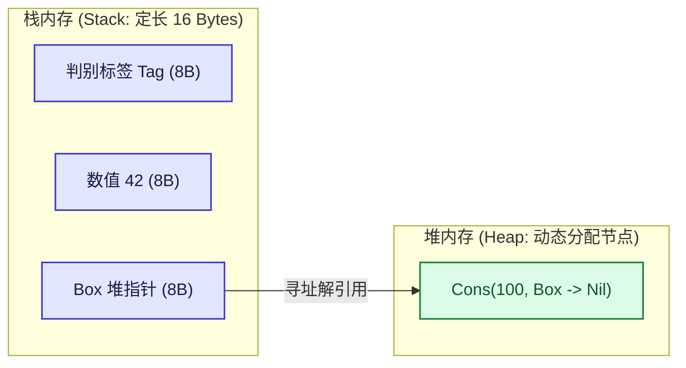

import AdtRecursiveTypesDiagram from "../../../components/diagrams/AdtRecursiveTypesDiagram";

在软件工程中，我们每天都在定义结构体（Struct）、元组（Tuple）、枚举（Enum）与模式匹配。在直觉上，它们只是编译器组织内存与区分分支的语法糖。

然而，在程序语言理论（PLT）与数学视角下，类型世界拥有极其宏伟而优美的代数对称性：<strong>类型并不是被动堆砌的字节块，而是一个严谨的半环（Semiring）代数系统</strong>。我们所熟知的加法、乘法、零、一与指数运算法则，不仅在离散数字上成立，在类型系统上同样天衣无缝地运作。

更震撼的是：当我们把初等代数方程扩展为自指的<strong>多项式不动点方程（Polynomial Fixed-Point Equations）</strong>时，递归数据结构（自然数、链表、二叉树）应运而生；当对类型表达式进行形式微积分求导 $\frac{d}{dX} T(X)$ 时，居然精准推导出了著名的局部光标导航结构 —— <strong>Huet 拉链（Zipper）</strong>；而递归类型（Recursive Types / $\mu$ 演算）更是一举打破了 STLC 的强规范化束缚，在纯静态类型演算中重新赋予了 $Y$ 组合子打字能力，完成了向图灵完备性的伟大回归。

本文将从类型的半环结构出发，系统推导代数数据类型、形式导数、递归类型形式系统（Iso-recursive 与 Equi-recursive），并深度剖析其在物理内存中的工程落地。

---

## 一、为什么叫“代数”数据类型：类型半环

在集合论中，一个类型可以被视为其所有可能合法值的集合。考虑类型的<strong>基数（Cardinality，即合法可能值的数量）</strong>：

- <strong>空类型（Void / Empty / `never`）</strong>：不包含任何值，基数为 $0$；
- <strong>单元类型（Unit / `()`）</strong>：仅包含唯一的一个平庸值，基数为 $1$；
- <strong>布尔类型（Bool）</strong>：包含 $\text{true}$ 与 $\text{false}$，基数为 $2$。

### 1.1 加法：和类型（Sum Type）

<strong>和类型（Sum Type / 标签联合 / Rust `enum` / TypeScript 联合类型）</strong>对应集合的不相交并集（Disjoint Union）：

$$
\text{Card}(A + B) = \text{Card}(A) + \text{Card}(B)
$$

例如：$\text{Bool} \cong 1 + 1$。一个值要么属于左侧 $A$，要么属于右侧 $B$。

### 1.2 乘法：积类型（Product Type）

<strong>积类型（Product Type / 元组 Pair / 结构体 Struct）</strong>对应笛卡尔积（Cartesian Product）：

$$
\text{Card}(A \times B) = \text{Card}(A) \times \text{Card}(B)
$$

要构造一个积类型的值，必须同时给出 $A$ 的值<strong>且</strong>给出 $B$ 的值。

### 1.3 指数：函数类型（Exponential / Function Type）

从类型 $A$ 到类型 $B$ 的<strong>函数类型 $A \to B$</strong>，其可能存在的纯映射数量等于以目标为底、以源为幂的指数：

$$
B^A \triangleq A \to B, \quad \text{Card}(B^A) = \text{Card}(B)^{\text{Card}(A)}
$$

例如：从 $\text{Bool}$ 到包含 3 个枚举值的类型，其纯函数数量恰好等于 $3^2 = 9$ 种可能。

### 1.4 类型半环代数恒等式

在抽象代数中，带有加法和乘法的结构只要满足结合律、交换律与分配律，就构成一个<strong>半环（Semiring）</strong>。类型系统不仅满足半环公理，而且每一个代数等式都在程序语言中对应一个<strong>天然的同构变换（Isomorphism $\cong$）</strong>：

| 初等代数恒等式 | 类型论同构式 | 编程语言工程含义 |
| :--- | :--- | :--- |
| $A + 0 = A$ | $A + \text{Void} \cong A$ | 与不可达的 `never` 分支合并，无缝剪枝消除 |
| $A \times 1 = A$ | $A \times \text{Unit} \cong A$ | 元组中携带空元组 `()` 不增减任何有效信息 |
| $A \times 0 = 0$ | $A \times \text{Void} \cong \text{Void}$ | 如果元组某一字段包含不可构造的空类型，整个元组无法构造 |
| $A \times (B + C) = A B + A C$ | $A \times (B + C) \cong (A \times B) + (A \times C)$ | 结构体包含枚举，等价于枚举的各分支包含打平的结构体 |
| $(C^B)^A = C^{A \times B}$ | $(A \to (B \to C)) \cong ((A \times B) \to C)$ | <strong>柯里化同构（Currying Isomorphism）</strong> |
| $C^{A + B} = C^A \times C^B$ | $((A + B) \to C) \cong (A \to C) \times (B \to C)$ | 处理和类型参数的函数，等价于分别处理左右分支的两个函数之对偶 |


---

## 二、类型微积分：Huet Zipper 是数据结构的形式导数

如果在类型多项式上运用微积分求导法则，会发生什么？

法国计算机科学家热拉尔·于埃（Gérard Huet）在 1997 年发明了著名的<strong>拉链数据结构（Zipper）</strong>，用于在纯不可变数据结构中以 $O(1)$ 时间复杂度移动聚焦光标并局部更新。

随后，数学家与计算机科学家康拉德·麦克布莱德（Conor McBride）发现了令人震撼的秘密：<strong>数据结构的 Zipper 上下文（Context），在数学上严格等价于该数据结构多项式的一阶形式导数（Formal Derivative $\frac{d}{dX} T(X)$）！</strong>

### 2.1 形式导数的物理几何意义

在普通微积分中，导数 $\frac{d}{dx} f(x)$ 描述了微小变化率；而在离散类型代数中，对类型多项式求导 $\frac{d}{dX} T(X)$ 的几何意义是：<strong>在复合数据结构中，恰好扣掉一个元素 $X$（留出一个“洞” Hole），所剩下的外部环绕上下文（Context）</strong>。

### 2.2 链表的求导与 List Zipper

链表的多项式级数展开为：

$$
\text{List } X = 1 + X + X^2 + X^3 + \dots = \frac{1}{1 - X}
$$

我们直接对该分式运用微积分商法则求一阶导数：

$$
\frac{d}{dX} (\text{List } X) = \frac{d}{dX} \left( \frac{1}{1 - X} \right) = \frac{1}{(1 - X)^2} = \left( \frac{1}{1 - X} \right) \times \left( \frac{1}{1 - X} \right) = \text{List } X \times \text{List } X
$$

求导结果为<strong>两个链表的乘积</strong>！

这与 Huet 定义的 List Zipper 严丝合缝：一个聚焦在某个元素上的链表光标，周围的上下文恰好就是<strong>当前元素左侧的前缀元素列表（倒序维护以便 $O(1)$ 弹栈）与右侧的后缀元素列表</strong>：

$$
\text{Zipper } X \cong \text{List } X \times X \times \text{List } X
$$

向左移动光标只需将左侧弹出压入右侧，向右移动光标只需将右侧弹出压入左侧，完全无需重新分配整条链表！

### 2.3 二叉树的求导与 Tree Zipper

考虑二叉树的单步节点多项式：$T(X) = 1 + A \cdot X^2$（其中 $X$ 代表子树）。对 $X$ 求偏导数：

$$
\frac{d}{dX} (1 + A \cdot X^2) = 2 \cdot A \cdot X = 2 \times A \times \text{Tree } A
$$

求导展开式中的每一项都具备完美的物理对应：
- 因子 $2 \cong 1 + 1$：代表一个二选一的布尔分支 —— 当前究竟是步入了<strong>左子树</strong>还是<strong>右子树</strong>；
- 因子 $A$：代表当前分叉父节点上存储的数据载荷；
- 因子 $\text{Tree } A$：代表<strong>留在身后、未被访问的另一半兄弟子树</strong>！

这三者的组合，正是树遍历导航中著名的<strong>面包屑（Breadcrumb）</strong>！

---

## 三、多项式不动点方程与递归类型

有限的代数加乘只能表达定长结构（如二元组、三元枚举）。为了表达任意长度的集合数据（自然数、链表、树、图），我们必须引入<strong>自指与自递归</strong>。

### 3.1 经典数据结构的不动点方程

考察以下经典结构的递归定义：

1. <strong>自然数（Peano Nat）</strong>：一个自然数要么是零（$1$），要么是另一个自然数的后继（$X$）：
   $$
   X \cong 1 + X
   $$
2. <strong>链表（List）</strong>：一个列表要么是空链表（$1$），要么是一个元素与剩余列表的配对（$A \times X$）：
   $$
   X \cong 1 + A \times X
   $$
3. <strong>二叉树（Tree）</strong>：一棵树要么是空叶子（$1$），要么是一个根节点和两棵子树（$A \times X^2$）：
   $$
   X \cong 1 + A \times X^2
   $$

在数学上，这些方程的解就是函子（Functor）在类型范畴中的<strong>初始代数（Initial Algebra / 最小不动点）</strong>。

### 3.2 形式化类型绑定器 $\mu X.\, T$

为了在类型系统中严格刻画这种自指方程的最小解，逻辑学界引入了<strong>类型级不动点绑定器 $\mu$（Mu-binder）</strong>：

$$
T ::= X \mid T_1 \to T_2 \mid T_1 \times T_2 \mid T_1 + T_2 \mid \mu X.\, T
$$

在类型表达式 $\mu X.\, T$ 中，符号 $\mu$ 充当类似 $\lambda$ 的绑定器，它宣布：<strong>变量 $X$ 在整个类型表达式 $T$ 的有效范围内递归指代自身</strong>。

- 自然数类型形式化：$\text{Nat} \triangleq \mu X.\, 1 + X$
- 泛型链表类型形式化：$\text{List } A \triangleq \mu X.\, 1 + A \times X$
- 泛型二叉树类型形式化：$\text{Tree } A \triangleq \mu X.\, 1 + A \times X^2$

---

## 四、递归类型的两大家族：Iso-recursive vs Equi-recursive

类型系统如何判断一个带有 $\mu$ 的递归类型与它的单步展开形式之间的关系？类型理论由此分化为两大流派：

### 4.1 等构递归（Iso-recursive Types）

在<strong>等构递归</strong>理论中，递归类型与其单步展开形式<strong>在数学上并不严格相等，而是互相同构（Isomorphic）</strong>：

$$
\mu X.\, F \not\equiv [X \mapsto \mu X.\, F]F \quad \text{但} \quad \mu X.\, F \cong [X \mapsto \mu X.\, F]F
$$

为了跨越同构的两端，语言必须在<strong>项层显式引入两个互逆的打字算子</strong>：

$$
\begin{gathered}
\frac{\Gamma \vdash t : [X \mapsto \mu X.\, T]T}{\Gamma \vdash \text{fold}_{[\mu X.\, T]} \; t : \mu X.\, T} \quad (\text{T-Fold}) \\[12pt]
\frac{\Gamma \vdash t : \mu X.\, T}{\Gamma \vdash \text{unfold}_{[\mu X.\, T]} \; t : [X \mapsto \mu X.\, T]T} \quad (\text{T-Unfold})
\end{gathered}
$$

其操作语义消去规则极其简洁直观：

$$
\text{unfold} \; (\text{fold} \; v) \longrightarrow_\beta v
$$

- <strong>优势</strong>：类型检查算法是简单的一阶语法比对（完全确定且线性复杂度）；
- <strong>工程对应</strong>：Haskell 的 `newtype`、OCaml 的显式数据构造器。

### 4.2 等价递归（Equi-recursive Types）

在<strong>等价递归</strong>理论中，编译器认为递归类型与它的无限展开形式<strong>在语义上是完全同一的真理（Identical）</strong>：

$$
\mu X.\, F \equiv [X \mapsto \mu X.\, F]F
$$

程序员无需在代码中手写任何 `fold` 或 `unfold`，项在传递给期待展开类型的函数时会自动被视为合法。

#### 语义模型：无限正则树（Infinite Regular Trees）

在等价递归下，一个类型被看作一棵拥有有限个不同子树的<strong>无限正则树</strong>。例如 $\text{Nat} = \mu X.\, 1 + X$ 对应的树是：

$$
1 + (1 + (1 + (1 + \dots)))
$$

#### 判定挑战：Amadio-Cardelli 算法

等价递归极大提升了书写的便利性，但将类型检查器的复杂度推向了悬崖。判断两个等价递归类型是否相等（$S \equiv T$）或是否构成子类型（$S \le T$），不能靠简单的一阶匹配（否则算法会陷入无限递归展开）。

罗伯托·马马迪奥（Roberto M. Amadio）与卢卡·卡德利（Luca Cardelli）于 1993 年提出了著名的<strong>带假说记忆集（Visited Hypotheses $\Sigma$）的共归纳循环检测算法</strong>：

$$
\frac{\Sigma \cup \{(S, T)\} \vdash \text{unfold}(S) \le \text{unfold}(T)}{\Sigma \vdash S \le T} \quad (\text{若 } (S, T) \notin \Sigma)
$$

如果当前比对的类型对 $(S, T)$ 已经存在于历史推导路径 $\Sigma$ 中，说明我们沿着无限树的循环回路绕回了原点，算法立即判定终止并返回成功！

---

## 五、图灵完备的回归：为 Y 组合子赋予类型

我们在前文讨论 STLC 时曾得出一个沉重的结论：由于强规范化定理，STLC 必然在有限步内停机，无法编写死循环发散项 $\Omega$，也无法编写通用的无类型 $Y$ 组合子 $Y = \lambda f.\, (\lambda x.\, f\, (x\, x))(\lambda x.\, f\, (x\, x))$。

其根本卡点在于：为了对自复制子项 $x \; x$ 进行类型检查，形参 $x$ 必须同时满足：
- 作为函数：$x : T_1 \to T_2$；
- 作为参数：$x : T_1$；
- 从而导致不可解的自引用循环方程：$T_1 = T_1 \to T_2$。

### 5.1 解构自引用方程

现在，我们拥有了递归类型！方程 $X = X \to R$ 在递归类型系统中拥有精确的解：

$$
T \triangleq \mu X.\, (X \to R)
$$

在等构递归系统中，我们利用 $\text{unfold}$ 算子：
1. 设变量 $x$ 具有类型 $T$（即 $x : \mu X.\, (X \to R)$）；
2. 对 $x$ 进行展开：
   $$
   \text{unfold} \; x : T \to R
   $$
3. 此时，$\text{unfold} \; x$ 是一个接收类型为 $T$ 的函数，而实参 $x$ 本身恰好就是类型 $T$！
4. 因此，应用表达式：
   $$
   (\text{unfold} \; x) \; x : R
   $$
   <strong>顺利、完美、无可争议地通过了类型检查！</strong>

### 5.2 严格构造良类型 Y 组合子

基于这一自解构项，我们可以在没有任何外生 `fix` 原语的前提下，于纯类型演算中完整定义通用不动点组合子 $Y$：

$$
Y_R \triangleq \lambda f:(R \to R).\, (\lambda x:T.\, f \; ((\text{unfold} \; x) \; x)) \; (\text{fold} \; (\lambda x:T.\, f \; ((\text{unfold} \; x) \; x)))
$$

其类型签名严格闭合为：

$$
Y_R : (R \to R) \to R
$$

<strong>结论</strong>：递归类型的引入打破了类型的强规范化封印。<strong>它在赋予语言定义链表与树等递归数据结构能力的同时，不可避免地伴随着通用图灵机停机不可判定性（Halting Problem）的重临人间</strong>。

---

## 六、交互探针：代数数据结构与递归演进模拟器

通过下方交互图表，你可以直观调试与单步观察 ADT 的三维视角：在 <strong>Iso-recursive 模式</strong>下单步验证展开与折叠解构；在 <strong>Zipper 模式</strong>下查看多项式一阶形式导数；在 <strong>Memory 模式</strong>下观测物理内存无限内联与定长收敛的对比：

<AdtRecursiveTypesDiagram client:load />

---

## 七、现代工业语言的工程落地与内存陷阱

从抽象的代数公理下沉到真实的物理计算机内存时，递归类型立即撞上了最严苛的物理限制：<strong>计算机内存指针寻址与定长栈帧（Stack Frame）</strong>。

### 7.1 Rust 的无限大小死锁（E0072）

在 Rust 这类追求零运行时开销（Zero-Cost Abstractions）、数据默认完全栈上扁平内联的系统级语言中，直接写出递归数据结构是致命的：

```rust
// ❌ 编译报错：error[E0072]: recursive type `List` has infinite size
enum List {
    Nil,
    Cons(u64, List),
}
```

#### 为什么会无限大

Rust 编译器必须在编译期计算每个类型的确定物理字节大小 `sizeof(List)`。根据和类型与积类型的内存法则：

$$
\text{sizeof}(\text{List}) = \text{Tag} + \max(0, \; \text{sizeof}(u64) + \text{sizeof}(\text{List})) = 8 + 8 + \text{sizeof}(\text{List})
$$

方程解为 $\text{sizeof}(\text{List}) = \infty$！编译器根本无法在栈上预分配固定大小的内存空间。

#### 引入指针间接层（Box Indirection）

解决这一物理死锁的标准方案是引入<strong>指针间接层（Indirection）</strong>：

```rust
// ✅ 编译通过：sizeof(List) 严格收敛为 16 字节
enum List {
    Nil,
    Cons(u64, Box<List>),
}
```

指针（`Box`）在 64 位机器上无论指向的目标数据有多庞大，其本身的宽度固定是 $8$ 个字节。递归结构的内存占用从而由栈上无限展开，解耦为<strong>栈上定长句柄 + 堆上动态链式节点</strong>。



### 7.2 TypeScript 的递归类型别名

TypeScript 允许直接声明等价递归类型的类型别名：

```typescript
type JSONValue =
  | string
  | number
  | boolean
  | null
  | JSONObject
  | JSONArray;

interface JSONObject {
  [key: string]: JSONValue;
}
interface JSONArray extends Array<JSONValue> {}
```

由于 JavaScript 运行时所有对象天然是指针引用，TypeScript 编译器无需担心物理栈分配，但为了防御类型检查器的无穷递归死循环，TypeScript 编译器内部设置了<strong>递归推导深度阈值</strong>，在超过上限时强制截断并抛出 `Type instantiation is excessively deep and possibly infinite`。

---

## 八、总结：代数数据类型的统一全景

从简单的初等代数到现代类型论，代数数据类型构筑了一条令人叹为观止的理性长廊：

1. <strong>代数底色</strong>：加法是分支（和类型），乘法是组合（积类型），指数是函数，代数方程化简对应代码重构；
2. <strong>微积分投影</strong>：对类型多项式求一阶形式导数 $\frac{d}{dX} T(X)$，在几何上自然诞生了维护光标与上下文的 Huet Zipper；
3. <strong>递归飞跃</strong>：引入类型级不动点 $\mu X.\, T$，以最小不动点形式化自然数、链表与树；
4. <strong>计算完备</strong>：通过递归类型攻克自引用难题，静态证明了 $Y$ 组合子的良类型性，重登图灵完备之巅；
5. <strong>物理具象</strong>：系统编程语言通过指针间接层（`Box<T>`）将数学上无限展开的正则树安全降解为物理硬件中紧凑高效的链式堆内存。

数据结构不再是随意的内存拼凑，它是数学宇宙在计算机逻辑世界中最优美的一首代数交响诗。
