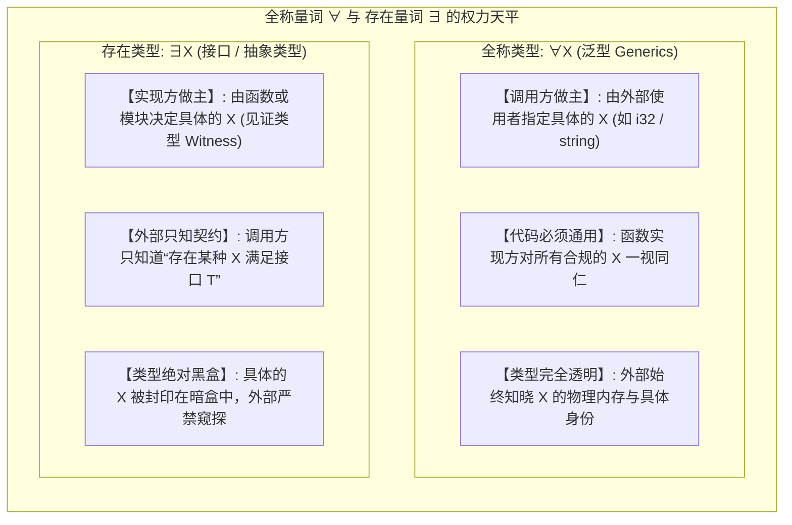
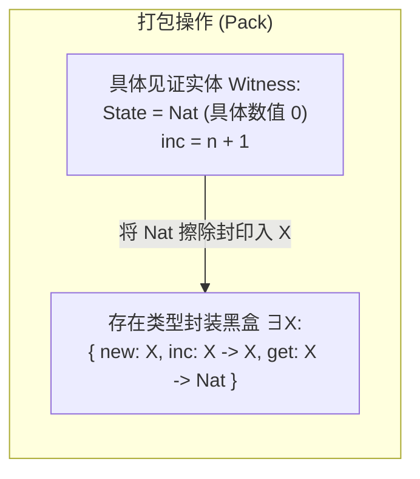
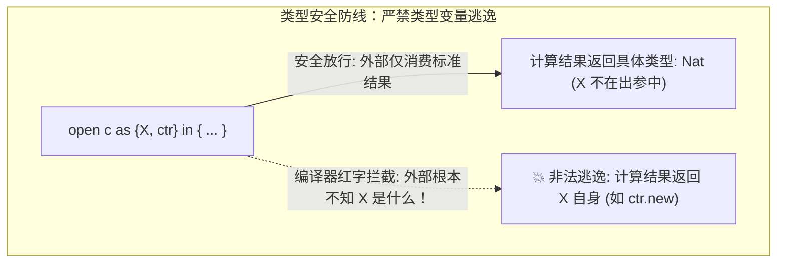
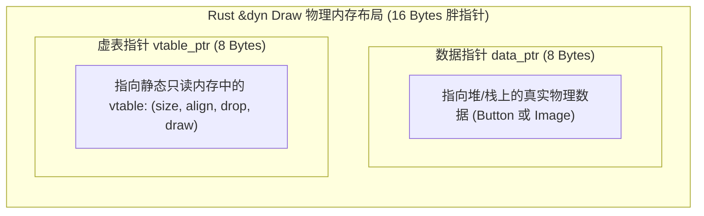
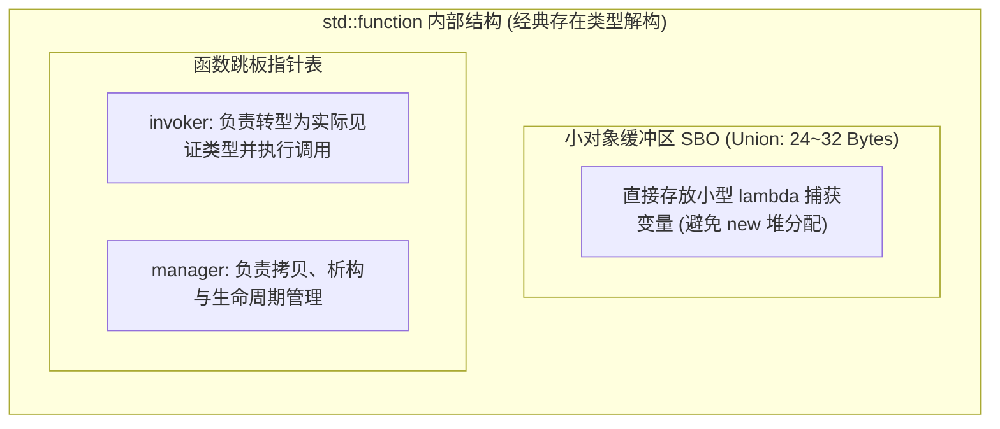

import ExistentialTypesDiagram from "../../../components/diagrams/ExistentialTypesDiagram";

在软件工程中，有一条被奉为圭臬的黄金定律：<strong>高内聚、低耦合、面向接口编程，而不是面向实现编程。</strong>

我们每天都在熟练地使用各种信息隐藏（Information Hiding）机制：在面向对象语言中声明私有字段（`private`）与公共接口（`interface`）；在 Rust 中返回不透明类型 `impl Iterator` 或使用动态分发 `Box<dyn Trait>`；在 C++ 中使用 `std::function` 包装任意闭包；在 TypeScript 中利用函数作用域闭包封锁内部状态。

但你是否曾停下来思考过：<strong>“接口”和“封装”在数学逻辑与类型论中究竟对应着什么？</strong>

1988 年，图灵奖得主约翰·米切尔（John C. Mitchell）与编程语言理论大师戈登·普洛特金（Gordon Plotkin）在一篇划时代的论文中给出了震撼整个学术界的回答：
> <strong>“抽象数据类型，就是存在类型！”（Abstract Types Have Existential Type）</strong>

本文将从最朴素的软件封装直觉出发，为你拆解<strong>存在类型（Existential Types, $\exists X. T$）</strong>的形式化骨架；解密为什么 $\forall$（泛型）与 $\exists$（接口）代表了调用方与实现方的“权力大反转”；并跨越 <strong>Rust、C++、C# 与 TypeScript</strong>，揭开工业界在虚表分发、单态化优化与对象安全背后的深层类型理论。

---

## 一、直觉引入：全称与存在的权力大反转

要透彻理解存在类型 $\exists X. T$，最有效的方法是将它与我们早已烂熟于心的<strong>全称类型（Universal Types / 泛型, $\forall X. T$）</strong>放在天平两端进行对照。



### 1.1 全称量词 $\forall$：调用方是上帝

在 System F 或现代泛型中，全称多态的签名通常写作：
```rust
fn map<T, U>(list: Vec<T>, f: impl Fn(T) -> U) -> Vec<U>
```
在这里：
- <strong>调用方决定具体类型</strong>：调用方可以决定将 `T` 实例化为 `i32`，也可以决定实例化为 `String`；
- <strong>实现方必须服从</strong>：`map` 的内部代码不能预设 `T` 的具体身份，它必须提供一段对<strong>任意（For All）</strong> `T` 均有效运作的普适算法。

### 1.2 存在量词 $\exists$：实现方是国王

现在，将权力的天平彻底反转。考虑一个生产迭代器的函数：
```rust
fn make_even_numbers() -> impl Iterator<Item = u32>
```
在这个签名中：
- <strong>实现方决定具体类型</strong>：函数内部可以用极其复杂的迭代器链、匿名闭包或者内部结构体来生成偶数（比如 `Filter<Map<Range<u32>, ...>, ...>`）。这个长达几百字节的具体类型称为<strong>见证类型（Witness Type）</strong>；
- <strong>调用方只知存在性</strong>：调用方完全不知道、也不需要知道底层的具体类型是什么。调用方只知道：<strong>存在（There Exists）</strong>某个隐藏的具体类型 $X$，它满足 `Iterator<Item = u32>` 的契约！

<strong>一句话记忆</strong>：$\forall$ 是调用方向实现方灌入类型；$\exists$ 是实现方向调用方隐藏类型。

---

## 二、形式化极简基石：打包、开箱与类型防逃逸

在类型论中，存在类型的形式化语法围绕两个原子操作展开：<strong>打包（Pack）</strong>与<strong>开箱（Unpack / Open）</strong>。

### 2.1 经典抽象数据类型：计数器（Counter）

设想我们要向外部发布一个抽象的“计数器（Counter）”模块。调用方能够创建一个计数器、让其自增、并读取数值，但调用方<strong>绝不能直接触碰或篡改计数器的内部内部表示</strong>。

我们声明存在类型签名如下：

$$
\text{Counter} = \exists X. \{ \text{new}: X, \quad \text{inc}: X \to X, \quad \text{get}: X \to \text{Nat} \}
$$

这里的 $X$ 是一个抽象类型变量，代表未知的内部状态。

### 2.2 打包（Pack / Introduction Rule）：见证者入箱封印

实现方决定使用自然数 $\text{Nat}$ 作为内部状态。实现方执行<strong>打包（Pack）</strong>操作：

$$
c = \text{pack } \{ *\text{Nat}, \; \{ \text{new} = 0, \; \text{inc} = \lambda n. n+1, \; \text{get} = \lambda n. n \} \} \text{ as } \text{Counter}
$$



打包操作完成的那一刻，具体的见证类型 $\text{Nat}$ 便从对外接口中彻底隐形了，取而代之的是纯粹的抽象契约 $\text{Counter}$。

### 2.3 开箱（Unpack / Elimination Rule）与作用域隔离

外部消费者拿到黑盒 $c$ 后，必须通过 `open`（也称 `unpack`）语句在局部作用域内消费它：

$$
\text{open } c \text{ as } \{X, \text{ctr}\} \text{ in } (\text{ctr}.\text{get} (\text{ctr}.\text{inc} \; \text{ctr}.\text{new}))
$$

在 `in` 后面的局部受控作用域中：
- 引入了抽象类型变量 $X$；
- 引入了操作实例 $\text{ctr}$，其成员类型中的 $X$ 保持抽象；
- 表达式执行 `ctr.inc`，将初值自增，并最终调用 `ctr.get` 提取出最终结果。

### 2.4 理论第一铁律：抽象类型变量严禁逃逸（No Type Escape）

审视存在类型的形式化打字规则：

$$
\frac{\Gamma \vdash e : \exists X. T \quad \Gamma, X, x:T \vdash t : U \quad X \notin \text{FTV}(U)}{\Gamma \vdash (\text{open } e \text{ as } \{X, x\} \text{ in } t) : U} \quad (\text{T-Unpack})
$$

请格外警惕规则中最右侧的前提约束：

$$
X \notin \text{FTV}(U)
$$

这行符号规定：<strong>局部开箱计算的最终返回类型 $U$ 中，绝对不能包含抽象类型变量 $X$！</strong>



#### 为什么类型变量一旦逃逸，系统就会崩溃？
如果允许 $X$ 逃出 `open` 作用域：
1. 外部环境根本没有绑定类型变量 $X$ 的上下文，逃出来的变量变成了<strong>悬垂类型变量（Dangling Type Variable）</strong>；
2. 如果系统中有两个不同的计数器实例 $c_1$ 和 $c_2$，它们底层的见证类型可能一个是 $\text{Nat}$，另一个是复杂链表。一旦允许返回内部类型 $X$，调用方就会误将 $c_1$ 的内部状态塞入 $c_2$ 的 `inc` 方法中，引发致命的<strong>类型混淆（Type Confusion）</strong>与物理内存越界访问！

---

## 三、交互式沙盒：存在类型与信息隐藏动态探针

为了让打包（Pack）、开箱（Unpack）、类型变量逃逸拦截、物理内存分发（单态化 vs 胖指针 vs SBO）以及 $\forall$ 与 $\exists$ 的权力天平变得触手可及，下方提供了一个动态交互式验证探针。你可以在 4 大经典场景之间自由切换，观察类型检查器的推导轨迹与运行时安全沙盒的推演。

<ExistentialTypesDiagram client:load />

---

## 四、Rust 的系统级落地：impl Trait 与 dyn Trait 的终极对决

现代语言中，将存在类型在系统级工程中发挥到极致的当属 Rust。在 Rust 中，存在类型分裂演化成了两种截然不同的形态：<strong>静态存在类型（`impl Trait`）</strong>与<strong>动态存在类型（`dyn Trait`）</strong>。

### 4.1 静态存在类型：impl Trait 的零开销抽象

在 Rust 函数的返回值位置使用 `impl Trait`，就是纯粹的静态存在类型（也称不透明返回类型 Opaque Return Types）：

```rust
// 静态存在类型：实现方决定见证类型，外部只知其实现了 Iterator
fn produce_squares() -> impl Iterator<Item = i32> {
    (0..100).map(|x| x * x) 
    // 真实类型是 Map<Range<i32>, [closure]>，外部完全无需知道！
}
```

#### 为什么说它是“静态”的存在类型？
- <strong>编译期完全已知尺寸</strong>：虽然对外隐藏，但 rustc 编译器在单态化（Monomorphization）编译期对底层真实结构体的大小、对齐与方法了如指掌；
- <strong>绝对零运行时开销</strong>：无堆分配（Heap Allocation）、无虚函数表（vtable）、无间接跳转（Indirect Jump）。生成的机器汇编与手写特化结构体完全相同，能够被彻底内联优化。

### 4.2 动态存在类型：dyn Trait 与胖指针（Fat Pointer）

当我们需要将不同类型的对象放入同一个集合（异质容器，如 `Vec<Box<dyn Draw>>`）时，静态存在类型无能为力。此时必须请出<strong>动态存在类型（Trait Objects / `dyn Trait`）</strong>：

```rust
trait Draw {
    fn draw(&self);
}

struct Button { width: u32 }
struct Image { path: String }

impl Draw for Button { fn draw(&self) { println!("Drawing button"); } }
impl Draw for Image { fn draw(&self) { println!("Drawing image"); } }

// 动态存在类型封包：&dyn Draw 包含了具体见证类型指针与虚表指针
fn render_ui(items: &[&dyn Draw]) {
    for item in items {
        item.draw(); // 运行时通过 vtable 间接调用
    }
}
```



在物理层面上，`&dyn Trait` 是一个由两个 64 位指针组成的<strong>胖指针（Fat Pointer）</strong>：
1. `data_ptr`：指向真实见证类型的内存实例；
2. `vtable_ptr`：指向编译器为该具体类型自动生成的虚函数跳转表。

### 4.3 为什么对象安全（Object Safety）严禁返回 Self？

很多 Rust 开发者曾被编译器的报错痛击：
```rust
trait CloneableDraw: Draw {
    fn clone_self(&self) -> Self; // 💥 编译报错：the trait cannot be made into an object!
}
// let x: Box<dyn CloneableDraw>; // error[E0038]: not object-safe!
```

为什么 Trait 只要包含一个返回 `Self` 的方法，就绝不能被制成 `dyn Trait` 对象？

<strong>答案正是前文形式化理论中的铁律 —— “类型变量严禁逃逸（$X \notin \text{FTV}(U)$）”！</strong>
- 在 `dyn Trait` 这个存在类型黑盒中，`Self` 就是被封印的抽象类型变量 $X$；
- 如果允许调用 `x.clone_self()`，其返回值的类型必然是 `Self`（即 $X$）；
- 调用方在栈上必须为返回值预先分配空间，但调用方根本不知道被封装在虚表后面的具体对象有多大（`sizeof(X)` 是未知的！）；
- <strong>抽象类型 $X$ 试图逃逸出黑盒，Rust 编译器的对象安全检查（Object Safety Check）在第一时间果断将其斩杀！</strong>

同样的道理，如果方法带有泛型参数（如 `fn foo<T>(&self)`），因为泛型可以在调用时被实例化为无穷多种类型，编译器无法在有限尺寸的虚表中放置无限个函数指针槽位，因此也严禁制作成动态 Trait 对象。

---

## 五、C++ 的无继承多态：类型擦除（Type Erasure）与 SBO

C++ 没有原生的一阶存在类型关键字，但在工程实践中，C++ 开发者发明了一种极其强大的设计模式 —— <strong>类型擦除（Type Erasure）</strong>。

### 5.1 std::function 的底层玄机

`std::function<int(int)>` 可以容纳任何能接收 `int` 并返回 `int` 的实体：普通函数指针、仿函数（Functor）、甚至是捕获了海量外部变量的 Lambda 表达式。

`std::function` 是如何做到不依赖公有基类继承，却能容纳千奇百怪的具体类型的？



`std::function` 的核心设计就是手工用 C++ 模板编写的存在类型打包器：
1. <strong>见证类型绑定</strong>：当传入一个 Lambda 时，模板构造函数推导捕获具体的闭包类 $F$；
2. <strong>跳板函数生成</strong>：编译器实例化一个静态函数 `invoke_impl(void* storage, int arg)`，内部将 `storage` 强转为 `F*` 并执行；
3. <strong>小对象优化（SBO, Small Buffer Optimization）</strong>：如果闭包占用的内存小于 24 或 32 字节，直接塞入栈上的内部缓冲区；只有超过阈值时才回退至堆内存分配（`new`）。

### 5.2 Sean Parent 的 Concept/Model 纯值多态

现代 C++ 宗师 Sean Parent 曾做过一场震动业界的演讲《Inheritance Is the Base Class of Evil》（继承是万恶之源）。他提倡的纯值多态（Value-based Polymorphism）利用类型擦除，让类完全不需要写 `public Base` 就能实现多态集合：

```cpp
#include <memory>
#include <iostream>

class Shape {
private:
    struct Concept { // 纯虚接口：存在类型的形式化契约
        virtual ~Concept() = default;
        virtual void draw() const = 0;
    };

    template <typename T>
    struct Model final : Concept { // 见证类型包装器 (Witness Wrapper)
        T data;
        Model(T x) : data(std::move(x)) {}
        void draw() const override { data.draw(); }
    };

    std::unique_ptr<Concept> pimpl; // 黑盒封印

public:
    template <typename T>
    Shape(T x) : pimpl(std::make_unique<Model<T>>(std::move(x))) {} // 打包 Pack!

    void draw() const { pimpl->draw(); } // 开箱消费 Unpack!
};
```

无需侵入式继承，任何实现了 `draw()` 的独立结构体（即使来自第三方库）都可以直接隐式打包为 `Shape`。这正是存在类型的终极工程魅力：<strong>用组合与封包，彻底替代脆弱紧耦合的面向对象继承体系！</strong>

---

## 六、C# 与 TypeScript 中的黑盒抽象标本

### 6.1 C# 迭代器状态机与私有接口实现

在 C# 中，当你编写包含 `yield return` 的方法时：
```csharp
public IEnumerable<int> GeneratePrimes() {
    yield return 2;
    yield return 3;
    // ...
}
```
C# 编译器会在幕后自动合成一个私有的嵌套类（如 `<GeneratePrimes>d__1 : IEnumerable<int>`）。这是一个实现了状态机逻辑的具体类。

方法对外声明的返回类型是 `IEnumerable<int>`。外部调用方永远无法拿到这个私有类的类名，更无法直接修改状态机指针。具体实现类型被彻底隐藏，调用方只能通过 `IEnumerator.MoveNext()` 契约逐步提取值。

### 6.2 TypeScript 词法闭包：最纯粹的存在类型封包

在没有私有字段的早期 JavaScript/TypeScript 时代，道格拉斯·克罗克福德（Douglas Crockford）推广的模块模式（Module Pattern），其本质就是无类型的存在量词打包：

```typescript
function createVault() {
  // 见证数据 Witness：被封闭在词法作用域内的局部变量
  let secretKey = "quantum-token-42";
  let accessCount = 0;

  // 打包返回存在类型黑盒：外部只能调用暴露的受控方法
  return {
    verify(key: string): boolean {
      accessCount++;
      return key === secretKey;
    },
    getUsage(): number {
      return accessCount;
    }
  };
}

const vault = createVault();
// 外部调用方绝对无法通过 vault.secretKey 读取或修改密钥！
```

在这个场景中，词法作用域就是物理防爆舱，局部变量的内存地址被引擎的垃圾回收器（GC）保护在调用栈外部，向外部提供了最坚固的黑盒存在类型保障。

---

## 七、四大语言存在类型横向全景对照与全篇总结

下表总结了 C++、Rust、C# 与 TypeScript 在存在类型与信息隐藏维度的设计选择与技术权衡：

| 特性维度 | C++ | Rust | C# | TypeScript |
| :--- | :--- | :--- | :--- | :--- |
| <strong>静态存在类型</strong> | C++20 `auto` 配合 Concepts（编译期不透明） | <strong>`impl Trait`</strong>（零开销、单态化不透明返回） | 弱（编译器自动合成私有状态机类） | 不支持（编译期类型被完全擦除） |
| <strong>动态存在类型</strong> | 类型擦除习语（`std::function` / 虚基类） | <strong>`dyn Trait`</strong>（胖指针：数据指针 + 虚表指针） | 接口引用（`IFoo`，托管堆对象头虚表指针） | 接口 / 对象形状检查（鸭子类型） |
| <strong>内存开销模型</strong> | SBO 优化（小对象栈存储，大对象堆存储） | 胖指针 16 字节（栈上），零堆分配惩罚 | 托管对象指针 8 字节 + 堆对象头开销 | 纯 GC 堆引用对象 |
| <strong>防逃逸安全防御</strong> | 模板编译报错或 `target<T>` 探针返回空指针 | <strong>对象安全检查（Object Safety）</strong>严禁返回 `Self` | 编译器接口可访问性检查拦截 | 词法闭包严格隔离私有环境变量 |

### 全篇总结

存在类型，绝非象牙塔中晦涩难懂的数理逻辑玩具，而是每一个工业级软件架构师每天都在仰仗的无形护盾：

1. <strong>权力的倒转</strong>：全称量词 $\forall$（泛型）是调用方指定类型、实现方服从普适算法；存在量词 $\exists$（抽象类型）是实现方封装具体见证实体、调用方只依赖抽象契约；
2. <strong>防逃逸铁律</strong>：打包（Pack）将具体见证类型封印入盒，开箱（Unpack）在沙盒中消费数据。类型变量严禁逃出作用域（$X \notin \text{FTV}(U)$）是保障系统不发生类型混淆的最高公理；
3. <strong>系统工程的演进</strong>：从 C++ 手工打造的 `std::function` 类型擦除与小对象优化，到 Rust 将存在类型清晰分化为零开销静态单态化的 `impl Trait` 与 16 字节胖指针的 `dyn Trait`，类型理论与底层硬件执行效率在此达成了精妙绝伦的统一。
