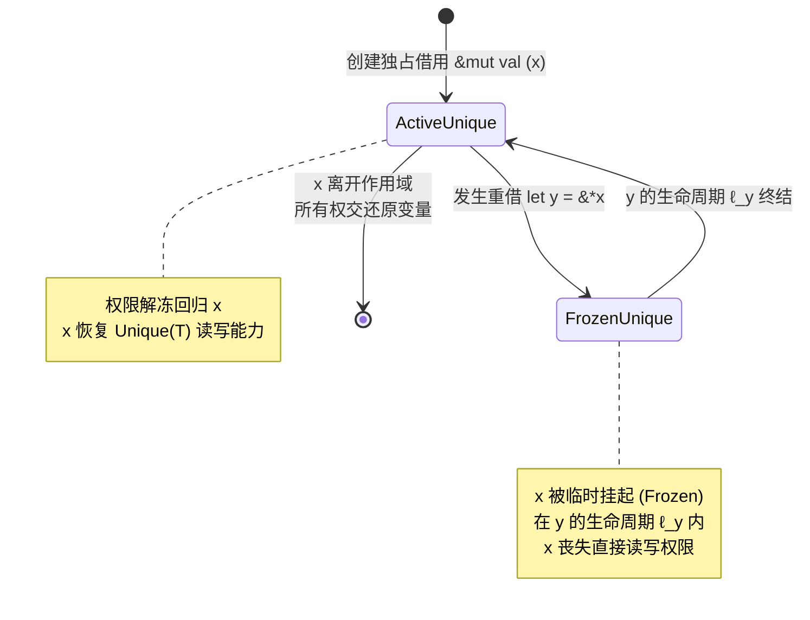

import BorrowConflictDemo from "../../../components/demos/BorrowConflictDemo";
import CodePlayground from "../../../components/framework/CodePlayground";

export const splitBorrowSnippet = [
  "struct Vector3 {",
  "    x: f64,",
  "    y: f64,",
  "    z: f64,",
  "}",
  "",
  "fn main() {",
  "    let mut v = Vector3 { x: 1.0, y: 2.0, z: 3.0 };",
  "",
  "    // 形式化判定：v.x 与 v.y 物理内存不相交 (v.x ≁ v.y)",
  "    // 借用检查器允许同时借出不相交字段的独占写权限 W(v.x) || W(v.y)",
  "    let rx = &mut v.x;",
  "    let ry = &mut v.y;",
  "",
  "    *rx += 10.0;",
  "    *ry *= 5.0;",
  "",
  '    println!("分离借用执行成功: Vector3({:.1}, {:.1}, {:.1})", v.x, v.y, v.z);',
  "}",
].join("\n");

export const reborrowSnippet = [
  "fn main() {",
  "    let mut val = 42;",
  '    println!("[初始状态] val = {}", val);',
  "",
  "    // 1. x 获得对 val 的独占访问权 Unique(val)",
  "    let x: &mut i32 = &mut val;",
  "",
  "    // 2. 从 x 重借 (Reborrow) 出只读引用 y，此时 x 暂时降级挂起为 Frozen",
  "    let y: &i32 = &*x;",
  '    println!("[重借期间] y 首次活跃读取: {}", y);',
  "",
  "    // 试着解开下面这一行的注释并点击运行：",
  "    // *x = 99; // 编译报错 error[E0506]: 在只读重借 y 仍在活跃使用期间，不能向被借出的 *x 写入",
  "",
  "    // 关键点：再次使用 y，根据 NLL 规则将 y 的活跃生命周期显式延续至此处",
  '    println!("[重借期间] y 再次活跃读取: {}", y);',
  "",
  "    // 3. 在此之后 y 的生命周期正式终结，x 自动解冻并重新恢复独占写权限",
  "    *x = 100;",
  '    println!("[解冻之后] 通过 x 写入后 val = {}", val);',
  "}",
].join("\n");

export const conflictCaseSnippet = [
  "fn main() {",
  "    let mut x = 10;",
  "",
  "    let r1 = &x; // 事件 A1: 只读共享借用 R(x)",
  '    println!("r1 首次读取: {}", r1);',
  "",
  "    // 试着解开下面两行注释并点击「运行代码」，观察编译器拒绝并触发真实的 E0502 借用冲突：",
  "    // let r2 = &mut x; // 事件 A2: 独占写借用 W(x)",
  '    // println!("r1 = {}, r2 = {}", r1, r2); // 此时 r1 活跃区间延伸至此处，产生冲突！',
  "",
  '    println!("生命周期错开，当前代码安全合规！");',
  "}",
].join("\n");

在系统编程语言的发展史中，Rust 最具革命性的突破莫过于在 <strong>零运行时开销 Zero-cost Abstractions</strong> 的前提下，通过编译期静态分析彻底消除了内存不安全与数据竞争（Data Races）。这一奇迹的幕后推手正是 <strong>借用检查器（Borrow Checker）</strong>。

初学者往往通过一条朴素的口诀来理解借用检查规则：

> “同一时刻，要么只能有一个可变引用，要么可以有任意多个不可变引用。”

这种直觉将借用机制类比为多线程并发中的“读写锁（RWLock）”。然而，一旦涉足更深层次的系统设计——例如结构体不同字段的分离借用（Split Borrows）、重借（Reborrowing）时的权限降级与让渡、以及非词法生命周期（NLL, Non-Lexical Lifetimes）的控制流分析——单纯的“读写二元论”就会显得捉襟见肘，甚至引发诸多令人费解的认知困惑。

本文旨在超越表层的编程语法，自底向上构建一个 <strong>精确的形式化语义模型</strong>，将借用安全收敛为由 <strong>Place（存储位置）</strong>、<strong>Permission（访问权限）</strong>、<strong>Lifetime（生命周期）</strong> 与 <strong>Aliasing（别名关系）</strong> 构成的空间-时间判定体系。

---

## 一、访问事件与三元组抽象

为了形式化描述程序的每一次内存读写，我们首先定义最基本的原子概念：<strong>访问事件（Access Event）</strong>。

程序运行过程中的任意一次访问，均可形式化抽象为一个三元组：

$$
A = (p, \alpha, \ell)
$$

其中三个分量分别定义了访问的空间靶向、操作权限与时间有效区间：

### 1.1 存储位置：Place（$p$）

在编译器中间表示（如 Rust MIR）中，<strong>Place</strong> 代表内存中具有明确物理地址的存储位置。它可以是一个基础局部变量，也可以是复合类型的路径投影（Projection）：

- 基础变量：$x,\ y$
- 元组/结构体字段投影：$x.0,\ x.1,\ \mathit{point}.x$
- 指针/引用解引用：$*r,\ **ptr$
- 数组/切片下标索引：$x[i]$

### 1.2 访问权限：Permission（$\alpha$）

访问权限刻画了当前操作对目标存储位置的读写意图，基础二值集合定义为：

$$
\alpha \in \{R, W\}
$$

- $R = \text{shared / read}$：共享读取权限，操作保证不改变目标内存的内容。
- $W = \text{exclusive / write}$：独占写入权限，操作可能会改变目标内存的状态。

### 1.3 生命周期区间：Lifetime（$\ell$）

$\ell$ 表示该借用或访问在控制流图（Control Flow Graph, CFG）上保持 <strong>活跃 Live</strong> 的点集。在简化的一维时间模型下，可直观视为时间轴上的半开区间 $[s, e)$。非词法生命周期（NLL）本质上就是将 $\ell$ 从静态代码词法作用域缩减为真实的变量使用活跃路径。

---

## 二、访问冲突判定的充要准则

设程序中存在两个并发或具有潜在重叠的访问事件：

$$
A_1 = (p_1, \alpha_1, \ell_1), \qquad A_2 = (p_2, \alpha_2, \ell_2)
$$

借用检查器的核心使命，就是在编译期证明系统中不存在任何非法的冲突访问。形式化地，两个访问事件发生 <strong>借用冲突 $A_1 \bowtie A_2$</strong> 当且仅当同时满足以下三个充要条件：

### 条件一：空间别名冲突（$p_1 \sim p_2$）

关系 $\sim$ 表示两个 Place <strong>指向同一底层存储位置</strong>（或其内部存储存在重叠包含关系）：

$$
p_1 \sim p_2 \iff \operatorname{Overlap}(\operatorname{Memory}(p_1), \operatorname{Memory}(p_2))
$$

- <strong>同变量必别名</strong>：$x \sim x$
- <strong>不相交字段互斥</strong>：对于元组 $x = (u, v)$，字段 $x.0$ 与 $x.1$ 在内存布局上是首尾独立的，因此：
  $$
  x.0 \not\sim x.1
  $$
  这从形式化上解释了为什么 Rust 允许同时对不同字段借出独占写权限（即 $W(x.0) \parallel W(x.1)$ 完全合法）。
- <strong>包含关系产生别名</strong>：对结构体整体的访问必然覆盖其所有子字段，即 $x \sim x.0$。

<CodePlayground
  client:visible
  lang="rust"
  title="独立字段分离借用 (Split Borrows) 现场编译"
  description="编译器静态分析证明 v.x 与 v.y 物理内存不重叠，因而允许并发借出两个可变引用。"
  initialCode={splitBorrowSnippet}
/>

### 条件二：生命周期重叠（时间轴相交）

两个访问在时间/控制流维度上必须具有交集：

$$
\ell_1 \cap \ell_2 \neq \varnothing
$$

若一个引用的使用已经终结，其占用的权限即交还给环境。即使它们访问同一个 Place 且包含写操作，只要生命周期完全错开（即 $\ell_1 \cap \ell_2 = \varnothing$），就不会产生冲突。

### 条件三：权限互斥冲突

定义权限冲突判定谓词 $\operatorname{conflict}(\alpha_1, \alpha_2)$：

$$
\operatorname{conflict}(R, R) = \mathrm{false}
$$

$$
\operatorname{conflict}(R, W) = \operatorname{conflict}(W, R) = \operatorname{conflict}(W, W) = \mathrm{true}
$$

读读安全共享，写操作具有绝对排他性。

### 综合判定定理

将空间、时间与权限三者合取，即可得到借用检查的核心判定准则：

$$
\boxed{
A_1 \bowtie A_2 \iff (p_1 \sim p_2) \land (\ell_1 \cap \ell_2 \neq \varnothing) \land \operatorname{conflict}(\alpha_1, \alpha_2)
}
$$

<strong>借用检查器（Borrow Checker）的形式化目标：拒绝并拦截任何使得 $A_1 \bowtie A_2 = \mathrm{true}$ 的程序。</strong>

---

## 三、交互实验区：借用冲突三维判定模拟器

通过下方交互式实验区，你可以自由调节两个访问事件 $A_1$ 与 $A_2$ 的 Place 场景（同变量、独立字段、解引用）、读写权限（$R$ 或 $W$）以及在时间轴上的生命周期区间，直观观察三维准则是如何实时判定借用合法性的：

<BorrowConflictDemo client:visible />

---

## 四、为什么 `&mut T` 不能仅仅表示为写权限 $W$？

这是借用检查形式化过程中最容易产生误解的关键节点。

如果将不可变引用 `&T` 视为只读权限 $R$，许多人便顺理成章地将可变引用 `&mut T` 理解为写入权限 $W$。然而，这种映射是<strong>不完备且容易误导的</strong>：

### 4.1 $\operatorname{Shared}(T)$ 与 $\operatorname{Unique}(T)$

在现代类型系统视角下，Rust 引用类型的更精确代数语义是：

- `&T` $\implies \operatorname{Shared}(T)$：表示<strong>对目标类型的共享访问</strong>，赋予只读权限 $R$。
- `&mut T` $\implies \operatorname{Unique}(T)$：表示<strong>对目标类型的独占拥有（Unique Access）</strong>。

$\operatorname{Unique}(T)$ 的关键不是它能写，而是它的<strong>排他性所有权约束</strong>：

$$
\operatorname{Unique}(T) \implies \text{系统中不存在任何其他重叠的活跃访问（Overlap Access）指向 } T
$$

### 4.2 独占性蕴含读写双全（$R + W$）

当你拥有一个 `&mut T` 时，你不仅拥有写入权限 $W$，<strong>同时也完整拥有读取权限 $R$</strong>。你随时可以从 `&mut T` 中安全读取数据：

```rust
let x: &mut i32 = ...;
let val = *x; // 读操作完全合法，因为 Unique(T) 涵盖 R
*x = val + 1; // 写操作同样合法
```

更重要的是，`&mut T` 作为独占所有者，在自身生命周期内可以被进一步 <strong>解构与降级</strong>，这引出了 Rust 核心机制：<strong>重借（Reborrowing）</strong>。

---

## 五、Reborrow（重借）与借用栈：权限的暂时让渡与冻结

观察以下代码中 Reborrow 期间权限的转移、挂起与解冻全过程：

<CodePlayground
  client:visible
  lang="rust"
  title="Reborrow 权限让渡与生命周期解冻现场运行"
  description="点击「运行代码」观察 x 在重借出 y 期间被冻结挂起；尝试解开注释中的冲突写入，观察 rustc 编译器的安全拦截行为。"
  initialCode={reborrowSnippet}
/>

如果按照朴素的读写互斥模型，`x` 是写引用（$W$），`y` 是读引用（$R$），它们同时存在岂非直接触犯了 $R \parallel W$ 冲突？

答案在于 <strong>Reborrow 的权限转移与冻结状态机</strong>。

形式化而言，当从一个独占借用派生出子借用时，原借用并不会被销毁，而是发生如下状态跃迁：

$$
\operatorname{Unique}(x) \overset{\text{reborrow}}{\longrightarrow} \operatorname{Shared}(y) \quad \text{同时暂态冻结：} \operatorname{Frozen}(x, \ell_y)
$$



在子引用 $y$ 的活跃生命周期区间 $\ell_y$ 内部：

1. 活跃的访问事件只有 $A_y = (*x, R, \ell_y)$；
2. 原始引用 $x$ 对应的访问能力被<strong>临时冻结（Suspended / Frozen）</strong>，任何尝试通过 $x$ 进行的并发读写都会被视为未就绪；
3. 一旦 $y$ 的生命周期 $\ell_y$ 结束，$x$ 的独占状态自动从挂起中恢复，重新取回完整的 $R+W$ 权限。

这一过程在学术界的理论模型（如 RustBelt 与 Stacked Borrows / Tree Borrows）中被形式化为<strong>借用权限栈（Borrow Stack）</strong>：后借出的项压入栈顶获得活动权，当栈顶项释放后，栈底项重新成为活动项。

---

## 六、形式化模型与 Rust 语言实体的精确映射

我们将上述抽象模型与 Rust 语言特性进行映射对照：

| Rust 语言实体 / 行为        | 形式化模型对应分量                         | 语义本质说明                                             |
| :-------------------------- | :----------------------------------------- | :------------------------------------------------------- |
| <strong>不可变借用 `&T`</strong>         | $\operatorname{Shared}(T) \to R(p)$        | 允许多方共享读取，禁止写入                               |
| <strong>可变借用 `&mut T`</strong>       | $\operatorname{Unique}(T) \to \{R, W\}(p)$ | 绝对排他的独占访问保证                                   |
| <strong>解引用读取 `*r`</strong>         | $A = (*r, R, \ell_{\text{read}})$          | 在读取表达式时刻发起 $R$ 访问                            |
| <strong>赋值写入 `*r = v`</strong>       | $A = (*r, W, \ell_{\text{write}})$         | 在写入表达式时刻发起 $W$ 访问                            |
| <strong>生命周期标注 `'a`</strong>       | 区间 $\ell \subseteq \text{CFG}$           | 控制流图上访问权限保持活跃的区间                         |
| <strong>结构体字段 `x.0`, `x.1`</strong> | 不相交 Place（$x.0 \not\sim x.1$）         | 空间上独立，允许并发互斥借出                             |
| <strong>重借（Reborrow）</strong>        | 权限状态机让渡与暂时冻结                   | $\operatorname{Frozen}(x, \ell_y)$，子生命周期终结后解冻 |
| <strong>编译报错 E0502/E0499</strong>    | 判定准则 $A_1 \bowtie A_2 = \mathrm{true}$ | 空间、时间、权限三维同时重叠冲突                         |

### 经典编译推演实例

#### 案例 1：读读共享（编译通过）

```rust
let mut x = 10;
let r1 = &x;
let r2 = &x;
println!("{} and {}", r1, r2);
```

- $A_1 = (x, R, \ell_1)$，其中 $\ell_1 = [2, 5]$
- $A_2 = (x, R, \ell_2)$，其中 $\ell_2 = [3, 5]$
- 空间别名：$x \sim x = \mathrm{true}$
- 时间重叠：$[2, 5] \cap [3, 5] \neq \varnothing = \mathrm{true}$
- 权限冲突：$\operatorname{conflict}(R, R) = \mathrm{false}$
- <strong>结论</strong>：$A_1 \bowtie A_2 = \mathrm{false}$，代码安全编译通过。

#### 案例 2：读写并发冲突（编译器拒绝）

```rust
let mut x = 10;
let r1 = &x;
let r2 = &mut x; // error[E0502]: cannot borrow `x` as mutable because it is also borrowed as immutable
println!("{}", r1);
```

- $A_1 = (x, R, \ell_1)$，$\ell_1 = [2, 4]$（因第 4 行仍在使用 `r1`）
- $A_2 = (x, W, \ell_2)$，$\ell_2 = [3, 3]$
- 空间别名：$x \sim x = \mathrm{true}$
- 时间重叠：$[2, 4] \cap [3, 3] = [3, 3] \neq \varnothing = \mathrm{true}$
- 权限冲突：$\operatorname{conflict}(R, W) = \mathrm{true}$
- <strong>结论</strong>：三维合取成立，$A_1 \bowtie A_2 = \mathrm{true}$，编译器准确触发错误拦截。

现场验证上述推演：预设代码处于生命周期错开的安全状态；试着取消注释触犯三维重叠，观察 `rustc` 实际抛出的 `error[E0502]`：

<CodePlayground
  client:visible
  lang="rust"
  title="三维判定准则现场推演：读写冲突与编译器拦截"
  description="解开注释中的非法借用行，点击运行，观察 rustc 借用检查器现场输出的真实 E0502 错误诊断！"
  initialCode={conflictCaseSnippet}
/>

---

## 七、结语：跨语言的类型设计四元组思维

当我们跳出 Rust 编译器的具体实现细节，去审视所有尝试解决并发安全与内存别名问题的现代系统时，最普适且坚固的概念范式可以浓缩为如下四元组：

$$
\boxed{
\text{Borrowing System} \approx \text{Place} + \text{Permission} + \text{Lifetime} + \text{Aliasing}
}
$$

1. <strong>Place（位置）</strong> 决定了内存拓扑与空间颗粒度；
2. <strong>Permission（权限）</strong> 区分了共享共存与独占排他；
3. <strong>Lifetime（生命周期）</strong> 约束了权限在时间流中的有效生存期；
4. <strong>Aliasing（别名分析）</strong> 建立了多个符号路径之间的等价映射关系。

理解了这四大维度的形式化约束，你便不仅掌握了 Rust 借用检查器的核心原理，更获得了一种能够穿透所有现代所有权体系（如 Swift Noncopyable Types、Mojo 内存模型乃至分离逻辑 Separation Logic）的系统思维框架。
