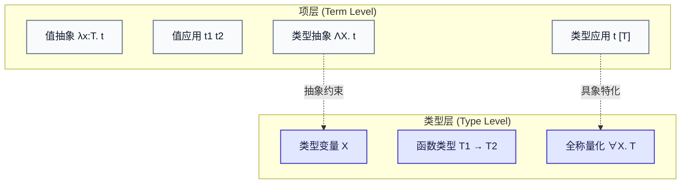
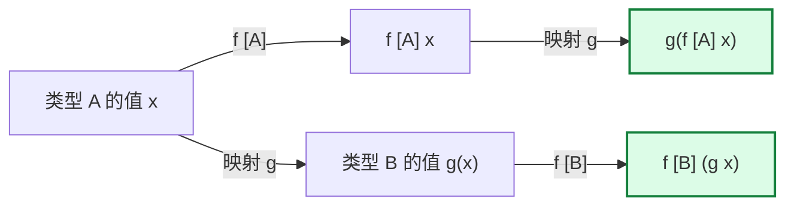

import SystemFPolymorphismDiagram from "../../../components/diagrams/SystemFPolymorphismDiagram";

在简单类型 $\lambda$ 演算（STLC）中，我们通过类型系统确立了“良类型的程序永远不会犯傻”的安全性保证，并消除了死循环发散态。然而，STLC 的安全性伴随着沉重的代价 —— <strong>代码无法复用与“多态贫血症”</strong>。

在 STLC 中，如果你编写了一个恒等函数，由于形参必须绑定具体类型，你被迫为每一种类型重复复制代码：

$$
\begin{aligned}
\text{id}_{\text{Bool}} &= \lambda x:\text{Bool}.\, x : \text{Bool} \to \text{Bool} \\
\text{id}_{\text{Nat}} &= \lambda x:\text{Nat}.\, x : \text{Nat} \to \text{Nat} \\
\text{id}_{\text{String}} &= \lambda x:\text{String}.\, x : \text{String} \to \text{String}
\end{aligned}
$$

这三个函数在项逻辑上完全一致，但类型系统却将它们粗暴地割裂为互不相通的孤岛。

为了打破这一僵局，数理逻辑学家让-伊夫·吉拉德（Jean-Yves Girard, 1972）在证明论中与计算机科学家约翰·雷诺兹（John C. Reynolds, 1974）在多态编程语言研究中，不谋而合地独立发现了<strong>二阶 $\lambda$ 演算（Second-order Lambda Calculus，简称 System F 或 $\lambda 2$）</strong>。

System F 引入了<strong>全称类型量化（Universal Quantification, $\forall X.\, T$）</strong>与<strong>二阶抽象（Type Abstraction, $\Lambda X.\, t$）</strong>，不仅彻底奠定了现代泛型编程（如 Rust 泛型、Haskell、TypeScript 泛型）的数学基础，而且展现出纯依靠类型量化即可从虚无中重构所有代数数据结构的不可思议的力量。

本文将从 STLC 的局限出发，系统推导 System F 的形式公理、两阶段二阶求值、非直谓性、强规范化、免费定理以及现代编译器的三大实现范式。

---

## 一、语法扩充：类型变量与全称量化

在 System F 中，类型不再仅仅是静态的基底标签，它本身也可以被<strong>参数化、抽象和传递</strong>。

### 1.1 类型层语法生成式

System F 在类型层引入了<strong>类型变量（Type Variable, $X$）</strong>与<strong>全称量化类型构造器（Universal Quantifier, $\forall$）</strong>：

$$
T ::= X \mid T_1 \to T_2 \mid \forall X.\, T
$$

- <strong>类型变量（$X, Y, Z$）</strong>：充当类型占位符，可以在外层被类型绑定器（$\forall X$ 或 $\Lambda X$）所约束；
- <strong>全称类型（$\forall X.\, T$）</strong>：表示“对于任意合法的类型 $X$，均满足类型契约 $T$”。例如，多态恒等函数的类型记作：
  $$
  \forall X.\, X \to X
  $$

### 1.2 项层语法生成式

为了配合类型层的全称量化，项层同步扩充了<strong>二阶类型抽象</strong>与<strong>类型应用</strong>：

$$
t ::= x \mid \lambda x:T.\, t \mid t_1 \; t_2 \mid \Lambda X.\, t \mid t \; [T]
$$

- <strong>一阶值抽象（$\lambda x:T.\, t$）</strong>：接收<strong>值参数</strong> $x$；
- <strong>一阶值应用（$t_1 \; t_2$）</strong>：将函数作用于<strong>实参值</strong> $t_2$；
- <strong>二阶类型抽象（$\Lambda X.\, t$）</strong>：大写 Lambda，接收<strong>类型参数</strong> $X$；
- <strong>二阶类型应用（$t \; [T]$）</strong>：方括号表示将类型实参 $T$ 代入多态项 $t$。

---

## 二、双层打字环境与形式化推导规则

由于引入了类型变量 $X$，一个类型表达式本身是否合法（例如是否存在未绑定的游离类型变量）需要前置校验。为此，打字系统被拓展为由<strong>类型变量环境（$\Delta$）</strong>与<strong>项变量环境（$\Gamma$）</strong>共同构成的双层体系。

### 2.1 良型类型判断

$$
\Delta = X_1, X_2, \dots, X_n
$$

判断 $\Delta \vdash T \; \text{ok}$ 表示类型 $T$ 中出现的所有自由类型变量均已被包含在环境 $\Delta$ 中。

### 2.2 二阶打字公理

除了继承自 STLC 的规则外，System F 引入了两条核心二阶公理：

$$
\begin{gathered}
\frac{\Delta, \, X, \; \Gamma \vdash t : T}{\Delta, \, \Gamma \vdash (\Lambda X.\, t) : \forall X.\, T} \quad (\text{T-TAbs}) \\[14pt]
\frac{\Delta, \, \Gamma \vdash t : \forall X.\, T_{12} \quad \Delta \vdash T_2 \; \text{ok}}{\Delta, \, \Gamma \vdash t \; [T_2] : [X \mapsto T_2]T_{12}} \quad (\text{T-TApp})
\end{gathered}
$$

1. <strong>类型抽象规则（T-TAbs）</strong>：若在扩展了类型变量 $X$ 的上下文下，项 $t$ 具备类型 $T$（且 $X$ 不能作为自由变量出现在项上下文 $\Gamma$ 中），则类型抽象项 $\Lambda X.\, t$ 具备全称类型 $\forall X.\, T$；
2. <strong>类型应用规则（T-TApp）</strong>：若项 $t$ 具有全称类型 $\forall X.\, T_{12}$，且 $T_2$ 是当前环境下的良型类型，则将 $T_2$ 注入后，结果的类型为<strong>在类型体 $T_{12}$ 中将所有自由出现的 $X$ 代换为 $T_2$ 所得到的新类型 $[X \mapsto T_2]T_{12}$</strong>。

### 2.3 多态恒等子打字推导

我们以多态恒等函数 $\text{id} = \Lambda X.\, \lambda x:X.\, x$ 作用于类型 $\text{Bool}$ 为例构造推导树：

$$
\cfrac{\cfrac{\cfrac{x:X \in (x:X)}{X; \; x:X \vdash x : X} \; (\text{T-Var})}{\emptyset; \; \emptyset \vdash (\lambda x:X.\, x) : X \to X} \; (\text{T-Abs})}{\emptyset; \; \emptyset \vdash (\Lambda X.\, \lambda x:X.\, x) : \forall X.\, X \to X} \; (\text{T-TAbs})
$$

随后进行类型应用 $\text{id} \; [\text{Bool}]$：

$$
\cfrac{\vdash \text{id} : \forall X.\, X \to X \quad \vdash \text{Bool} \; \text{ok}}{\vdash \text{id} \; [\text{Bool}] : \text{Bool} \to \text{Bool}} \; (\text{T-TApp})
$$

推导结果与我们人工手写的 $\text{id}_{\text{Bool}}$ 丝毫不差！但在这里，它是从纯粹的数学规则中机械特化出来的。

---

## 三、二阶操作语义与两阶段 β-归约

System F 的求值是一个精妙的<strong>两阶段展开过程</strong>：

### 3.1 阶段一：类型层 $\beta$-归约（Type Beta-Reduction）

当类型抽象项遭遇类型实参时，触发类型替换：

$$
(\Lambda X.\, t) \; [T] \longrightarrow_{\beta_{\text{type}}} [X \mapsto T]t
$$

在这一步中，类型占位符 $X$ 在项 $t$ 的内部被彻底展开为具象类型 $T$，外层的类型量化符 $\Lambda X$ 被消除。

### 3.2 阶段二：值层 $\beta$-归约（Value Beta-Reduction）

经过类型替换后，项退化为一个普通的、带具象类型的 STLC 函数抽象，随后接收实参值触发常规代换：

$$
(\lambda x:T.\, t) \; v \longrightarrow_{\beta_{\text{val}}} [x \mapsto v]t
$$

### 3.3 形式化求值全流程图景

考虑调用多态恒等子 $\text{id} \; [\text{Bool}] \; \text{true}$：

$$
\begin{aligned}
& (\Lambda X.\, \lambda x:X.\, x) \; [\text{Bool}] \; \text{true} \\
\longrightarrow_{\beta_{\text{type}}} & (\lambda x:\text{Bool}.\, x) \; \text{true} \\
\longrightarrow_{\beta_{\text{val}}} & \text{true}
\end{aligned}
$$

这揭示了现代编译器的深层本质：<strong>类型应用在编译期擦除或特化类型，值应用在运行期流转数据</strong>。

---

## 四、非直谓性（Impredicativity）与自应用奇迹

在数理逻辑与集合论中，允许定义引用“包含自身在内的全集”往往会导致灾难性的罗素悖论（如“所有不包含自身的集合构成的集合”）。

然而，System F 却大胆拥抱了<strong>非直谓性（Impredicativity）</strong>：

### 4.1 什么是全称类型的非直谓性

在类型应用规则中，类型实参 $T_2$ 可以是<strong>任意良型类型</strong>，这其中包括<strong>包含全称量词 $\forall$ 自身的高阶类型</strong>！

这意味着：在求值 $\text{id} \; [T]$ 时，我们完全可以将多态恒等函数自身的类型 $T = \forall Y.\, Y \to Y$ 作为参数传递给自身：

$$
\text{id} \; [\forall Y.\, Y \to Y] \; \text{id}
$$

我们追踪其归约过程：

$$
\begin{aligned}
& (\Lambda X.\, \lambda x:X.\, x) \; [\forall Y.\, Y \to Y] \; \text{id} \\
\longrightarrow_{\beta_{\text{type}}} & (\lambda x:(\forall Y.\, Y \to Y).\, x) \; \text{id} \\
\longrightarrow_{\beta_{\text{val}}} & \text{id}
\end{aligned}
$$

它不仅完全合法，而且在类型检查与求值两端均保持自洽！

### 4.2 为什么非直谓性没有引发逻辑崩溃

为什么非直谓性在集合论中引发了罗素悖论，在 System F 中却没有导致逻辑不一致？

核心在于吉拉德严格划定的界限：<strong>项不能依赖于类型的值，且类型层本身没有循环的自指公理（避免了 $\text{Type} : \text{Type}$ 引发的 Girard 悖论）</strong>。非直谓性赋予了 System F 骇人听闻的表达深度，使得所有离散数据结构都可以在纯函数中被直接编码。

---

## 五、纯多态世界的奇迹：丘奇数据结构编码

在 UTLC 中，我们通过无类型的 $\lambda$ 抽象编码了布尔值与自然数；在 STLC 中，由于缺乏多态，这些编码完全失效（必须为不同返回类型写不同的编码）。

在 System F 中，<strong>我们不需要任何基底类型（No Primitive Types Needed）</strong>，仅仅依靠 $\forall$ 量词即可构造出具有严格类型安全保障的全套现代代数数据结构！

### 5.1 丘奇布尔值（Church Booleans）

布尔值的本质是“接收两个同类型分支并挑选其一”：

$$
\text{Bool} \triangleq \forall X.\, X \to X \to X
$$

$$
\begin{aligned}
\text{true} &\triangleq \Lambda X.\, \lambda t:X.\, \lambda f:X.\, t \\
\text{false} &\triangleq \Lambda X.\, \lambda t:X.\, \lambda f:X.\, f
\end{aligned}
$$

条件分支选择 $\text{if-then-else}$ 就是类型应用与参数传递：

$$
\text{cond} \triangleq \Lambda X.\, \lambda b:\text{Bool}.\, \lambda t:X.\, \lambda f:X.\, b \; [X] \; t \; f
$$

### 5.2 丘奇自然数（Church Numerals）

自然数 $n$ 的本质是“在任意载体类型 $X$ 上，对初值连续应用变换函数 $n$ 次”：

$$
\text{Nat} \triangleq \forall X.\, (X \to X) \to X \to X
$$

$$
\begin{aligned}
0 &\triangleq \Lambda X.\, \lambda s:(X \to X).\, \lambda z:X.\, z \\
1 &\triangleq \Lambda X.\, \lambda s:(X \to X).\, \lambda z:X.\, s \; z \\
2 &\triangleq \Lambda X.\, \lambda s:(X \to X).\, \lambda z:X.\, s \; (s \; z)
\end{aligned}
$$

其后继函数 $\text{succ}$：

$$
\text{succ} \triangleq \lambda n:\text{Nat}.\, \Lambda X.\, \lambda s:(X \to X).\, \lambda z:X.\, s \; (n \; [X] \; s \; z)
$$

### 5.3 纯多态积类型与连续传递风格（CPS）

两个类型 $A$ 与 $B$ 的有序对，在 System F 中被编码为一个<strong>接收访问器函数的多态分发器</strong>：

$$
A \times B \triangleq \forall R.\, (A \to B \to R) \to R
$$

$$
\text{pair} \triangleq \Lambda A.\, \Lambda B.\, \lambda a:A.\, \lambda b:B.\, (\Lambda R.\, \lambda k:(A \to B \to R).\, k \; a \; b)
$$

投影函数 $\text{fst}$ 与 $\text{snd}$ 直接通过传入相应的挑选闭包实现：

$$
\text{fst} \triangleq \Lambda A.\, \Lambda B.\, \lambda p:(A \times B).\, p \; [A] \; (\lambda a:A.\, \lambda b:B.\, a)
$$

<strong>在 System F 中，数据与控制的边界彻底消融：数据不是被动的内存容器，而是一个主动等待求值上下文的高阶多态计算。</strong>

---

## 六、交互探针：二阶两阶段求值与免费定理

通过下方交互图表，你可以直观调试与单步观察 System F 的二阶归约机制。你可以自由选择预设、动态注入不同的类型实参（包括非直谓的高阶多态类型），并实时观测两阶段代换以及 Reynolds 自然性交换图的成立过程：

<SystemFPolymorphismDiagram client:load />

---

## 七、Girard 强规范化定理与可规约性候选者

在 STLC 中，强规范化可以通过对类型的简单大小进行结构归纳证明。

但在 System F 中，由于非直谓性，当我们在证明 $\forall X.\, T$ 的停机性时，类型变量 $X$ 可以被实例化为 $\forall X.\, T$ 本身！类型的复杂度在实例化后不减反增，这使得<strong>所有的经典一阶归纳证明方法在此彻底瓦解</strong>。

### 7.1 可规约性候选者（Candidats de Réductibilité）

让-伊夫·吉拉德在其博士论文中创造性地发明了<strong>可规约性候选者（Candidats de réductibilité）</strong>技术：

1. 不再孤立考察语法树的层级大小，而是为每一个类型构造一个<strong>项的集合解释 $\mathcal{R}_T$</strong>；
2. 集合中的项必须满足一系列严苛的停机封闭性质（如强规范化项的逆向弱头归约封闭性）；
3. 证明全称量词在语义解释上对应所有候选者集合的无穷交集；
4. 最终证明所有良类型的 System F 项都必然属于其对应类型的可规约性候选者集合。

由此推导出划时代的数学结论：

> <strong>定理（Girard 强规范化定理）</strong>：
>
> System F 中的每一个良类型程序，其<strong>所有可能的归约路径都必然在有限步内停机终止</strong>。

### 7.2 超越 Peano 算术的表达力

令人惊叹的是：虽然 System F 保证绝对停机，但其能够表达与计算的停机全函数集合，其丰富程度远远超越了一阶皮亚诺算术（Peano Arithmetic）的证明边界！著名的阿克曼函数（Ackermann Function）在 STLC 中无法定义，但在 System F 中却可以完全用良类型项编写并证明其停机性。

---

## 八、Reynolds 关系参数化与“免费定理”

参数多态（Parametric Polymorphism）最深邃的哲学在于其“参数性”：

<strong>一个参数多态函数，在运行时绝对无法探查、分支或嗅探类型变量 $X$ 的具象身份。它对待传入的数据，必须一视同仁。</strong>

约翰·雷诺兹将这种直觉形式化为<strong>关系参数化（Relational Parametricity）</strong>：如果一个关系在输入端保持，那么在经过多态函数变换后，在输出端也必须保持。

### 8.1 Wadler 的经典洞见：Theorems for Free!

计算机科学家菲利普·瓦德勒（Philip Wadler）在 1989 年发表了享誉编程语言学界的论文《Theorems for Free!》（免费定理）。

其核心思想是：<strong>单凭一个函数的参数多态类型签名，无需审阅任何实现源码，我们就能在数学上“免费”推导出关于该函数的代数等式定理！</strong>

#### 案例 1：多态恒等函数的唯一性

设函数 $f$ 具备类型：

$$
f : \forall X.\, X \to X
$$

根据关系参数化定理，对任意两个具象类型 $A, B$ 以及任意映射 $g: A \to B$，下述自然性交换图恒成立：

$$
g \circ (f \; [A]) \equiv (f \; [B]) \circ g
$$

因为这一条件对所有可能的映射 $g$ 均成立：
- 令 $B = A$ 且 $g$ 为仅输出固定值的常量函数，可立即解出唯一的代数约束：
  $$
  f \; [A] \; x = x
  $$
- <strong>结论</strong>：类型为 $\forall X.\, X \to X$ 的闭合良类型项，在数学上<strong>只能且必须是恒等函数 $\text{id}$</strong>！没有任何人能够写出一个类型是 $\forall X.\, X \to X$ 却做出非恒等行为的纯函数。

#### 案例 2：多态列表重排函数

考虑列表反转或重排函数：

$$
\text{rev} : \forall X.\, \text{List } X \to \text{List } X
$$

免费定理直接告诉我们：

$$
\text{map } g \circ (\text{rev} \; [A]) \equiv (\text{rev} \; [B]) \circ \text{map } g
$$

即：<strong>先反转列表再做元素映射变换，与先做元素映射变换再反转列表，结果永远完全同一！</strong>编译器可以借此在编译优化期进行极致的循环合并与管线重排。

---

## 九、现代工业语言的三大编译实现范式

System F 作为纯粹的数学体系，在落地到真实的物理硬件（有物理内存、寄存器与缓存行）时，面临着经典权衡：<strong>类型信息何时消除？机器代码如何排布？</strong>

现代工业编程语言由此分化为三大阵营：

| 实现范式 | 代表语言 | 核心编译机制 | 核心优势 | 主要理论与工程代价 |
| :--- | :--- | :--- | :--- | :--- |
| <strong>单态化特化 (Monomorphization)</strong> | Rust, C++ (Templates) | 编译器在静态编译期扫描所有调用的具象类型，为每个类型拷贝并特化生成一份独立的机器码 | 运行时零开销；无虚表间接寻址；数据完全栈上内联与连续内存布局 | 编译耗时变长；可执行二进制体积膨胀（Code Bloat）；无法直接支持动态异构集合 |
| <strong>类型擦除与装箱 (Type Erasure)</strong> | Java, TypeScript, Go | 编译后抹除所有多态类型信息，统一将泛型指针降解为通用指针（如 `Object` 或 `any`） | 编译极其迅速；二进制体积紧凑（全程序共用一套字节码/实现） | 无法直接特化原生未装箱数据；存在装箱/拆箱与指针解引用内存间接开销 |
| <strong>显式类型传递 (Explicit Type Passing)</strong> | Haskell (GHC) | GHC 编译器中间表示（Core）直接就是 System F 的严格扩展形式（System FC），类型作为证据显式传递 | 理论体系高度统一与完备；支持高阶类型、GADT 与精细的存在量化推导 | 复杂的优化 Pass 与内联依赖，需要强大的去装箱（Worker-Wrapper）分析驱动 |

### 9.1 Rust 的单态化实践

在 Rust 中，泛型函数 `fn id<T>(x: T) -> T` 在编译后并不存在一个“多态函数”的机器码符号。当你调用 `id(42i32)` 与 `id(true)` 时，LLVM 后端会分别编译出 `id_i32` 与 `id_bool` 两段截然不同的汇编指令。这正是 System F 类型应用 $t \; [T]$ 在工业物理层面的彻底具象化。

### 9.2 TypeScript 的擦除哲学

与 Rust 形成鲜明对照，TypeScript 的泛型仅存在于开发者的编辑器与 `tsc` 的类型检查阶段。一旦编译为 JavaScript，所有的 `<T>`、类型参数与类型约束被瞬间完全蒸发（Erasure）。这种纯擦除范式证明了：<strong>只要静态证明了 System F 的良类型性，运行时即便裸奔运行也能确保内存安全</strong>。

---

## 十、总结：从二阶多态迈向类型论深水区

System F 通过引入二阶全称量化，完美解决了 STLC 的多态贫血症，建立了从泛型数据抽象到编译器代码特化的宏伟桥梁：

- <strong>语法</strong>：以 $\Lambda X.\, t$ 与 $t \; [T]$ 补全了类型层面的抽象与应用；
- <strong>语义</strong>：两阶段 $\beta$-归约展现了从类型特化到值流转的清晰层次；
- <strong>纯粹</strong>：在没有任何内建基底类型的前提下，纯多态构造重现了整个离散数学宇宙；
- <strong>深邃</strong>：Reynolds 参数化与免费定理证明了类型不仅仅是约束，更是最强有力的代数定理生成器。

在 Barendregt 的 $\lambda$-立方体（Lambda Cube）中，System F 是沿“项依赖于类型”维度的伟大跃迁。以此为基石，向上引入“类型依赖于类型”便迈入了 System $F_\omega$（高阶类型构造器与 Monad 的家园），引入“类型依赖于项”便推开了依值类型论（Dependent Types）与现代形式化定理证明器（Coq / Lean 4）的圣殿大门。
