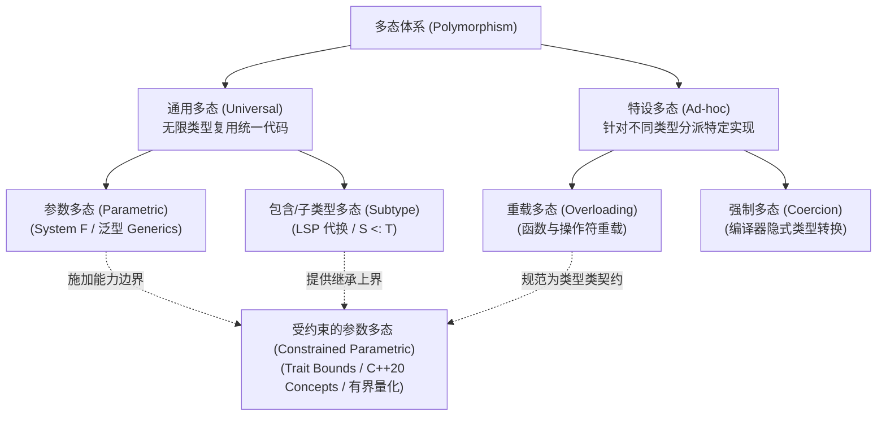
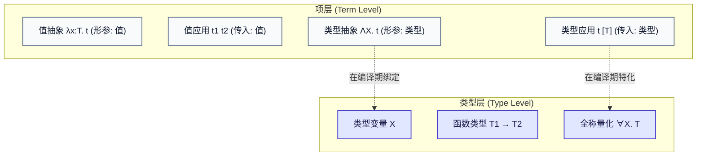
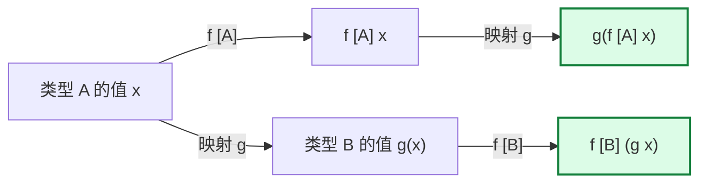
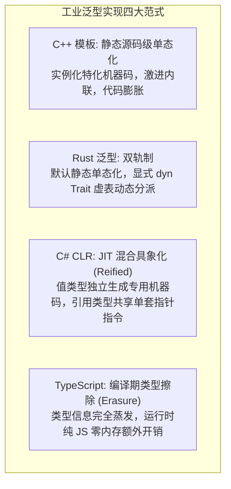

import SystemFPolymorphismDiagram from "../../../components/diagrams/SystemFPolymorphismDiagram";

在简单类型 $\lambda$ 演算（STLC）中，我们通过给每个形参标上静态类型，达成了“良类型的程序绝不犯傻”的停机安全乌托邦。然而，STLC 的纯净安全伴随着极其沉重的工业代价 —— <strong>代码无法复用与“多态贫血症”</strong>。

如果你在 STLC 中实现一个最简单的恒等函数（Identity），由于每个函数形参的类型必须白纸黑字地固定死，你被迫为每一种类型复制粘贴一份完全一模一样的逻辑代码：

$$
\begin{aligned}
\text{id}_{\text{Bool}} &= \lambda x:\text{Bool}.\, x : \text{Bool} \to \text{Bool} \\
\text{id}_{\text{Nat}} &= \lambda x:\text{Nat}.\, x : \text{Nat} \to \text{Nat} \\
\text{id}_{\text{String}} &= \lambda x:\text{String}.\, x : \text{String} \to \text{String}
\end{aligned}
$$

这三个函数在底层的运算行为上一模一样（输入什么就原样吐出什么），但类型系统却像一道道水泥墙，将它们粗暴地隔绝在互不相通的孤岛里。

为了打破这一僵局，数理逻辑学家让-伊夫·吉拉德（Jean-Yves Girard, 1972）在证明论中，与计算机科学家约翰·雷诺兹（John C. Reynolds, 1974）在多态编程语言研究中，不谋而合地独立发现了<strong>二阶 $\lambda$ 演算（Second-order Lambda Calculus，简称 System F 或 $\lambda 2$）</strong>。

System F 引入了<strong>全称类型量化（Universal Quantification, $\forall X.\, T$）</strong>与<strong>二阶抽象（Type Abstraction, $\Lambda X.\, t$）</strong>，不仅彻底奠定了现代泛型编程（如 Rust、C++ 模板、TypeScript、C# 泛型）的理论基石，更揭示了一个令所有程序员着迷的真理：<strong>仅凭函数的泛型类型签名，无需看任何一行源码，我们就能在数学上“免费”推导出关于该函数的代数等式定理！</strong>

---

## 一、为什么需要泛型：STLC 的多态贫血症

### 1.1 多态的分类学：Cardelli-Wegner 谱系与受约束参数多态

在现代软件工程中，“多态（Polymorphism）”是一个被高频提及的核心词汇。1985 年，类型论大师卢卡·卡德利（Luca Cardelli）与彼得·韦格纳（Peter Wegner）发表了奠基性论文《On Understanding Types, Data Abstraction, and Polymorphism》，首次为计算机科学建立了经典的多态分类谱系：



#### 1. 通用多态（Universal Polymorphism）
通用多态的本质特征是：<strong>同一段代码能够以相同的形式，安全地作用于潜在无限多的具体类型之上。</strong>
- <strong>参数多态（Parametric Polymorphism，即本篇主角 System F）</strong>：<strong>对所有类型一视同仁！</strong>核心算法与具体数据类型彻底解耦，函数完全不关心具体类型的内部构造（如恒等函数 `id = \X. \x:X. x`，在 Rust/C++/C#/TypeScript 中即为泛型函数）；
- <strong>包含多态（Inclusion Polymorphism / 子类型多态 Subtype Polymorphism）</strong>：代码面向抽象基类或形状接口编写，任何具体子类型的实例均可无缝代换（遵循里氏替换原则 LSP，如 `Dog <: Animal`）。

#### 2. 特设多态（Ad-hoc Polymorphism）
特设多态的本质特征是：<strong>同一函数名称在不同类型下执行截然不同的物理逻辑，仅对有限且显式声明的离散类型集合生效。</strong>
- <strong>重载多态（Overloading）</strong>：允许同名函数根据参数类型分派不同的物理实现（如 `+` 运算符在整数上执行 CPU 加法指令，在字符串上执行堆内存拼接）；
- <strong>强制多态（Coercion Polymorphism）</strong>：由编译器在调用点隐式插入类型转换逻辑（例如把整型 `int` 隐式拓宽提升为浮点型 `float`）。

#### 3. 终极集大成者：受约束的参数多态（Constrained Parametric Polymorphism）
纯粹的参数多态虽然极具通用性，但存在致命的“贫血症”：因为对类型参数一无所知，函数<strong>不能对泛型对象执行任何具有语义的操作</strong>（甚至连 `x == y` 或 `x < y` 都无法假设）。

为了突破纯参数多态的局限，现代程序语言将<strong>参数多态</strong>与<strong>特设多态/子类型多态</strong>深度融合，诞生了<strong>受约束的参数多态（Constrained Parametric Polymorphism）</strong>，亦称<strong>有界量化（Bounded Quantification）</strong>：
$$
\forall X <: T. \quad \text{或} \quad \forall X : \text{Trait}.
$$
它允许泛型函数在声明类型形参的同时，对其施加明确的能力约束：

| 语言体系 | 受约束参数多态的工程语法 | 核心实现与约束机制 |
| :--- | :--- | :--- |
| <strong>Rust</strong> | `fn sort<T: Ord>(v: &mut [T])` | <strong>Trait Bounds（特质约束）</strong>：基于类型类机制，编译期单态化分派 |
| <strong>C++20</strong> | `template<std::totally_ordered T> void sort(vector<T>& v)` | <strong>Concepts（概念约束）</strong>：编译期谓词检查，不满足约束则 SFINAE 失败 |
| <strong>C#</strong> | `void Sort<T>(List<T> v) where T : IComparable<T>` | <strong>泛型约束（where 子句）</strong>：名义接口约束，JIT 虚拟机分派 |
| <strong>TypeScript</strong> | `function sort<T extends { compare(other: T): number }>(v: T[])` | <strong>有界泛型（Bounded Generics）</strong>：结构形状约束，类型擦除 |

受约束的参数多态兼具了参数多态的通用复用能力与特设/包含多态的操作能力，成为了现代静态类型系统中最强韧的生产力工具。

### 1.2 四大现代语言的多态语法初览

我们在日常开发中写下的泛型，全部是 System F 全称量词的工业语法糖：

```typescript
// TypeScript: <T> 引入类型形参
function id<T>(x: T): T { return x; }
```

```rust
// Rust: 纯参数多态泛型函数
fn id<T>(x: T) -> T { x }
```

```cpp
// C++: 模板参数类型
template<typename T>
T id(T x) { return x; }
```

```csharp
// C#: 泛型方法
T Id<T>(T x) { return x; }
```

---

## 二、语法与形式公理：给类型当参数

在 STLC 中，函数只能接收<strong>普通的值</strong>（Value）作为参数。而在 System F 中，宇宙的规则被提升了一个维度：<strong>类型本身也可以作为参数进行抽象和传递！</strong>

### 2.1 类型层语法：全称量词 $\forall$

System F 在类型层引入了<strong>类型变量（Type Variable, 记作 $X$）</strong>与<strong>全称量化构造器（Universal Quantifier, 记作 $\forall$）</strong>：

$$
T ::= X \mid T_1 \to T_2 \mid \forall X.\, T
$$

- $X$：充当类型形参占位符；
- $\forall X.\, T$：读作“对任意类型 $X$，$T$ 均成立”。例如多态恒等函数的类型签名就是：
  $$
  \text{id} : \forall X.\, X \to X
  $$

### 2.2 项层语法：二阶类型抽象与应用

为了配合类型层的全称量化，项层同步扩充了<strong>二阶类型抽象</strong>与<strong>二阶类型应用</strong>：

$$
t ::= x \mid \lambda x:T.\, t \mid t_1 \; t_2 \mid \Lambda X.\, t \mid t \; [T]
$$

- <strong>一阶小写 $\lambda x:T.\, t$</strong>：接收一个<strong>值参数</strong> $x$；
- <strong>一阶值应用 $t_1 \; t_2$</strong>：把一个<strong>值实参</strong>喂给函数；
- <strong>二阶大写 $\Lambda X.\, t$</strong>：接收一个<strong>类型参数</strong> $X$；
- <strong>二阶类型应用 $t \; [T]$</strong>：用方括号将一个<strong>具体的类型实参</strong>（如 $\text{Bool}$ 或 $\text{Nat}$）代入多态项中。



多态恒等函数在 System F 中的完整定义为：
$$
\text{id} \triangleq \Lambda X.\, \lambda x:X.\, x
$$
外层的 $\Lambda X$ 负责捕获类型，内层的 $\lambda x:X$ 负责捕获具体数值。

---

## 三、两阶段求值模型：编译期特化与运行期流转

System F 的计算过程包含两个清晰解耦的计算阶段：

### 3.1 阶段一：二阶类型 $\beta$-归约（Type Beta-Reduction）

当一个多态项遇到类型实参时，触发类型层替换：

$$
(\Lambda X.\, t) \; [T] \quad \longrightarrow_{\beta_{\text{type}}} \quad [X \mapsto T]t
$$

在这一步中，表达式中所有抽象占位符 $X$ 被彻底替换为具体类型 $T$。外层的大写量词 $\Lambda X$ 随之消解。

### 3.2 阶段二：一阶数值 $\beta$-归约（Value Beta-Reduction）

经过类型替换后，多态项已经蜕变为了一个普通的、带具体类型的常规函数，随后接收数值实参执行正常计算：

$$
(\lambda x:T.\, t) \; v \quad \longrightarrow_{\beta_{\text{val}}} \quad [x \mapsto v]t
$$

### 3.3 形式化求值全景图

我们观察计算 $\text{id} \; [\text{Bool}] \; \text{true}$ 的完整轨迹：

$$
\begin{aligned}
& (\Lambda X.\, \lambda x:X.\, x) \; [\text{Bool}] \; \text{true} \\
\longrightarrow_{\beta_{\text{type}}} & (\lambda x:\text{Bool}.\, x) \; \text{true} \quad (\text{阶段一：类型特化}) \\
\longrightarrow_{\beta_{\text{val}}} & \text{true} \quad (\text{阶段二：数值代入})
\end{aligned}
$$

这揭示了现代所有编译型静态语言的核心架构秘密：<strong>阶段一（类型代换）发生在编译期，编译器在此特化或擦除类型；阶段二（数值流动）发生在运行期，CPU 在此真正执行逻辑代码！</strong>

---

## 四、非直谓性与高阶多态

在集合论中，允许一个集合的定义引用“包含自身在内的全集”往往会导致类似罗素悖论的死锁。但在 System F 中，却包含一个极其大胆而强大的特性 —— <strong>非直谓性（Impredicativity）</strong>。

### 4.1 什么是全称类型的自实例化

在类型应用 $t \; [T]$ 中，注入的类型实参 $T$ 可以是<strong>任意良型类型</strong>，包括<strong>包含全称量词 $\forall$ 自身的类型</strong>！

这意味着：我们可以把多态恒等函数自己的类型 $\forall Y.\, Y \to Y$，作为类型实参喂给它自己：

$$
\text{id} \; [\forall Y.\, Y \to Y] \; \text{id}
$$

追踪其化简过程：
1. 第一步类型应用：形参 $X$ 被替换为函数自身的类型 $\forall Y.\, Y \to Y$；
2. 第二步数值应用：将自身 $\text{id}$ 作为实参传入；
3. 输出结果仍然是 $\text{id}$！

整个过程在数学上完全自洽且类型安全。这种允许类型全称量化涵盖包含自身的宇宙的能力，赋予了 System F 无与伦比的表达深度。

### 4.2 现代工业语言中的高阶多态（Rank-N Types）

在主流编程语言中，泛型通常只能出现在外层函数的最前面（Rank-1 多态）：
```typescript
// Rank-1: 调用者在调用时决定 T 是什么
function run<T>(x: T): T { return x; }
```

但如果你想写一个函数，它的参数要求<strong>必须是一个“能够接受任意类型”的泛型函数</strong>呢？这就是 <strong>Rank-2 多态</strong>：

```typescript
// TypeScript 支持函数参数位置的高阶多态（Rank-2 Types）
function runOnBoth(genericFn: <T>(x: T) => T) {
    const num = genericFn<number>(42);
    const str = genericFn<string>("hello");
    return [num, str];
}

// 传入真正的多态恒等函数
runOnBoth(<T>(x: T) => x); // 完美工作！
```

在 C++ 中，这种高阶泛型能力正是通过<strong>泛型 Lambda（Generic Lambdas，C++14 起支持 `[](auto x)`）</strong>或模板模板参数（Template Template Parameters）来实现的。

---

## 五、纯多态世界的奇迹：丘奇数据结构编码

在 UTLC 中，丘奇编码缺乏类型保护；在 STLC 中，由于缺乏多态，丘奇编码无法通用。
而在 System F 中，展现了数理逻辑最震撼的一幕：<strong>我们甚至不需要任何内置基底类型（不需要 Bool，不需要 Int，不需要 Pair），仅凭 $\forall$ 全称量化，就能凭空定义出类型安全的所有经典数据结构！</strong>

### 5.1 丘奇布尔值（Church Booleans）

布尔类型的本质就是“在任意给定的类型 $X$ 下，接收两个候选分支并选出一个”：

$$
\text{Bool} \triangleq \forall X.\, X \to X \to X
$$

$$
\begin{aligned}
\text{true} &\triangleq \Lambda X.\, \lambda t:X.\, \lambda f:X.\, t \\
\text{false} &\triangleq \Lambda X.\, \lambda t:X.\, \lambda f:X.\, f
\end{aligned}
$$

条件分支选择函数 $\text{cond}$ 就是简单的类型代换与传参：
$$
\text{cond} \triangleq \Lambda X.\, \lambda b:\text{Bool}.\, \lambda t:X.\, \lambda f:X.\, b \; [X] \; t \; f
$$

### 5.2 丘奇自然数（Church Numerals）

自然数 $n$ 的本质是“在任意载体类型 $X$ 上，对初始值连续调用变换函数 $n$ 次”：

$$
\text{Nat} \triangleq \forall X.\, (X \to X) \to X \to X
$$

$$
0 \triangleq \Lambda X.\, \lambda s:(X \to X).\, \lambda z:X.\, z
$$

$$
1 \triangleq \Lambda X.\, \lambda s:(X \to X).\, \lambda z:X.\, s \; z
$$

自然数不再是机器内存中的二进制整数，而是一个<strong>拥有绝对类型安全、自带循环迭代能力的纯函数</strong>。

### 5.3 丘奇二元组（Church Pair）

两个类型 $A$ 与 $B$ 的有序对，被编码为一个<strong>接收访问器函数的高阶多态分发器</strong>：

$$
A \times B \triangleq \forall R.\, (A \to B \to R) \to R
$$

数据不再是一个静态的被动内存结构，而是一个主动等待求值上下文的闭包。在 System F 中，<strong>数据与控制的物理界限被彻底抹平</strong>。

---

## 六、交互探针：二阶两阶段求值与免费定理

通过下方交互图表，你可以直观调试与单步观察 System F 的二阶两阶段归约机制。你可以自由选择预设、动态注入不同的类型实参（包括非直谓的高阶多态类型），并实时观测类型代换与 Reynolds 交换图的成立过程：

<SystemFPolymorphismDiagram client:load />

---

## 七、强规范化定理：泛型代码依然没有死循环

在 STLC 中，强规范化保证了没有死循环。在表达力暴增的 System F 中，由于引入了能够自引用的全称类型变量，死循环会不会卷土重来？

数理逻辑学家让-伊夫·吉拉德在其博士论文中给出了斩钉截铁的回答：

> <strong>定理（Girard 强规范化定理）</strong>：
> 凡是符合 System F 类型系统的良类型泛型程序，<strong>所有可能的归约路径都必然在有限步内停机终止！</strong>

### 超越皮亚诺算术的庞大表达力
STLC 只能表达非常基础的初等算术。而 System F 虽然绝对保证停机，但其能够计算并证明停机的函数集合之庞大，<strong>远远超越了一阶皮亚诺算术（Peano Arithmetic）的表达能力极限</strong>！著名的增长极其恐怖的阿克曼函数（Ackermann Function），在 STLC 中无法定义，但在 System F 中却可以用纯良类型程序完全表达出来。

---

## 八、Reynolds 关系参数化与“免费定理”

参数多态（Parametric Polymorphism）最深邃的哲学在于其“参数性（Parametricity）”：

<strong>一个真正的参数多态泛型函数，在运行时绝对无法探查、分支或嗅探类型变量 $X$ 的具象身份。它对待任何传入的数据，必须绝对一视同仁。</strong>

1989 年，计算机科学家菲利普·瓦德勒（Philip Wadler）发表了一篇极富传奇色彩的论文 —— 《Theorems for Free!》（免费定理）。

其核心思想让无数软件工程师大受震撼：<strong>仅凭一个泛型函数的类型签名，根本无需审阅它的源码实现，我们就能在数学上“免费”推导出关于该函数的代数等式定理！</strong>

### 8.1 案例 1：恒等函数的唯一性

设有一个函数签名：

$$
f : \forall X.\, X \to X
$$

我们能写出几种不同的符合该签名的纯函数实现？
<strong>只有一种！它只能且必须是恒等函数！</strong>

我们来看看为什么：
- 函数 $f$ 接收类型为 $X$ 的参数 $x$；
- 函数的返回值必须是 $X$；
- 但是在泛型函数内部，由于 $X$ 是未知的任意类型，函数<strong>不可能凭空造出一个新的 $X$</strong>（除非外部传入构造器）；
- 函数也不能把数字 42、布尔值 true 硬赋给返回值，因为如果调用者传入的是 `Image`，42 根本不是 `Image`；
- 函数唯一能做的合法操作，就是<strong>原样将输入的 $x$ 返回</strong>！

在数学上，根据关系参数化，对任意映射 $g: A \to B$，下述自然性交换图必然恒成立：

$$
g \circ (f \; [A]) \equiv (f \; [B]) \circ g
$$



### 8.2 案例 2：列表重排与变换的自由交换律

再看列表反转或重排函数：

$$
\text{rev} : \forall X.\, \text{List } X \to \text{List } X
$$

免费定理直接告诉我们一个无需证明的定理：

$$
\text{map } g \circ (\text{rev} \; [A]) \equiv (\text{rev} \; [B]) \circ \text{map } g
$$

<strong>“先反转列表再做元素映射变换，与先做元素映射变换再反转列表，两者的计算结果绝对完全同一！”</strong>
现代现代编译器（如 GHC）正是利用这一免费定理，在中间代码优化期肆无忌惮地进行<strong>循环合并（Loop Fusion）</strong>与数据流管线重排，而完全不用担心改变程序的业务逻辑。

### 8.3 软件工程启示：类型即最强安全契约

在工业级 API 设计中，很多初学者认为“泛型只是为了减少重复代码”。然而，免费定理揭示了更震撼的工程哲理：

> <strong>泛型不仅是为了代码复用，更是对调用方最强有力的防篡改安全承诺！</strong>

- 如果你的函数声明接收具体类型 `fn process(data: UserData)`：调用方时刻提心吊胆，生怕你在函数内部偷偷修改 `UserData` 的内部属性、或者悄悄把数据持久化到本地文件；
- 如果你的函数签名是参数多态的 `fn process<T>(data: T) -> T`：调用方拥有无与伦比的安全感！因为纯泛型剥夺了你窥探与篡改具体属性的一切能力，你在类型系统的铁律下除了原样保护它之外别无选择！

#### 现实的打破：any 与类型反射的破坏
在实际语言中，如果使用了破坏参数性的后门：
- TypeScript 中的 `(x as any)`；
- C# 中的 `x is string` 或反射 `typeof(T)`；
- C++ 中的 `typeid(T)` 或模版偏特化；
这些后门打破了纯参数多态的黑盒假设，使得“免费定理”失效。因此在函数式编程与高安全领域，纯粹的参数多态被视作代码可靠性的终极圣杯。

---

## 九、现代工业语言四大泛型实现范式大对决

System F 是一套纯粹高维的数学演算。但当它降临到物理现实的计算机硬件（CPU、L1/L2 缓存、寄存器、堆栈物理内存）时，每一门语言都面临着致命的物理抉择：<strong>泛型代码的类型信息何时消除？机器指令如何排布？</strong>

现代主流编程语言由此演化出了四大截然不同的工业派系：



### 9.1 四大阵营全景横向评测

| 核心维度 | C++ (Templates) | Rust (Generics) | C# (CLR Reified) | TypeScript (Erasure) |
| :--- | :--- | :--- | :--- | :--- |
| <strong>特化时机</strong> | 编译期前端实例化 | 编译期 LLVM 后端单态化 | JIT 运行时首次加载类时 | 编译后完全擦除（无特化） |
| <strong>物理机器码</strong> | 每个具象类型一份独立二进制代码 | 每个具象类型一份独立二进制代码 | 值类型独立特化；引用类型指针共享 | 全程序共用一套 JavaScript 字节码 |
| <strong>运行时类型保留</strong> | 仅依赖 RTTI（需额外开启开销） | 无（运行时无 T 元数据） | <strong>完整保留</strong>（支持 `typeof(T)`、反射） | <strong>完全无</strong>（运行时无泛型概念） |
| <strong>代码体积 (Code Size)</strong> | 易发生严重<strong>代码膨胀</strong> | 易发生代码膨胀，可用 `dyn` 规避 | 极佳平衡（指针共享避免膨胀） | 最紧凑（无任何额外二进制代码） |
| <strong>执行性能</strong> | 极致（激进内联、零虚表） | 极致（无装箱、数据栈上连续排布） | 极高（值类型无装箱，内存连续） | 依赖 JS 引擎 JIT 优化 |
| <strong>类型检查时机</strong> | 早期延迟至实例化；C++20 Concepts 强化 | <strong>定义处严格 Trait Bound 前置检查</strong> | 编译期与运行时双重验证 | 编译期 `tsc` 检查 |

### 9.2 C++：单态化极限内联与编译报错灾难

C++ 模板本质是<strong>图灵完备的高级 AST 代码生成器</strong>。当你写下 `std::vector<int>` 和 `std::vector<double>` 时，编译器在后台原封不动地把源码复制了两份，并将 `T` 替换为 `int` 与 `double` 分别重新编译！
- <strong>优势</strong>：CPU 缓存友好，能够针对特定类型进行深度的指令级向量化与循环展开；
- <strong>代价</strong>：生成的可执行文件体积急剧膨胀（Code Bloat）；在 C++20 Concepts 诞生前，若类型不满足内部隐式操作，编译器在深层模板实例化时会吐出长达数千行的灾难级报错。

### 9.3 Rust：严格的前置证明与静态/动态双轨制

Rust 继承了 C++ 极致的单态化性能（`fn id<T>(x: T)` 会编译为针对具体类型的专用汇编），但它做出了两大划时代的工程改良：
1. <strong>Trait Bound 前置证明</strong>：与 C++ 模板在被具体调用时才报错不同，Rust 的泛型在函数<strong>定义处</strong>就必须依据声明的 `where T: Clone + Display` 完成数学证明。一旦函数定义通过编译，后续传入任何满足条件的类型都绝对不会报内部语法错误！
2. <strong>显式双轨制</strong>：如果你担心单态化导致二进制文件体积失控，Rust 允许你主动切换为基于虚表（vtable）的<strong>动态分派 `dyn Trait`</strong>（胖指针），用一次微小的虚函数跳转开销换取全程序共用一套代码。

### 9.4 C#：JIT 混合具象化（Reified Generics）的工程奇迹

C# 与 .NET CLR 的泛型实现被誉为虚拟机工业史上的杰作：
- <strong>面对值类型（`int`, `DateTime`, `struct`）</strong>：JIT 编译器采用单态化，为每个不同的值类型生成高度优化的专用机器码，彻底根除了 Java 早期的装箱/拆箱（Boxing/Unboxing）性能损耗，在内存中保持紧凑扁平排布；
- <strong>面对引用类型（`string`, `class`）</strong>：由于所有引用对象在底层本质上都是相同长度的堆指针，CLR 极其聪明地<strong>让所有引用类型的泛型实例共享同一套机器码</strong>！
- <strong>具象化成果</strong>：在 C# 中，泛型在运行时是真实存在的，你可以直接写 `if (typeof(T) == typeof(string))`，也可以写 `new T()`。

### 9.5 TypeScript：纯粹的编译期擦除（Type Erasure）

TypeScript 走向了另一个极端：<strong>它只在编译期充当开发者的思维辅助工具</strong>。
在 `tsc` 完成类型拓扑推导与安全性验证后，所有的 `<T>` 标签、类型参数在输出的 `.js` 文件中被瞬间蒸发殆尽。
- <strong>优势</strong>：零运行时内存负担，零 JIT 预热延迟，生成的代码极其轻盈；
- <strong>代价</strong>：在运行时完全无法获取泛型的真实信息，无法在 JS 运行时通过 `T` 进行类型分派。这完美印证了 System F 的核心预言：<strong>类型只是编译期的脚手架，拆除脚手架后，大厦依然稳固伫立！</strong>

---

## 十、总结：从二阶多态迈向类型论深水区

System F 通过引入二阶全称量化，彻底终结了简单类型系统的贫血困境，建立了从数学理论到工业级泛型实现的宏伟桥梁：

1. <strong>全称抽象</strong>：$\Lambda X.\, t$ 与 $t \; [T]$ 将类型本身提升为可计算、可传递的一等公民；
2. <strong>两阶段求值</strong>：二阶 $\beta$-归约理清了“编译期特化类型”与“运行期流转数据”的时序边界；
3. <strong>免费定理</strong>：参数多态不仅是代码复用工具，更是软件工程中抵御状态篡改、保障行为确定性的最高契约；
4. <strong>工业四范式</strong>：C++ 单态化、Rust 动静双轨、C# JIT 混合具象化与 TypeScript 纯擦除，展现了理论模型在不同物理权衡下的绚丽工程绽放。

在 Barendregt 的 $\lambda$-立方体（Lambda Cube）全景图中，System F 标志着人类从一阶命题逻辑跨入二阶谓词逻辑的伟大飞跃。以此为基点，向上迈进是研究高阶类型构造器的 System $F_\omega$（Monad 与类型级计算），向前跨越则是连接真实世界值的<strong>依值类型论（Dependent Types）</strong>与现代定理证明器（Lean 4 / Coq）的真理殿堂。

---

### 相关延伸阅读

- 探索从命题到程序的逻辑基石，可参阅：[《简单类型 λ 演算（STLC）与 Curry–Howard 同构》](/posts/type-systems/simply-typed-lambda-calculus)；
- 探讨包含多态、型变与 Rust 生命周期协变，可参阅：[《子类型与型变：从包含规则到生命周期协变》](/posts/type-systems/subtyping-and-variance)；
- 探索代数多项式与不动点求值，可参阅：[《代数数据类型（ADT）与递归类型：从类型半环到多项式不动点》](/posts/type-systems/algebraic-data-types-and-recursive-types)。
