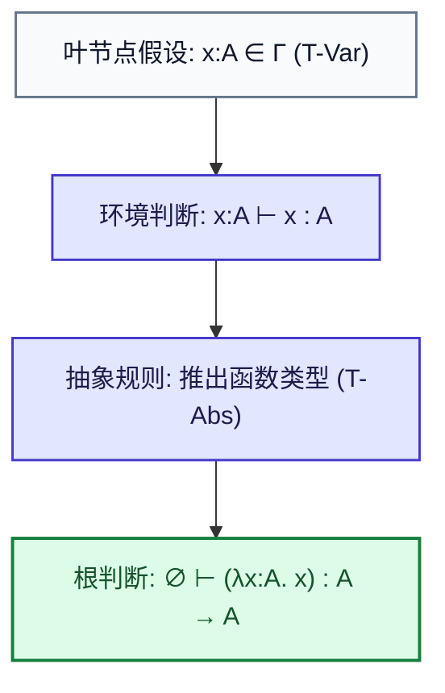
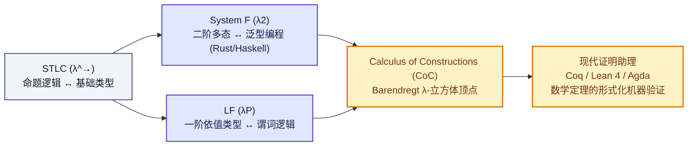

import CurryHowardDiagram from "../../../components/diagrams/CurryHowardDiagram";

在无类型 $\lambda$ 演算（UTLC）的宇宙中，一切既是数据又是函数。这种纯粹的自由赋予了它图灵完备的表达力，但也带来了严峻的混沌：程序可能毫无征兆地陷入死循环（如自复制项 $\Omega = (\lambda x.\, x\, x)(\lambda x.\, x\, x)$），也可能在无意义的荒谬应用中陷入停滞。

为了给这片荒野建立秩序，阿隆佐·邱奇（Alonzo Church）于 1940 年引入了类型概念，诞生了<strong>简单类型 $\lambda$ 演算（Simply Typed Lambda Calculus，简称 STLC 或 $\lambda^\to$）</strong>。

STLC 不仅是现代静态类型编程语言（如 Rust、Haskell、TypeScript、OCaml）类型检查器的理论原点，更是二十世纪数理逻辑中最令人震撼的奇迹 —— <strong>柯里-霍华德同构（Curry–Howard Correspondence / Propositions-as-Types）</strong>的诞生之地。

本文将从 STLC 的形式化语法与打字规则出发，系统推导类型安全（Type Safety）双定理，阐明强规范化（Strong Normalization）的停机保证与哲学代价，并以双重视角深入剖析直觉主义命题逻辑与类型系统之间天衣无缝的对偶宇宙。

---

## 一、语法、类型与打字环境

在 STLC 中，世界被清晰地划分为两层：<strong>项层（Terms）</strong>与<strong>类型层（Types）</strong>。

### 1.1 类型层语法生成式

最基础的 STLC 类型集合 $\mathcal{T}$ 由基底类型与函数类型构造器归纳定义：

$$
T ::= B \mid T_1 \to T_2
$$

- <strong>基底类型（Base Type / Primitive Types，简记 $B$）</strong>：表示不可再分的原子数据类型（例如布尔类型 $\text{Bool}$、自然数类型 $\text{Nat}$ 或单元类型 $\text{Unit}$）；
- <strong>函数类型（Function Type，简记 $T_1 \to T_2$）</strong>：表示接收类型为 $T_1$ 的参数并返回类型为 $T_2$ 的结果的映射。

<strong>结合律约定</strong>：箭头类型构造器 $\to$ 遵循<strong>右结合（Right-Associative）</strong>：

$$
T_1 \to T_2 \to T_3 \equiv T_1 \to (T_2 \to T_3)
$$

这与项层柯里化（Currying）的应用左结合形成了完美的数学镜像：一个接收两个参数的函数，本质上是接收第一个参数并返回一个新函数。

### 1.2 项层语法生成式

STLC 的项集合由带显式类型注解的 $\lambda$ 抽象归纳生成：

$$
t ::= x \mid \lambda x:T_1.\, t_2 \mid t_1 \; t_2
$$

与 UTLC 的唯一本质区别在于：<strong>在函数抽象 $\lambda x:T_1.\, t_2$ 的形参位置，必须显式标注形参所属的类型 $T_1$</strong>（即邱奇风格 Church-Style STLC）。

### 1.3 打字环境与打字判断

一个自由变量（如 $x$）本身不具备固定的类型，它的类型取决于它所处的上下文。为此，我们引入<strong>打字环境（Typing Context / Environment，记作 $\Gamma$）</strong>。

- $\Gamma$ 是一个从变量名到类型的有限偏映射（Partial Map）：
  $$
  \Gamma = x_1:T_1, \, x_2:T_2, \, \dots, \, x_n:T_n
  $$
- 形式化<strong>打字判断（Typing Judgment）</strong>写作：
  $$
  \Gamma \vdash t : T
  $$
  读作：“在打字环境 $\Gamma$ 下，项 $t$ 具备良类型 $T$”。若 $\Gamma = \emptyset$（空环境），则简记为 $\vdash t : T$，称 $t$ 为闭合良类型项。

---

## 二、形式化打字规则与推导树

STLC 的类型检查机制由三条核心归纳推理公理严格定义：

### 2.1 三大核心打字公理

$$
\begin{gathered}
\frac{x:T \in \Gamma}{\Gamma \vdash x : T} \quad (\text{T-Var}) \\[12pt]
\frac{\Gamma, \, x:T_1 \vdash t_2 : T_2}{\Gamma \vdash (\lambda x:T_1.\, t_2) : T_1 \to T_2} \quad (\text{T-Abs}) \\[12pt]
\frac{\Gamma \vdash t_1 : T_{11} \to T_{12} \quad \Gamma \vdash t_2 : T_{11}}{\Gamma \vdash t_1 \; t_2 : T_{12} \quad} \quad (\text{T-App})
\end{gathered}
$$

1. <strong>变量规则（T-Var）</strong>：如果打字环境 $\Gamma$ 已经将变量 $x$ 绑定为类型 $T$，则 $x$ 在该环境下自然具有类型 $T$；
2. <strong>抽象规则（T-Abs）</strong>：若在将形参 $x:T_1$ 扩充进环境的上下文（$\Gamma, x:T_1$）中，函数体 $t_2$ 能够推导出类型 $T_2$，则整个抽象项在原环境 $\Gamma$ 下具有函数类型 $T_1 \to T_2$；
3. <strong>应用规则（T-App）</strong>：若函数项 $t_1$ 具有类型 $T_{11} \to T_{12}$，且实参项 $t_2$ 的类型恰好严格等于参数所期待的 $T_{11}$，则调用结果的类型为返回值类型 $T_{12}$。

### 2.2 打字推导树示例

我们以恒等函数项 $I = \lambda x:A.\, x$ 为例，严格构造其自底向上的<strong>打字推导树（Typing Derivation Tree）</strong>：

$$
\cfrac{\cfrac{x:A \in (x:A)}{x:A \vdash x : A} \; (\text{T-Var})}{\emptyset \vdash (\lambda x:A.\, x) : A \to A} \; (\text{T-Abs})
$$

推导树以无前提的公理为叶，以打字规则为分支，以最终的目标判断为根。<strong>类型检查的本质，就是在语法树上自底向上寻找并验证一棵合法的推导树</strong>。

---

## 三、类型安全：Progress 与 Preservation 双定理

引入类型系统的核心目的是什么？逻辑学家与计算机科学家罗宾·米尔纳（Robin Milner）给出了流传千古的著名格言：

> <strong>“良类型的程序永远不会犯傻（Well-typed programs cannot go wrong）。”</strong>

在现代程序语言理论中，马蒂亚斯·费莱森（Matthias Felleisen）与安德鲁·赖特（Andrew Wright）将其形式化为两大坚不可摧的数学支柱：<strong>前进定理（Progress）</strong>与<strong>保持定理（Preservation）</strong>。

### 3.1 前进定理（Progress Theorem）

前进定理断言：一个封闭且类型正确的程序永远不会“卡死”（Stuck）。它要么已经是一个不可再归约的终极值（Value），要么必然存在合法的下一步归约。

> <strong>定理 1（Progress / 前进定理）</strong>：
>
> 设 $t$ 为闭合项（即 $\emptyset \vdash t : T$），则：
> 1. $t$ 是一个值（在基础 STLC 中，值是抽象项 $\lambda x:T_1.\, t_2$）；
> 2. 或者，存在某项 $t'$，使得 $t \longrightarrow t'$。

#### 归纳证明思路

对打字推导树 $\emptyset \vdash t : T$ 进行结构归纳：
- 若最后一步规则是 $\text{T-Var}$：由于项是闭合项，空环境下不可能存在自由变量，此分支空虚成立；
- 若最后一步规则是 $\text{T-Abs}$：项本身就是抽象项 $\lambda x:T_1.\, t_2$，直接满足“$t$ 是一个值”；
- 若最后一步规则是 $\text{T-App}$（$t = t_1 \; t_2$）：由归纳假设，$t_1$ 要么能步进，要么是值；$t_2$ 同理。若 $t_1$ 能步进，则整体按求值规则步进；若 $t_1$ 是值，由类型签名 $t_1 : T_{11} \to T_{12}$ 及规范型引理（Canonical Forms Lemma），$t_1$ 必然是某种形式的抽象 $\lambda x:T_{11}.\, t_{12}$，此时直接触发 $\beta$-归约 $((\lambda x.\, t_{12}) \; t_2 \longrightarrow [x \mapsto t_2]t_{12})$。因此 $t$ 绝不会卡死。

### 3.2 保持定理（Preservation / Subject Reduction）

保持定理断言：程序的求值步骤绝对不会破坏或篡改原有的类型契约。

> <strong>定理 2（Preservation / 主题归约保持定理）</strong>：
>
> 设 $\Gamma \vdash t : T$。若 $t \longrightarrow t'$，则必有：
> $$
> \Gamma \vdash t' : T
> $$

#### 核心代换引理（Substitution Lemma）

保持定理证明的真正灵魂在于<strong>代换操作与类型系统的相容性</strong>：

> <strong>引理（代换引理）</strong>：
> 若 $\Gamma, \, x:S \vdash t : T$ 且 $\Gamma \vdash s : S$，则：
> $$
> \Gamma \vdash [x \mapsto s]t : T
> $$

代换引理保证了在函数调用发生、实参替换形参的瞬间，生成的新项严格保持原有的输出类型不变。

两相结合，类型安全得到了无懈可击的形式化闭环：<strong>从一个良类型的程序出发，每走一步类型都保持不变（Preservation），并且只要还没算出最终结果就绝不会卡死（Progress），直至求值到合法的值为止</strong>。

---

## 四、强规范化定理与停机性哲学代价

在无类型 $\lambda$ 演算中，我们能够随心所欲地写出自复制项 $\omega = \lambda x.\, x \; x$ 与著名的死循环发散组合子 $\Omega = \omega \; \omega$。

但在 STLC 中，能否写出 $\Omega$ 呢？

### 4.1 类型的自指困境

让我们尝试给自应用项 $\lambda x.\, x \; x$ 赋予一个合法类型：

1. 设形参 $x$ 的类型为 $T_x$；
2. 在函数体中，$x$ 充当了函数，作用于实参 $x$（即应用 $x \; x$）；
3. 根据应用打字规则 $\text{T-App}$，作为函数的 $x$ 其类型必须形如 $T_1 \to T_2$；
4. 同时，作为实参的 $x$ 其类型是 $T_x$；因此必须满足等式：
   $$
   T_x = T_x \to T_2
   $$

在有限树结构的简单类型系统中，<strong>任何类型都不可能严格等于“自身作为参数的函数类型”</strong>（这会导致类型的无穷展开 $T_x = (((\dots \to T_2) \to T_2) \to T_2)$）。因此：

<strong>在 STLC 中，$\omega = \lambda x.\, x \; x$ 根本无法通过类型检查！发散态 $\Omega$ 在语法层面上被直接绞杀。</strong>

### 4.2 强规范化定理（Strong Normalization）

逻辑学家威廉·泰特（William W. Tait）与让-伊夫·吉拉德（Jean-Yves Girard）证明了关于 STLC 的划时代定理：

> <strong>定理 3（Strong Normalization / 强规范化定理）</strong>：
>
> 如果一个项 $t$ 在 STLC 中是良类型的（即存在某 $T$ 使得 $\Gamma \vdash t : T$），那么<strong>关于 $t$ 的所有可能的 $\beta$-归约序列都是有限的</strong>。
>
> 换言之：<strong>STLC 中的每一个良类型程序，都必定在有限步内停机终止，绝不存在任何死循环！</strong>

### 4.3 停机性保证的哲学代价：图灵完备性的丧失

强规范化定理展现了类型系统惊人的纯净性与确定性，但也带来了一个残酷的理论代价：

根据图灵机与停机问题（Halting Problem）的不可判定性：<strong>任何能够保证所有程序均必然停机的编程语言，其表达能力在数学上绝对不可能达到图灵完备（Turing Complete）</strong>。

STLC 为了换取绝对的停机安全，自愿放弃了图灵完备性。

#### 工业语言的妥协：显式递归原语 fix

为了在拥有静态类型的同时重获编写通用递归算法的能力，实际的编程语言通过外生手段引入了<strong>不动点操作符 $\text{fix}$</strong>：

$$
\frac{\Gamma \vdash t : T \to T}{\Gamma \vdash \text{fix} \; t : T} \quad (\text{T-Fix})
$$

其求值规则为 $\text{fix} \; v \longrightarrow v \; (\text{fix} \; v)$。$\text{fix}$ 算子的引入打破了强规范化停机铁律，使得有限类型系统能够表达无限展开，重新挽回了通用编程的生产力。

---

## 五、理论巅峰：Curry–Howard 同构

在 20 世纪中叶，数理逻辑学家哈斯凯尔·柯里（Haskell Curry）与威廉·阿尔文·霍华德（William Alvin Howard）注意到了一个令人震惊的巧合：

<strong>直觉主义命题逻辑（Intuitionistic Propositional Logic, IPL）中自然推导（Natural Deduction）的证明规则，与 STLC 中类型推导与 $\beta$-归约的计算规则，在形式上存在一一对应的完美双射！</strong>

这就是计算科学宇宙中最宏伟的对偶桥梁 —— <strong>柯里-霍华德同构（Curry–Howard Correspondence）</strong>，通常被称为 <strong>“命题即类型，证明即程序（Propositions-as-Types, Proofs-as-Programs）”</strong>。

### 5.1 逻辑与计算的对照字典

| 数理逻辑世界（Intuitionistic Logic） | 编程语言与类型系统（STLC） | 符号对应 |
| :--- | :--- | :--- |
| <strong>命题（Proposition）</strong> $A$ | <strong>类型（Type）</strong> $A$ | $A$ |
| <strong>证明/证据（Proof / Evidence）</strong> | <strong>程序/项（Program / Term）</strong> $t$ | $t : A$ |
| <strong>假说引入（Hypothesis）</strong> $[A]$ | <strong>打字环境变量（Context Var）</strong> $x:A$ | $x \in \Gamma$ |
| <strong>蕴涵（Implication）</strong> $A \implies B$ | <strong>函数类型（Function Type）</strong> $A \to B$ | $A \to B$ |
| <strong>假言推理（Modus Ponens / $\to$-E）</strong> | <strong>函数调用/应用（T-App）</strong> | $t_1 \; t_2$ |
| <strong>假言推导构造（$\to$-I）</strong> | <strong>函数抽象（T-Abs）</strong> | $\lambda x:A.\, t$ |
| <strong>合取（Conjunction）</strong> $A \land B$ | <strong>积类型（Product Type / Pair）</strong> | $A \times B$ |
| <strong>合取消除（$\land$-E）</strong> | <strong>元组解构/投影（fst / snd）</strong> | $\text{fst} \; p, \; \text{snd} \; p$ |
| <strong>析取（Disjunction）</strong> $A \lor B$ | <strong>和类型（Sum Type / Either）</strong> | $A + B$ |
| <strong>析取消除（$\lor$-E）</strong> | <strong>模式匹配（Pattern Matching / case）</strong> | $\text{case } s \text{ of } \dots$ |
| <strong>荒谬/假（Absurdity / Falsehood）</strong> $\bot$ | <strong>空类型（Void / Empty / never）</strong> | $\text{Void}$ |
| <strong>真理（Tautology / Truth）</strong> $\top$ | <strong>单元类型（Unit Type）</strong> | $\text{Unit} \; ()$ |
| <strong>割消除（Cut Elimination）</strong> | <strong>程序计算（$\beta$-Reduction）</strong> | $t \longrightarrow_\beta t'$ |

### 5.2 证明化简即程序求值

在逻辑学中，根岑（Gerhard Gentzen）提出了著名的<strong>割消除定理（Cut Elimination Theorem）</strong>：如果一个证明中包含冗余的“先引入再消除”的弯路（称为 Cut），那么这个证明可以被局部展开并化简为一个“无割正规证明（Cut-Free Proof）”。

而在计算机科学中，如果你构造了一个函数抽象 $\lambda x.\, t$，并立即将它应用于实参 $u$（这恰是一个 $\text{Redex}$），运行时将其代换展开 $(\lambda x.\, t) \; u \longrightarrow [x \mapsto u]t$。

<strong>逻辑学中的证明化简（Proof Normalization），完完全全就是计算机科学中的 $\beta$-归约求值！</strong>

---

## 六、交互探针：Curry–Howard 逻辑与计算对偶镜像

通过下方交互图表，你可以直观对比直觉主义逻辑的<strong>自然推导树（Natural Deduction）</strong>与程序世界的 <strong>STLC 类型派生树（Typing Derivation）</strong>。探针涵盖了 8 组经典定理，支持单步演示假说引入、消除推理与割消除归约的全流程：

<CurryHowardDiagram client:load />

---

## 七、代数数据类型：逻辑联结词在类型论中的全面投影

不仅蕴涵（$\implies$）对应函数，直觉主义逻辑的所有逻辑联结词都在现代编程语言的代数数据类型（Algebraic Data Types, ADT）中拥有最纯正的几何投影。

### 7.1 合取 $A \land B \Longleftrightarrow$ 积类型 $A \times B$

在逻辑上，要证明“$A$ 且 $B$”，你必须同时拿出 $A$ 的证明与 $B$ 的证明。这在计算上恰好是一个<strong>有序对（Pair / 元组）</strong>：

$$
\begin{gathered}
\frac{\Gamma \vdash t_1 : T_1 \quad \Gamma \vdash t_2 : T_2}{\Gamma \vdash (t_1, \, t_2) : T_1 \times T_2} \quad (\text{T-Pair} \iff \land\text{-I}) \\[10pt]
\frac{\Gamma \vdash t : T_1 \times T_2}{\Gamma \vdash \text{fst} \; t : T_1} \quad (\text{T-Fst} \iff \land\text{-E}_1) \qquad
\frac{\Gamma \vdash t : T_1 \times T_2}{\Gamma \vdash \text{snd} \; t : T_2} \quad (\text{T-Snd} \iff \land\text{-E}_2)
\end{gathered}
$$

其局部化简规则（$\beta$-归约）体现了割消除的精髓：

$$
\text{fst} \; (v_1, \, v_2) \longrightarrow_\beta v_1 \qquad \text{snd} \; (v_1, \, v_2) \longrightarrow_\beta v_2
$$

### 7.2 析取 $A \lor B \Longleftrightarrow$ 和类型 $A + B$

在直觉主义逻辑（BHK 释义）中，要证明“$A$ 或 $B$”，你必须明确告知当前给出的是 $A$ 的证据还是 $B$ 的证据。在编程语言中，这就是带标签的<strong>和类型（Sum Type / 标签联合 / Rust 的 `Result<T, E>` 与 `enum`）</strong>：

$$
\begin{gathered}
\frac{\Gamma \vdash t_1 : T_1}{\Gamma \vdash \text{inl} \; t_1 : T_1 + T_2} \quad (\text{T-Inl} \iff \lor\text{-I}_1) \qquad
\frac{\Gamma \vdash t_2 : T_2}{\Gamma \vdash \text{inr} \; t_2 : T_1 + T_2} \quad (\text{T-Inr} \iff \lor\text{-I}_2) \\[12pt]
\frac{\Gamma \vdash t : T_1 + T_2 \quad \Gamma, x_1:T_1 \vdash t_1 : T \quad \Gamma, x_2:T_2 \vdash t_2 : T}{\Gamma \vdash \text{case } t \text{ of inl } x_1 \Rightarrow t_1 \mid \text{inr } x_2 \Rightarrow t_2 : T} \quad (\text{T-Case} \iff \lor\text{-E})
\end{gathered}
$$

析取消除规则 $\lor\text{-E}$ 对应穷尽式<strong>模式匹配（Pattern Matching）</strong>：编译器强迫你同时处理 `inl` 与 `inr` 两种可能性，漏掉任意一种情况就无法闭合推导树。

### 7.3 否定 $\neg A \Longleftrightarrow A \to \text{Void}$ 与矛盾爆炸

在直觉主义逻辑中，否定并非独立的原始符号，而是定义为<strong>引向荒谬的函数</strong>：

$$
\neg A \triangleq A \implies \bot
$$

其中 $\bot$ 对应<strong>空类型 $\text{Void}$</strong>（在 Rust 中为 `!`，在 TypeScript 中为 `never`）。

- 空类型 $\text{Void}$ 的定义特征是：<strong>它没有任何构造子（Constructor）</strong>，即在空上下文下绝对无法造出类型为 $\text{Void}$ 的值；
- <strong>爆炸原理（Principle of Explosion / Ex Falso Quodlibet）</strong>：
  $$
  \bot \implies A
  $$
  在计算中体现为标准消去函数 $\text{absurd}: \text{Void} \to A$。因为参数位置的 $\text{Void}$ 永远无法被构造出来，所以该函数内部永远不会被真正执行，从而能够无条件伪装成任意目标类型 $A$。

### 7.4 直觉主义边界：排中律 LEM 的非构造性困境

经典逻辑中的公理<strong>排中律（Law of Excluded Middle, LEM）</strong>：

$$
\forall A, \; A \lor \neg A
$$

在直觉主义逻辑中被严格剔除。为什么？

从 Curry–Howard 的计算视角审视，如果排中律是一个通用的合法公理，就意味着我们必须为任意未知类型 $A$ 编写一个通用的闭合程序：

$$
\vdash \text{lem} : A + (A \to \text{Void})
$$

要构造一个和类型的值，根据规范型定理，这个函数在运行后必须要么返回 $\text{inl}(a)$（提供一个 $A$ 的具体值），要么返回 $\text{inr}(f)$（提供一个能把任意 $A$ 驳倒转化为荒谬的算法）。

试想：若将命题 $A$ 设为“黎曼猜想”或“P 是否等于 NP”，人类至今未证明也未证伪。<strong>一个纯函数怎么可能在不接受任何外部神谕输入的前提下，凭空算出一个确定性的 `inl` 或 `inr`？</strong>

排中律本质上是<strong>非构造性的（Non-Constructive）</strong>。只有在带有异常跳转或 Continuation 捕获控制操作符（如 Scheme 的 `call/cc`）的语言中，排中律才能通过“时间旅行与状态回溯”被赋予非纯计算意义（即皮尔士定律 Peirce's Law 与经典控制操作符的对偶）。

---

## 八、从 STLC 到现代类型理论的演进

STLC 与 Curry–Howard 同构绝非尘封的象牙塔理论，它们构成了整个现代软件工业工程与形式化验证系统的坚实底座：

1. <strong>工业泛型与二阶多态（System F）</strong>：在 STLC 基础上允许项依赖于类型（$\Lambda X.\, t$），对应全称量词 $\forall X.\, P(X)$，这就是 Rust `fn id<T>(x: T) -> T` 与 TypeScript 泛型的理论发源地；
2. <strong>依值类型（Dependent Types）与形式化证明器</strong>：允许类型依赖于项（如长度为 $n$ 的向量类型 $\text{Vec}(A, n)$），使得类型系统能够表达任意复杂的数学定理与软件规格；现代交互式定理证明器（如 Coq、Lean 4）正是利用 Curry–Howard 同构，将编写软件与验证数学手稿融为一体。

简单类型 $\lambda$ 演算以极其严谨克制的数学语言告诉我们：<strong>编写优雅、类型安全的软件，本质上就是在向宇宙写下一篇无懈可击的逻辑证明。</strong>
