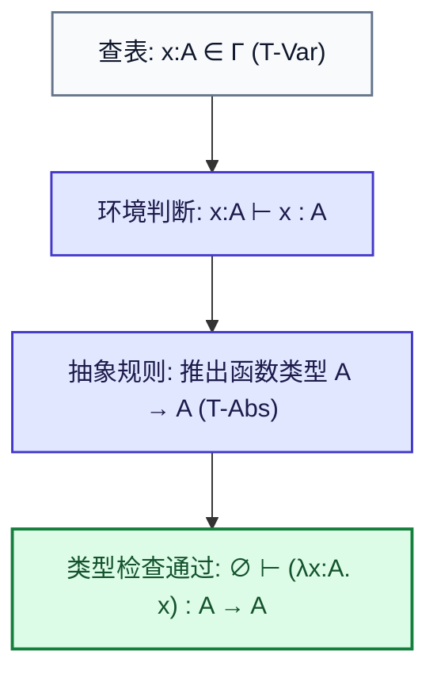
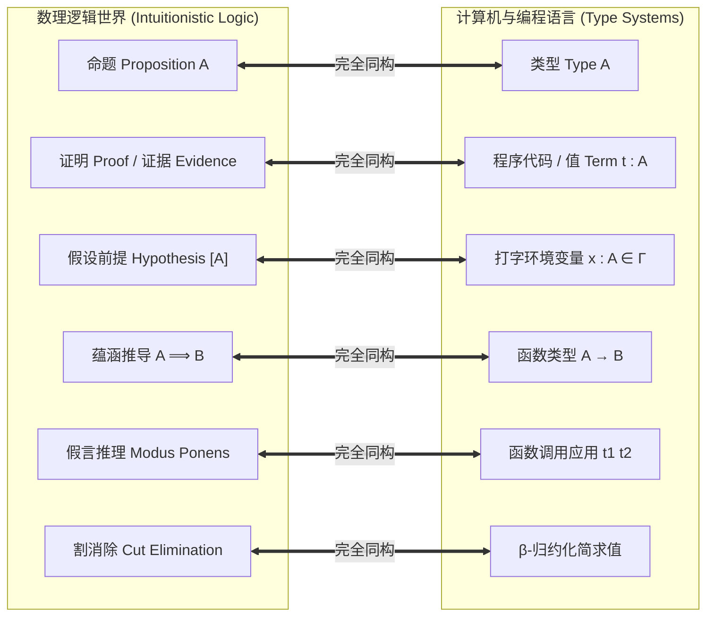
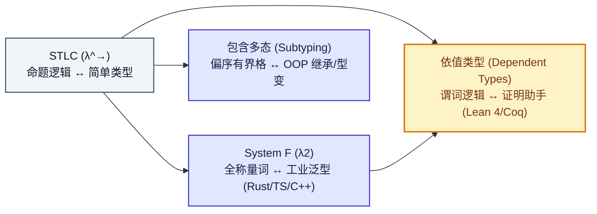

import CurryHowardDiagram from "../../../components/diagrams/CurryHowardDiagram";

在无类型 $\lambda$ 演算（UTLC）的宇宙中，一切既是数据又是函数。这种纯粹的自由赋予了它图灵完备的表达力，但也带来了严峻的混乱：程序可能毫无征兆地陷入死循环（如自复制项 $\Omega = (\lambda x.\, x\, x)(\lambda x.\, x\, x)$），也可能把一个布尔值强行当作加法器调用而陷入崩溃。

为了给这片野性生长的纯函数荒野建立秩序，阿隆佐·邱奇（Alonzo Church）于 1940 年引入了类型概念，诞生了<strong>简单类型 $\lambda$ 演算（Simply Typed Lambda Calculus，简称 STLC 或 $\lambda^\to$）</strong>。

STLC 不仅是现代静态类型编程语言（如 Rust、TypeScript、C++、C#）类型检查器的理论原点，更是二十世纪数理逻辑中最令人震撼的奇迹 —— <strong>柯里-霍华德同构（Curry–Howard Correspondence / Propositions-as-Types）</strong>的诞生之地。

它用极其朴素的规则向世人揭示了一个宏伟的宇宙秘密：<strong>我们在屏幕前编写的每一行类型安全的代码，其本质上都在无意识地向宇宙写下一篇严密的数学逻辑定理证明！</strong>

---

## 一、语法、类型与打字环境：给野性代码套上缰绳

在 STLC 中，世界被清晰地划分为两层：<strong>项层（Terms，运行时的代码与值）</strong>与<strong>类型层（Types，编译期的规格与契约）</strong>。

### 1.1 类型层与项层生成式

最基础的 STLC 类型集合由基底类型与函数类型构造器归纳定义：

$$
T ::= B \mid T_1 \to T_2
$$

- <strong>基底类型（Base Type / Primitive Types，记作 $B$）</strong>：原子数据类型，如 $\text{Bool}$、$\text{Nat}$、$\text{Unit}$；
- <strong>函数类型（Function Type，记作 $T_1 \to T_2$）</strong>：表示接收类型 $T_1$ 的实参并返回类型 $T_2$ 结果的映射。

箭头符号 $\to$ 遵循<strong>右结合（Right-Associative）</strong>：$T_1 \to T_2 \to T_3 \equiv T_1 \to (T_2 \to T_3)$。这与项层柯里化（Currying）的应用左结合形成了完美的数学镜像：一个多参数函数在本质上就是一个接收第一个参数、并返回“接收剩余参数的新函数”的单参函数。

而在项层，语法与 UTLC 几乎完全一致，唯一的区别在于函数抽象处必须显式给形参打上类型烙印：

$$
t ::= x \mid \lambda x:T_1.\, t_2 \mid t_1 \; t_2
$$

### 1.2 打字环境与打字判断

一个单独出现的局部变量（如 $x$）本身是看不出类型的，它的身份取决于定义它时的上下文。为此，类型检查器引入了一个符号表 —— <strong>打字环境（Typing Context / Environment，记作 $\Gamma$）</strong>：

$$
\Gamma = x_1:T_1, \, x_2:T_2, \, \dots, \, x_n:T_n
$$

形式化<strong>打字判断（Typing Judgment）</strong>写作：

$$
\Gamma \vdash t : T
$$

读作：“在环境 $\Gamma$ 的见证下，表达式 $t$ 拥有合法的类型 $T$”。若 $\Gamma = \emptyset$（空环境），则记作 $\vdash t : T$，称 $t$ 为闭合良类型项。

### 1.3 现代语言中的类型标注映射

这套语法在现代四大主流语言中早已深入骨髓：

```typescript
// TypeScript: 形参显式类型注解与箭头返回类型推导
const double = (x: number): number => x * 2;
```

```rust
// Rust: 闭包显式类型注解
let double = |x: i32| -> i32 { x * 2 };
```

```cpp
// C++14: 带后置返回类型的显式 Lambda 签名
auto double_fn = [](int x) -> int { return x * 2; };
```

```csharp
// C#: 显式委托形参
Func<int, int> doubleFn = (int x) => x * 2;
```

---

## 二、形式化打字规则：编译器在背后算什么

当你在 IDE 里敲下一行代码时，TypeScript 编译器 `tsc`、Rust 编译器 `rustc` 或 C++ 编译器到底在算什么？它们在根据以下三条经典的公理规则构建一棵自底向上的<strong>打字推导树（Typing Derivation Tree）</strong>：

$$
\begin{gathered}
\frac{x:T \in \Gamma}{\Gamma \vdash x : T} \quad (\text{T-Var}) \\[12pt]
\frac{\Gamma, \, x:T_1 \vdash t_2 : T_2}{\Gamma \vdash (\lambda x:T_1.\, t_2) : T_1 \to T_2} \quad (\text{T-Abs}) \\[12pt]
\frac{\Gamma \vdash t_1 : T_{11} \to T_{12} \quad \Gamma \vdash t_2 : T_{11}}{\Gamma \vdash t_1 \; t_2 : T_{12} \quad} \quad (\text{T-App})
\end{gathered}
$$

1. <strong>变量规则（T-Var）</strong>：如果上下文字典 $\Gamma$ 里明确记录了 $x$ 是 $T$ 类型，那么提取 $x$ 时的类型就是 $T$；
2. <strong>抽象规则（T-Abs）</strong>：假设形参 $x$ 拥有类型 $T_1$，在此假定下如果能推导证明函数体 $t_2$ 产生类型 $T_2$，那么这个函数整体就拥有类型 $T_1 \to T_2$；
3. <strong>应用规则（T-App）</strong>：如果你手里的函数期待 $T_{11}$ 类型的输入并承诺吐出 $T_{12}$，而你传入的实参恰好也是 $T_{11}$，那么这次调用的结果就是 $T_{12}$。



<strong>所谓的静态编译期类型检查，本质上就是寻找并验证一棵自底向上能够完全闭合的推导树；一旦出现类型不匹配，推导树就会在某一个节点断裂，编译器当即报错退出。</strong>

---

## 三、类型安全：良类型的程序永远不会犯傻

计算机科学家罗宾·米尔纳（Robin Milner）曾留下了一句流传千古的警世名言：

> <strong>“良类型的程序永远不会犯傻（Well-typed programs cannot go wrong）。”</strong>

在程序语言理论中，这句话被严格形式化为两大坚不可摧的数学支柱：<strong>前进定理（Progress）</strong>与<strong>保持定理（Preservation）</strong>。

### 3.1 前进定理（Progress）与现代车祸现场

<strong>前进定理</strong>断言：一个封闭且类型检查通过的程序，在运行中<strong>绝不会陷入“未定义卡死（Stuck）”的状态</strong>。它要么已经计算完毕是一个最终的值（Value），要么必然能够执行合法的下一步归约。

在理想的理论世界中，这意味着运行时绝不可能发生“把整数当作函数指针去跳转”、“访问根本不存在的内存属性”这种惨剧。

然而，在工业界现实中，许多语言为了妥协而牺牲了 Progress 定理，制造了无数的<strong>车祸现场</strong>：

#### TypeScript 的非健全性妥协
TypeScript 的设计目标并不是纯数学意义上的安全，而是对已有庞大 JavaScript 生态的最大兼容。这导致 TypeScript 经常在静态检查通过后，运行时依然惨遭暴击：

```typescript
// 静态编译平静放行，0 错误！
const obj: { name?: string } = {};
const printUpper = (s: string) => s.toUpperCase();

// 使用非空断言 ! 或隐式 undefined 穿透：
printUpper(obj.name!); 
// 运行时惨烈崩溃: TypeError: Cannot read properties of undefined (reading 'toUpperCase')！
```
当运行到这行代码时，CPU 试图在 `undefined` 上寻找属性 `toUpperCase`，操作语义在此处<strong>无路可走彻底卡死（Stuck）</strong>！这就是打破 Progress 定理的现实代价。

#### C++ 的野指针与未定义行为（Undefined Behavior）
C++ 是一门静态类型语言，但它的类型检查允许被暴力击穿：
```cpp
int* p = nullptr;
// 静态类型检查器完全放行：
std::cout << *p << std::endl; 
// 运行时操作系统介入：Segmentation Fault (Core Dumped)！
```
当发生未定义行为或解引用空指针时，硬件层面直接截断进程，程序遭遇非预期的毁灭性卡死。

### 3.2 保持定理（Preservation / Subject Reduction）

<strong>保持定理</strong>断言：无论程序内部经历多少步计算与参数代换，<strong>计算后产生的新表达式其类型绝对不会发生畸变，严格保持与计算前完全一致</strong>：

$$
\Gamma \vdash t : T \quad \land \quad t \longrightarrow t' \implies \Gamma \vdash t' : T
$$

这保证了契约的永恒有效性：如果一个函数声明返回 `User`，无论它内部经历了多么复杂的递归、分支与化简，最终吐出来的那个值必然是一个合法的 `User`，绝不会在半路上变成一个 `int`。

### 3.3 Rust 对类型安全（Type Soundness）的捍卫

作为现代系统级工程的巅峰，<strong>Safe Rust 是极少数在工业级规模上严格捍卫 Progress 与 Preservation 定理的工业语言之一</strong>：
- 没有 `null`：所有可空性必须显式由 `Option<T>` 承载；
- 没有未初始化内存：编译器强制变量在使用前赋值；
- 借用检查器消除野指针：保证引用的目标内存永远存活有效。

在 Safe Rust 中，只要没有调用 `unsafe`，程序哪怕遇到不可挽回的错误（如数组越界），也是触发受控的展开（Panic）或进程退出，而<strong>绝对不会陷入内存踩踏与未定义行为的卡死深渊</strong>。

---

## 四、强规范化定理与停机性的哲学代价

在无类型 $\lambda$ 演算（UTLC）中，我们可以随心所欲地写出死循环自复制项 $\omega = \lambda x.\, x \; x$ 与发散项 $\Omega = \omega \; \omega$。

但是在 STLC 中，能否写出死循环呢？

### 4.1 类型的自指绞杀

让我们尝试给自应用项 $\lambda x.\, x \; x$ 打上类型：
1. 设形参 $x$ 的类型为 $T_x$；
2. 函数体中执行了应用 $x \; x$，意味着左边的 $x$ 是一个函数，作用于右边的实参 $x$；
3. 根据应用规则 $\text{T-App}$，左边 $x$ 的类型必须是一个形如 $T_1 \to T_2$ 的函数类型；
4. 同时，右边传入的实参正是 $x$ 自己（类型为 $T_x$），因此必须满足等式：
   $$
   T_x = T_x \to T_2
   $$

在有限树结构的简单类型系统中，<strong>任何类型都不可能等于“自身作为参数的函数类型”</strong>！因为这会导致无限展开：
$$
T_x = (T_x \to T_2) = ((T_x \to T_2) \to T_2) = \dots
$$
编译器要求类型的 AST 树必须是有限大小的。因此：<strong>自复制项在语法打字阶段被编译器直接就地绞杀，根本无法通过编译！</strong>

### 4.2 强规范化定理：绝对停机的乌托邦

由此，威廉·泰特（William Tait）与吉拉德（Jean-Yves Girard）证明了划时代的<strong>强规范化定理（Strong Normalization）</strong>：

> <strong>定理（Strong Normalization）</strong>：
> 凡是能够通过 STLC 类型检查的程序，<strong>所有可能的求值路径都必然在有限步内停机终止，绝不存在任何死循环！</strong>

每一个合法的 STLC 程序，都必定会平稳算出一个最终结果并安全退出。

### 4.3 戏剧性的哲学反转：图灵完备性的牺牲与类型系统的反噬

然而，天下没有免费的午餐。根据阿兰·图灵的<strong>停机问题（Halting Problem）</strong>证明：
> <strong>任何能够确保所有程序都必然停机的语言系统，其表达力在数学上绝对不可能是图灵完备的（Not Turing Complete）。</strong>

STLC 为了换取绝对的停机安全，付出了放弃图灵完备性的惨重代价：在 STLC 中你甚至无法表达通用的 `while(true)` 或任意深度的递归算法。

#### 运行时反转：主流语言如何挽回图灵完备
为了实际干活，现代工业语言（C++、Rust、C#、TypeScript）主动选择打破 STLC 的停机铁律：
- 显式引入不受限的循环关键字（`while`、`for`）；
- 引入递归函数与显式不动点原语；
- <strong>宁可冒着运行时死循环的风险，也必须换取图灵完备的工程表达力</strong>。

#### 编译期惊人反转：类型系统自身的失控膨胀
更富戏剧性的是：现代语言的语言设计者原本只打算让<strong>运行时代码</strong>拥有图灵完备性，却未曾料到其<strong>编译期类型系统本身，在不经意间也演化成了图灵完备的怪物！</strong>

```typescript
// TypeScript 类型体操的图灵完备死循环：
type InfiniteLoop<T> = InfiniteLoop<T>; // 编译器直接触发保护警报！
// Type instantiation is excessively deep and possibly infinite.(2589)
```

```cpp
// C++ 模板元编程的图灵完备死循环：
template<int N>
struct InfiniteTemplate {
    static constexpr int val = InfiniteTemplate<N + 1>::val;
};
// g++ 编译报错: fatal error: template instantiation depth exceeds maximum of 1024
```

现代编译器（`tsc`、`g++`、`rustc`）不得不在编译期强行内置递归深度保护阈值（如 `-ftemplate-depth=1024` 或 `recursion_limit`），以防止程序员写出的类型元编程代码在编译期直接把编译器本身给跑死机！

---

## 五、理论巅峰：Curry–Howard 同构

在 20 世纪中叶，数理逻辑学家哈斯凯尔·柯里（Haskell Curry）与威廉·霍华德（William Howard）发现了一个震撼数理界的惊人巧合：

<strong>直觉主义逻辑（Intuitionistic Logic）中证明定理的“自然推导规则”，与 STLC 中计算表达式的“打字推导规则”，在数学结构上是完完全全一一对应的同一套系统！</strong>

这就是科学史上最壮丽的交叉之一 —— <strong>柯里-霍华德同构（Curry–Howard Correspondence）</strong>，常被称为 <strong>“命题即类型，证明即程序（Propositions-as-Types, Proofs-as-Programs）”</strong>。



### 5.1 证明化简即程序求值

在逻辑学中，根岑（Gerhard Gentzen）提出了著名的<strong>割消除定理（Cut Elimination Theorem）</strong>：如果一个数学证明中包含“绕弯路”的逻辑证明（先构造出蕴涵又立即消除它），那么这个证明可以被局部化简为一个没有冗余的无割证明。

而在计算机科学中：
- 构造蕴涵再消除蕴涵，正好对应于：<strong>先定义一个匿名函数 $(\lambda x.\, t)$，然后立刻把实参 $u$ 喂给它调用！</strong>
- 执行这个函数调用、将参数代入求值的过程（即 $\beta$-归约），<strong>完完全全就是在执行逻辑学中的割消除化简！</strong>

<strong>你每一次在计算机中运行程序、化简表达式，其在逻辑宇宙中都在为一篇数学论文进行证明化简！</strong>

---

## 六、交互探针：Curry–Howard 逻辑与计算对偶镜像

通过下方交互图表，你可以直观对比直觉主义逻辑的<strong>自然推导树（Natural Deduction）</strong>与程序世界的 <strong>STLC 类型派生树（Typing Derivation）</strong>。探针涵盖了 8 组经典定理，支持单步演示假说引入、消除推理与割消除归约的全流程：

<CurryHowardDiagram client:load />

---

## 七、代数数据类型：逻辑联结词在现代工程中的投影

Curry–Howard 同构并不局限于“函数对应蕴涵”。数理逻辑中的“且”、“或”、“非”、“假”，全部在现代编程语言的核心语法中找到了不可思议的对应。

### 7.1 合取（且）$A \land B \Longleftrightarrow$ 积类型（元组与结构体）

在逻辑中，要证明“$A$ 且 $B$”成立，你必须拿出 $A$ 的证据<strong>并且</strong>拿出 $B$ 的证据。
在编程中，要构造一个类型，既要包含 $A$ 的数据又要包含 $B$ 的数据，这就是<strong>积类型（Product Type，即元组 Tuple 或结构体 Struct）</strong>：

```rust
// Rust: 元组与结构体就是逻辑上的“合取 (AND)”
struct ProofOfAAndB {
    evidence_a: A,
    evidence_b: B,
}
```

从命题 $A \land B$ 推出命题 $A$（逻辑合取消除），在程序里正是元组的解构或属性读取：`pair.0` 或 `pair.evidence_a`。

### 7.2 析取（或）$A \lor B \Longleftrightarrow$ 和类型与模式匹配穷尽性检查

在逻辑中，要证明“$A$ 或 $B$”成立，你必须明确给出 $A$ 的证据（左注入 $\text{inl}$），或者给出 $B$ 的证据（右注入 $\text{inr}$）。
在编程语言中，这就是带标签的<strong>和类型（Sum Type / 标签联合 Tagged Union）</strong>：

```rust
// Rust: enum 就是逻辑上的“析取 (OR)”
enum Either<A, B> {
    Left(A),
    Right(B),
}
```

```cpp
// C++17: std::variant 表达和类型
std::variant<A, B> either;
```

```typescript
// TypeScript: 可辨识联合类型
type Either = { kind: 'A'; val: A } | { kind: 'B'; val: B };
```

#### 为什么编译器强迫你“模式匹配穷尽（Exhaustiveness Check）”？
在编写 `match` 或 `switch` 时，如果漏掉了一个分支，编译器会立刻严厉报错：
- Rust：`error[E0004]: non-exhaustive patterns`；
- TypeScript：通过在 `default` 分支绑定 `never` 触发编译期防御：
  ```typescript
  function handleEither(e: Either) {
      switch (e.kind) {
          case 'A': return "处理 A";
          case 'B': return "处理 B";
          default:
              // 若上方分支有遗漏，此处编译报错！
              const exhaustiveCheck: never = e;
              throw new Error("Unreachable");
      }
  }
  ```
从 Curry–Howard 的视角看：<strong>漏掉一个分支，意味着你在数学上只证明了“当 $A$ 成立时定理成立”，却没有证明“当 $B$ 成立时定理成立”！你的数学推导树在此处根本无法闭合，逻辑是不健全的！</strong>编译器要求穷尽匹配，是在强迫你交出一份滴水不漏的完整证明。

### 7.3 荒谬 $\bot$、空类型与“爆炸原理”

逻辑学中最极端的概念是<strong>荒谬 / 绝对假（Absurdity / Falsehood，记作 $\bot$）</strong>。
在直觉主义逻辑中，否定并非独立的原始概念，而是定义为“能够推导出荒谬”：$\neg A \triangleq A \implies \bot$。

在类型论中，荒谬对应<strong>空类型（Bottom Type / Void / `never` / `!`）</strong>。空类型的定义特征是：<strong>宇宙中不存在任何能够构造出该类型的值！</strong>

#### 爆炸原理（Ex Falso Quodlibet）：为什么 panic!() 能被赋给任意类型？
逻辑学中有一个古老公理：<strong>从荒谬中可以推导出任何事情（$\bot \implies A$）</strong>。

看看这个逻辑公理在现代语言中化身为何种逆天机制：

```rust
// Rust 中 panic!() 返回发散类型 ! (Never)
fn get_user_id() -> u64 {
    let condition = true;
    if condition {
        42
    } else {
        // panic!() 的类型是 !，却可以合法充当返回值 u64！
        panic!("Something went terribly wrong!");
    }
}
```

```typescript
// TypeScript 中 throwError() 返回 never 类型
function throwError(): never {
    throw new Error("Fatal");
}

// 完美通过类型检查！never 是所有类型的子类型！
const myNumber: number = throwError(); 
```

为什么类型检查器会允许将 `panic!()` 赋给 `u64`，允许将 `never` 赋给 `number`？
因为从逻辑上看：既然 `never` 和 `!` 永远不可能产生正常返回的值，那么后续指望消费这个值的任何代码<strong>物理上永远不可能被执行到</strong>！既然绝不会执行，赋予它任何虚妄的期望类型都不会引发内存或语义错误。逻辑学千年前的抽象公理，以如此优雅冷酷的方式捍卫着编译器的类型代数完备性。

### 7.4 直觉主义边界：为什么纯函数无法免费证明“排中律”？

在经典初等逻辑中，大家都熟悉一条金科玉律 —— <strong>排中律（Law of Excluded Middle, LEM）</strong>：
$$
\forall A, \quad A \lor \neg A
$$
意思是：“任何命题，要么是真的，要么是假的，非黑即白。”

然而，在直觉主义逻辑与计算机科学中，<strong>排中律被坚决剔除</strong>！为什么？

从 Curry–Howard 的计算视角看：如果排中律是一个通用的合法定理，意味着我们可以写出一个通用的零参数泛型纯函数：
$$
\text{lem}: \forall A.\, \text{Either}<A, \; A \to \text{Void}>
$$
要让这个函数返回，它必须在编译期要么为你凭空捏出一个 $A$ 的具体实例（证明 $A$ 为真），要么为你凭空捏出一个能把 $A$ 证伪的通用算法（证明 $\neg A$ 为真）。

试想：如果你把命题 $A$ 设为“P 是否等于 NP”或“黎曼猜想是否成立”，人类至今未能证明。<strong>一段纯计算代码，怎么可能在不接入任何超级宇宙神谕机的前提下，凭空算出到底属于哪一个分支？</strong>

排中律本质上是<strong>非构造性的（Non-Constructive）</strong>。纯函数只能承认自己构造出来的证据；对于没有算法证明的未知领域，它绝不会狂妄地掷硬币猜测真假。

---

## 八、从 STLC 到现代类型理论的演进

简单类型 $\lambda$ 演算虽然奠定了类型安全与逻辑同构的基础，但它的表达力依然有限：不支持泛型、不支持动态子类型、无法表达复杂的长度依赖。沿着 STLC 的航道，程序语言理论向现代工业纵深演进出了浩瀚的星系：



1. <strong>参数多态（System F）</strong>：引入类型变量与全称量词 $\forall X$，诞生了现代泛型编程（Rust `Vec<T>`、C++ 模板、TypeScript 泛型函数）；
2. <strong>包含多态与型变（Subtyping & Variance）</strong>：引入 $S <: T$ 与格结构，奠定了面向对象代换、Java PECS 与 Rust 生命周期子类型化（`'a: 'b`）；
3. <strong>依值类型（Dependent Types）与形式化验证</strong>：允许类型依赖于具体的值（如固定长度矩阵 `Matrix<N, M>`），使得软件规格本身可以被编译器作为数学定理进行全自动机器证明（如 Lean 4 与 Coq 定理证明器）。

STLC 告诉我们：<strong>类型并不是束缚程序员手脚的繁文缛节，而是文明对抗程序世界混乱与虚无的第一座灯塔。</strong>

---

### 相关延伸阅读

- 探索泛型全称量词与擦除机制，可参阅：[《参数多态与 System F：从全称量词到泛型全景》](/posts/type-systems/system-f-and-parametric-polymorphism)；
- 探讨包含多态、LSP 与 Rust 生命周期协变，可参阅：[《子类型与型变：从包含规则到生命周期协变》](/posts/type-systems/subtyping-and-variance)；
- 探索集合与等价关系的离散数学基石，可参阅：[《集合论基础：从元素公理、二元关系到商集与划分》](/posts/discrete-math/set-theory-relations-and-partitions)。
