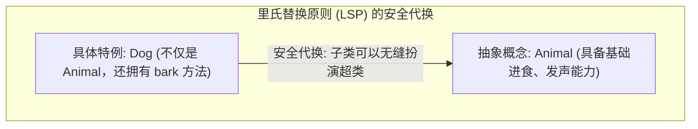
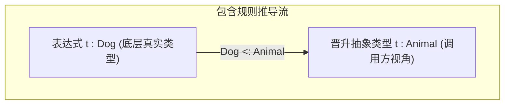
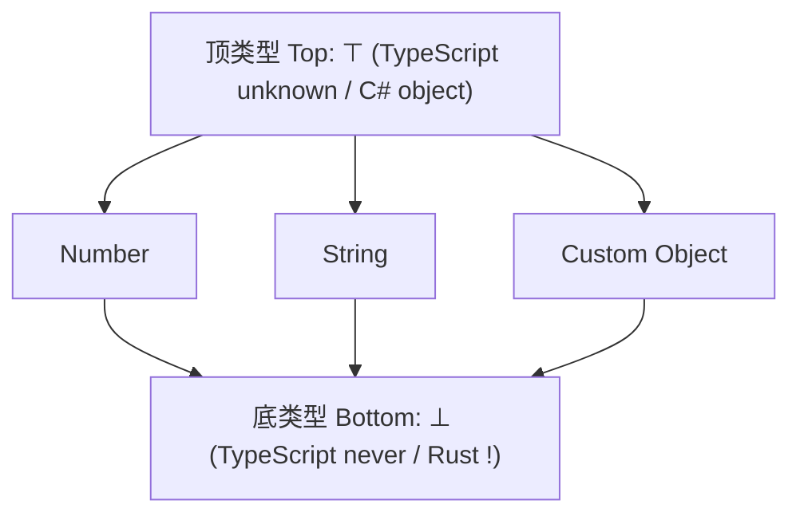
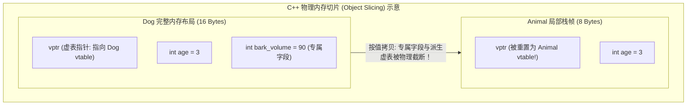
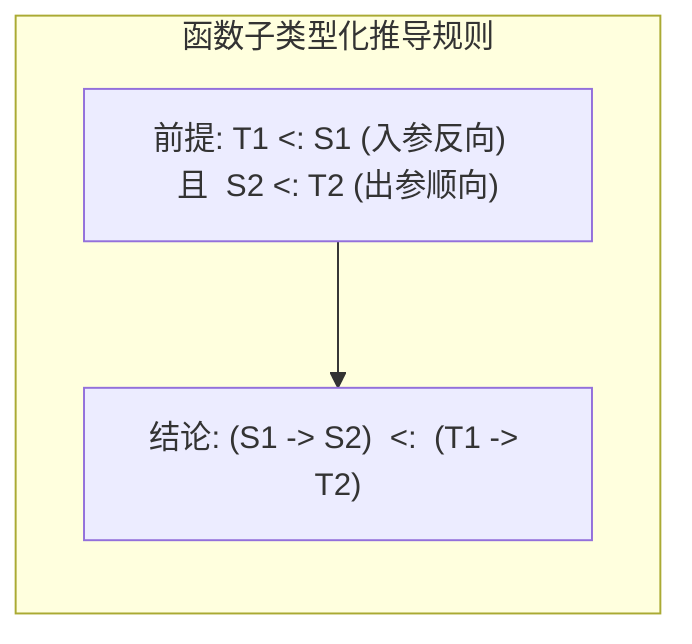
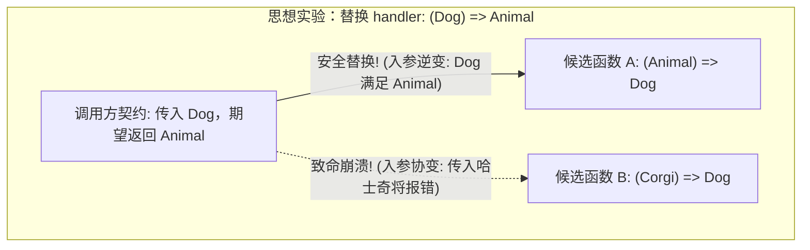
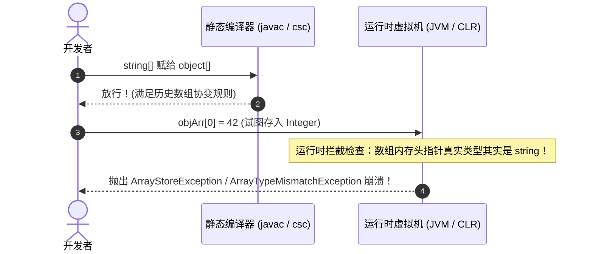
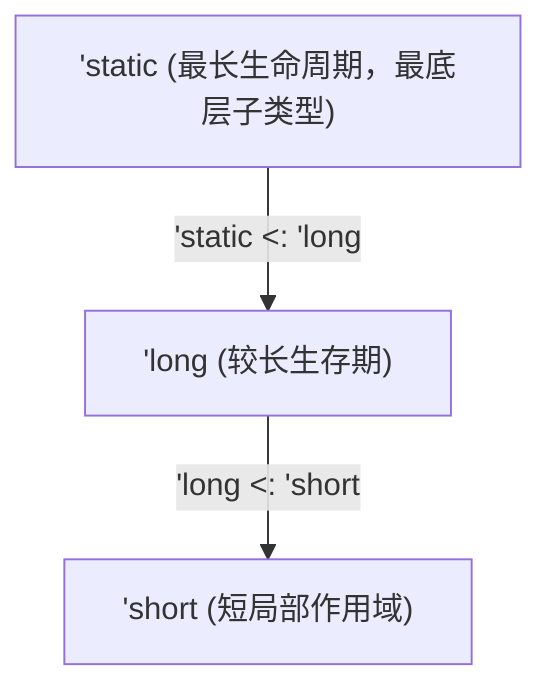
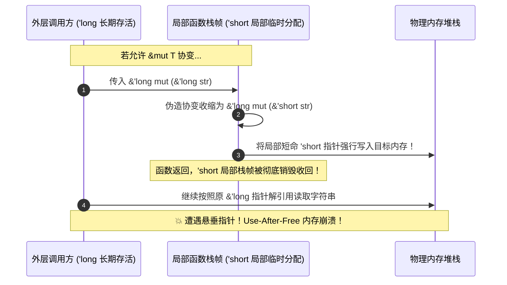

import SubtypingVarianceDiagram from "../../../components/diagrams/SubtypingVarianceDiagram";

在现代编程语言的类型系统中，<strong>多态（Polymorphism）</strong>呈现出三种截然不同的哲学形态：
1. <strong>参数多态（Parametric Polymorphism / System F）</strong>：通过类型参数（如泛型 `T`）实现“对所有类型一视同仁”的通用算法；
2. <strong>特设多态（Ad-hoc Polymorphism）</strong>：通过重载或类型类（Type Classes / Trait）为不同类型分派具体实现；
3. <strong>包含多态（Inclusion Polymorphism / 子类型化 Subtyping）</strong>：允许在期待抽象类型的上下文中，安全接纳更具体、更丰富的实体。

子类型化是面向对象与现代工程框架中最无处不在的机制：它让调用方能够“以少御多”，编写出高度可扩展的代码。然而，当子类型关系跨越复合类型构造器 —— 特别是<strong>函数（Function）</strong>、<strong>可变容器（Mutable Container）</strong>以及<strong>生命周期指针（Rust Lifetime）</strong>时，初学者的直觉往往会轰然倒塌：

- 为什么函数出参可以随子类协变，而入参却必须反转为逆变（Contravariant）？
- 为什么读写兼具的数组绝不能被允许协变？Java 和 C# 早期为什么都犯了同一个被称为“百万美元级别”的数组协变失误？
- C++ 传值时发生的“对象切片（Object Slicing）”如何破坏子类型？智能指针 `std::unique_ptr` 又如何优雅模拟协变？
- Rust 既没有类也没有继承，为什么却拥有世界上最严苛的生命周期子类型化（`'a: 'b`）？如果可变引用 `&mut T` 允许协变，为什么会导致致命的栈逃逸与 Use-After-Free 悬垂指针？

本文将从最直观的集合代换哲学出发，剖析格论骨架，横向穿梭于 <strong>C++、Rust、C# 与 TypeScript</strong> 的真实工业实现，为你揭开型变背后的数学对称与物理内存安全底色。

---

## 一、直觉引入：面向对象与“宽进严出”的代换哲学

在简单类型 $\lambda$ 演算（STLC）中，类型系统具有<strong>绝对刚性</strong>：如果函数签名标注为接收类型 $T$，传入的实参就必须在语法上丝毫不差地等同于 $T$。

然而在真实世界与大型软件建模中，概念天然具备“具体”与“宽泛”的包含层级。

### 1.1 里氏替换原则（LSP）的白话解释

1987 年，图灵奖得主芭芭拉·利斯科夫（Barbara Liskov）在演讲中给出了面向对象历史上最著名的基石准则 —— <strong>里氏替换原则（Liskov Substitution Principle, LSP）</strong>。形式化定义可能拗口，但其工程核心极其朴素：

> <strong>软件调用契约中的“宽进严出”</strong>：如果代码模块期待一份抽象契约（如 `Animal`），任何更具体的特例（如 `Dog`）都必须能够直接顶替上去，并且整个系统的行为不会发生崩溃、非法违约或逻辑失常。



这种代换的基础在于：`Dog` 提供的能力是 `Animal` 的<strong>超集</strong>，它只会满足并超出超类的承诺，绝不削减既有保证。

### 1.2 名义子类型 vs 结构子类型（鸭子类型）

在主流编程语言中，判定“$S$ 是否是 $T$ 的子类型”存在两种分道扬镳的流派：

1. <strong>名义子类型（Nominal Subtyping）—— 认证血统（C++、C#、Java、Rust）</strong>：
   必须显式声明继承或实现关系。即使两个结构体或类的内存布局、字段名称、方法签名百分之百相同，只要没有写出 `class Dog : public Animal` 或 `implements Trait`，编译器就绝不承认它们之间存在子类型关联。
2. <strong>结构子类型（Structural Subtyping）—— 鸭子类型（TypeScript、Go、OCaml）</strong>：
   “如果一只鸟走起来像鸭子、叫起来像鸭子，那它就是鸭子”。TypeScript 不关心类名或血缘，只比较形状（Shape）：

```typescript
interface Point2D {
  x: number;
  y: number;
}

// 没有任何 extends 声明，纯粹字面量对象
const point3D = { x: 10, y: 20, z: 30, color: "red" };

// 编译完全合法！因为 point3D 的结构完全包含了 Point2D 要求的字段
const p: Point2D = point3D;
```

无论名义还是结构，它们的底层数学本质都是相通的：<strong>子类型包含的信息更具体，所施加的约束更严格。</strong>

---

## 二、形式化极简基石：包含规则与类型格

类型理论用数学符号 $<:$ 表达子类型关系。

### 2.1 子类型预序与包含规则（Subsumption）

记号 $S <: T$ 读作“$S$ 是 $T$ 的子类型（Subtype）”，亦即“$T$ 是 $S$ 的超类型（Supertype）”。在类型系统公理中，子类型是一个<strong>预序（Preorder）</strong>，满足：

- <strong>自反性（Reflexivity）</strong>：$S <: S$（任何类型都是自身的子类型）；
- <strong>传递性（Transitivity）</strong>：若 $S <: U$ 且 $U <: T$，则 $S <: T$。

连接子类型与表达式推导的核心桥梁，是著名的<strong>包含规则（The Subsumption Rule）</strong>：

$$
\frac{\Gamma \vdash t : S \quad \vdash S <: T}{\Gamma \vdash t : T} \quad (\text{T-Sub})
$$

包含规则的核心含义在于：如果表达式 $t$ 本身拥有具体类型 $S$，且已知 $S <: T$，那么在当前上下文环境中，表达式 $t$ 可以被安全当作超类型 $T$ 的值使用。



### 2.2 顶类型 Top 与底类型 Bottom：有界格（Bounded Lattice）

若我们在子类型偏序集中引入极值元，整个类型系统便形成了一个优美的<strong>有界格（Bounded Lattice）</strong>：

1. <strong>顶类型（Top Type / $\top$）</strong>：全集的投影，所有类型的终极超类型：
   $$
   \forall T, \quad T <: \top
   $$
   它代表“任何值，但未做任何假设”。在 Java 中对应 `Object`，在 C# 中对应 `object?`，在 TypeScript 中对应 `unknown`。
2. <strong>底类型（Bottom Type / $\bot$）</strong>：空集的投影，所有类型的终极子类型：
   $$
   \forall T, \quad \bot <: T
   $$
   由于空集不存在合法值，它代表“绝不可能正常完成的运算”（如死循环、抛出异常崩溃、程序退出）。在 TypeScript 中对应 `never`，在 Rust 中对应发散类型 `!`。



### 2.3 TypeScript 的反面标本：any 是如何击穿类型格的？

TypeScript 的设计展现了优雅与实用的双重性：
- <strong>`unknown` 是严格健全的顶类型</strong>：你可以把任何东西赋给 `unknown`，但在对它进行 `typeof` 或类型断言收窄前，编译器严禁你调用它的任何属性或方法。
- <strong>`never` 是严格健全的底类型</strong>：用于模式匹配的穷尽性检查（Exhaustiveness Check），如果所有 case 分支被处理完毕，剩余变量的推导类型必为 `never`。
- <strong>`any` 是击穿有界格的“混沌特权”</strong>：为了兼顾遗留 JavaScript 代码，`any` 同时扮演了 $\top$ 和 $\bot$ —— 它既能接纳一切类型，又能被赋值给任何类型。这种“全集与空集重合”的自相矛盾直接废弃了类型系统的数学健全性。

---

## 三、C++ 物理内存视角下的子类型化陷阱

在托管语言（Java、C#、TypeScript）中，对象变量本质上是指向堆内存的一致指针（Uniform Reference）。但 C++ 是一门值语义（Value Semantics）与物理内存布局直接绑定的语言，这里的子类型化隐藏着让无数新手心碎的陷阱。

### 3.1 对象切片（Object Slicing）：值传递如何扼杀多态

在 C++ 中，子类型多态<strong>只能且必须通过指针（`Base*`）或引用（`Base&`）才能存活</strong>。如果尝试按值（By-value）传递，就会触发臭名昭著的<strong>对象切片（Object Slicing）</strong>：

```cpp
class Animal {
public:
    int age;
    virtual void speak() { std::cout << "Animal sound\n"; }
};

class Dog : public Animal {
public:
    int bark_volume;
    void speak() override { std::cout << "Woof! Volume: " << bark_volume << "\n"; }
};

void trigger_disaster(Animal a) { // 致命的按值传递！
    a.speak(); // 调用的永远是 Animal::speak()，绝非多态！
}

int main() {
    Dog d;
    d.age = 3;
    d.bark_volume = 90;
    trigger_disaster(d); // Dog 被硬生生截断为 Animal！
}
```



由于 `sizeof(Dog)` 大于 `sizeof(Animal)`，函数形参栈帧只为 `Animal` 预留了固定字节数。拷贝构造函数只能将属于基类的内存拷贝过去，并强行将虚表指针 `vptr` 重置为 `Animal` 的虚表！派生类的所有灵魂字段被生生“切掉”，多态在物理层面彻底湮灭。

### 3.2 虚函数重写的“协变返回类型”（Covariant Return Types）

C++ 允许在虚函数继承中支持一种极为优雅的型变 —— <strong>协变返回类型（Covariant Return Types）</strong>：

```cpp
class Base {
public:
    virtual Base* clone() { return new Base(*this); }
    virtual ~Base() = default;
};

class Derived : public Base {
public:
    // 允许返回派生类更具体的指针 Derived*，而不是必须写 Base*
    Derived* clone() override { return new Derived(*this); }
};
```

在这里，`Derived* <: Base*`，虚函数出参顺应了子类型方向，这是安全的协变。

但请注意：<strong>C++ 绝对不允许虚函数的入参逆变！</strong>
如果派生类尝试将入参签名改为更宽泛的基类指针，C++ 编译器不会将其视为虚函数重写（Override），而是直接认定为<strong>成员函数重载隐藏（Method Hiding）</strong>！在 C++ 虚表机制下，函数入参的逆变无法在单一虚表偏移槽位中无开销分派。

### 3.3 模板不变性与 unique_ptr 的优雅模拟

很多 C++ 开发者曾遭遇过这样的编译器无情驳回：
```cpp
std::vector<Dog*> dogs;
// 编译报错！std::vector<Animal*> 与 std::vector<Dog*> 毫无血缘继承关系！
std::vector<Animal*>& animals = dogs; 
```
C++ 模板类在类型系统上是<strong>严格不变（Strictly Invariant）</strong>的。`std::vector<T>` 对 `T` 绝不发生任何型变。

那智能指针 `std::unique_ptr<Base>` 为什么能够接收 `std::unique_ptr<Derived>` 呢？它并不是依靠子类型化，而是利用了<strong>泛型模板转换构造函数</strong>与 SFINAE/Concepts：

```cpp
template <class T, class Deleter = std::default_delete<T>>
class unique_ptr {
public:
    // 仅当 U* 能够隐式转换为 T* 时，该移动构造函数才被启用
    template <class U, class E>
        requires std::convertible_to<U*, T*>
    unique_ptr(unique_ptr<U, E>&& other) noexcept;
};
```
在库代码层面，C++ 标准库通过重载转换构造函数，用参数多态的受约束移动模拟出了“协变所有权转移”的高级体验。

---

## 四、记录子类型：字段越多，为什么反而是“子类型”？

在掌握函数与容器型变之前，最清晰的直觉训练是<strong>记录类型（Record Types / 结构体）</strong>。

### 4.1 宽度子类型（Width Subtyping）

考虑以下记录签名：

$$
T_1 = \{x: \text{Nat}\}
$$

$$
T_2 = \{x: \text{Nat}, y: \text{Nat}\}
$$

初学者往往下意识认为：$T_2$ 包含两个字段，比 $T_1$ 更多更大，因此 $T_2$ 是不是父类？

<strong>答案恰恰相反：约束越多，实例集合越小，因而它才是子类型！</strong>

$$
\{x: \text{Nat}, y: \text{Nat}\} <: \{x: \text{Nat}\} \quad (\text{Sub-Width})
$$

- 世界上满足“拥有 $x$ 坐标”的对象有无数个（比如一维质点、二维点、三维粒子、带颜色的点）；
- 满足“同时拥有 $x$ 和 $y$ 坐标”的对象，只是上述集合中的一部分。
- 消费者只需要访问字段 $x$。面对一个附带了 $y$ 字段的对象，读取 $x$ 没有任何阻碍。

### 4.2 深度子类型（Depth Subtyping）

如果记录内部的字段类型本身具备子类型关系，记录整体同样顺延下推：

$$
\frac{S_i <: T_i \quad (\forall i)}{\{l_1: S_1, \dots, l_n: S_n\} <: \{l_1: T_1, \dots, l_n: T_n\}} \quad (\text{Sub-Depth})
$$

例如在只读场景下，若 $\text{Dog} <: \text{Animal}$，那么持有成员 `{ pet: Dog }` 的对象自然就是 `{ pet: Animal }` 的子类型。

---

## 五、函数子类型化：反直觉的“入参逆变，出参协变”

如果说记录的子类型化符合朴素集合论，那么<strong>函数类型构造器（$\to$）</strong>的子类型规则，则是每一个软件工程师必须跨越的认知分水岭。

### 5.1 形式化公理与思想实验

函数类型的形式化子类型判定公理如下：

$$
\frac{T_1 <: S_1 \quad S_2 <: T_2}{S_1 \to S_2 <: T_1 \to T_2} \quad (\text{Sub-Arrow})
$$

请仔细观察上式的前提条件：
- <strong>出参（返回值）方向顺向保持</strong>：$S_2 <: T_2$（协变 Covariance）；
- <strong>入参（参数）方向被彻底反转</strong>：$T_1 <: S_1$（逆变 Contravariance）！



让我们通过一个极度具象的工程场景来理解这背后的安全铁律。

假设调用方声明了一个回调函数槽位：
```typescript
let handler: (d: Dog) => Animal;
```
手握这个函数槽位，调用方在未来的业务逻辑中只保证两件事：
1. 它只会向该函数传入 `Dog`（或狗的子类柯基）；
2. 它只需要函数返回一个合法的 `Animal` 供其展示。

现在，我们有两个实现函数候选：
- 候选函数 A：`fnA = (a: Animal): Dog => ...`
- 候选函数 B（危险！）：`fnB = (c: Corgi): Dog => ...`



我们将<strong>候选函数 A</strong>赋给 `handler`：
- 调用方传入一只普通的 `Dog`（甚至哈士奇）；
- 函数 A 的入参是 `Animal`，它能从容处理任何动物。面对一只具体的狗，输入<strong>绝对安全</strong>！
- 函数 A 执行完成，返回了一只纯种 `Dog`；
- 调用方只要一个抽象的 `Animal`。拿到一只狗，输出<strong>绝对安全</strong>！

结论成立：
$$
(\text{Animal} \to \text{Dog}) <: (\text{Dog} \to \text{Animal})
$$

### 5.2 为什么入参不能协变？

如果把<strong>候选函数 B</strong>（期待接收短腿柯基 `Corgi`）强行赋给期待 `Dog` 的槽位：
- 调用方按照契约，兴高采烈地传入了一只拉布拉多（属于 `Dog`，但不是 `Corgi`）；
- 函数 B 内部假设实参必是柯基，直接调用专属方法 `corgi.shortLegsShake()`；
- <strong>运行时灾难立即降临：拉布拉多没有该方法，抛出 `TypeError: undefined is not a function` 或 `NullPointerException`！</strong>

这就是面向对象系统架构中至高无上的准则：<strong>对输入的要求越宽松（逆变），代码兼容能力越强；对输出的承诺越具体（协变），调用方用起来越安全！</strong>

### 5.3 极性符号代数：高阶函数的“负负得正”

在复杂的函数式编程中，高阶函数往往层层嵌套。类型论使用<strong>极性微积分（Polarity Calculus）</strong>，把型变当作代数符号相乘：

- 协变位置赋予正号 $+$；
- 逆变位置赋予负号 $-$；
- 复合嵌套类型的型变等于<strong>从根节点到该叶子节点路径上所有符号的乘积</strong>。

考虑高阶函数类型：
$$
F = (A \to B) \to C
$$
我们来分析类型参数 $A$ 在整体类型 $F$ 中的综合型变：
1. $F$ 的参数是 $(A \to B)$。由于函数入参处于逆变位置，第一层赋予负号：$-_1$；
2. 在该参数内部，$A$ 又是函数 $(A \to B)$ 的入参，第二层再次赋予负号：$-_2$；
3. 符号相乘：
   $$
   \text{Polarity}(A) = (-_1) \times (-_2) = +
   $$

<strong>负负得正！在高阶函数中，作为参数的回调函数的参数，在整体签名中竟然奇迹般地翻转回了协变（Covariant）！</strong>

---

## 六、交互式沙盒：子类型与型变动态探针

为了让包含规则、逆变出入、极性符号代数以及内存安全约束变得触手可及，下方提供了一个动态交互式验证探针。你可以在 7 大经典场景之间自由切换，观察类型检查器的推导轨迹与运行时安全沙盒的推演。

<SubtypingVarianceDiagram client:load />

---

## 七、可变性与型变的历史悲剧：Java 与 C# 数组协变灾难

在编程语言设计史上有过一段惨痛教训：<strong>任何兼具读取与原位写入的可变容器，必须严格保持不变（Invariant）！</strong>

### 7.1 读写双向冲突的数学证明

设某容器类型为 $\text{Box}[T]$，它对外暴露两个基本方法：
1. <strong>读操作（Get）</strong>：$() \to T$。元素作为返回值输出，根据函数出参规则，要求 $T$ 处于<strong>协变（$+$）</strong>位置；
2. <strong>写操作（Set）</strong>：$T \to ()$。元素作为参数输入，根据函数入参规则，要求 $T$ 处于<strong>逆变（$-$）</strong>位置。

如果一个容器既能读、又能写，它若想成为子类型，必须同时满足：
$$
\text{Box}[S] <: \text{Box}[T] \iff (S <: T) \land (T <: S)
$$
根据偏序关系的反对称性（Antisymmetry），唯一解为：
$$
S = T
$$
<strong>定理：可变可读写的容器，在数学上只能是不变的（Invariant）！</strong>

### 7.2 爪哇与微软共同踩坑：数组协变引发运行时崩溃

在 1995 年 Java 诞生和 2000 年 C# 1.0 发布时，两门语言尚未引入泛型机制（Generics）。为了编写出通用的排序算法（如对任意对象数组排序 `Array.Sort(object[])`），两门语言的设计者不约而同地做出了同一个历史性妥协：<strong>强行规定原生数组是协变的！</strong>

$$
S <: T \implies S[] <: T[] \quad (\text{致命历史失误})
$$

这个妥协撕裂了静态类型系统的防线。看下方这段在 Java 和 C# 中完全平行的崩溃代码：

#### Java 阵营代码
```java
String[] strArr = new String[2];
Object[] objArr = strArr; // 静态编译器放行了！(数组协变)

// 向原本是 String 数组的堆空间写入了一个整数 Integer！
objArr[0] = Integer.valueOf(42); // 💥 运行时抛出 ArrayStoreException
```

#### C# 阵营代码
```csharp
string[] strArr = new string[2];
object[] objArr = strArr; // 同样通过编译！

// 试图将整数塞入 string 数组：
objArr[0] = 42; // 💥 运行时抛出 ArrayTypeMismatchException
```



为了防御类型系统被击穿后引发更底层的 C/C++ 内存段错误（若将整数当作指针解引用会导致机器崩溃），JVM 和 CLR 虚拟机不得不为<strong>每一次数组赋值操作</strong>注入额外的运行时类型检查（Array Store Check）！这成为了编程语言历史上因违背型变代数规律而付出惨重运行时代价的经典标本。

---

## 八、现代语言的型变解法：声明点 vs 使用点

为了安全驾驭型变，现代静态类型语言演化出两条截然不同的路线。

### 8.1 Java 的使用点型变：PECS 原则

Java 5 引入泛型后痛定思痛，将泛型类默认定为严格不变：`List<String>` 绝不再是 `List<Object>` 的子类型。但这导致 `printAll(List<Object>)` 无法接收 `List<String>`。

为此，Java 引入了基于通配符（Wildcards）的<strong>使用点型变（Use-site Variance）</strong>，被 Joshua Bloch 提炼为著名的 <strong>PECS 原则</strong>：

> <strong>PECS: Producer Extends, Consumer Super</strong>

1. <strong>`List<? extends T>`（Producer Extends，协变只读）</strong>：
   用于只从集合中读数据的生产者。你可以把 `List<Dog>` 赋给 `List<? extends Animal>`，安全读取 `Animal`，但编译器<strong>严禁向其中写入任何非 null 元素</strong>！
2. <strong>`List<? super T>`（Consumer Super，逆变只写）</strong>：
   用于往集合中写数据的消费者。你可以安全向 `List<? super Dog>` 添加 `Dog`，但读取出来的元素由于信息遗失，只能当作毫无特征的 `Object`。

### 8.2 C# 的声明点型变：in / out 关键字

每次使用泛型都要手写繁杂的 `<? extends ...>` 严重污染了接口代码。C# 4.0 选择了更为清爽的<strong>声明点型变（Declaration-site Variance）</strong>：在定义接口或委托时，直接声明类型参数的极性。

```csharp
// 生产者接口：使用 out 关键字标注协变（只读输出）
public interface IEnumerable<out T> : IEnumerable {
    IEnumerator<T> GetEnumerator();
}

// 消费者委托：使用 in 关键字标注逆变（只写输入）
public delegate void Action<in T>(T obj);
```

有了声明点标注，C# 开发者在编写业务代码时完全无感：`IEnumerable<string>` 能够直接自动赋值给 `IEnumerable<object>`。

#### 为什么 C# 值类型（struct）严禁参与型变？
即使声明了 `out T`，下面的代码在 C# 中依然被编译器坚决驳回：
```csharp
IEnumerable<int> intList = new List<int>();
// 编译报错！无法将 IEnumerable<int> 转换为 IEnumerable<object>
IEnumerable<object> objList = intList; 
```
<strong>物理底层原因</strong>：`int` 是栈上 4 字节的纯粹连续值，而 `object` 是指向堆上托管对象的 8 字节指针。如果允许型变，调用方解引用指针时将直接把数值当内存地址解引用导致程序奔溃！值类型由于缺乏统一的指针表示且涉及装箱（Boxing），绝不能参与托管型变。

### 8.3 TypeScript 的妥协：方法简写双变（Bivariance）

在 TypeScript 中，默认开启 `--strictFunctionTypes` 时，普通的函数指针赋值严格遵守<strong>入参逆变</strong>。但有一个广为人知的例外：<strong>对象字面量与接口中的方法简写（Method Shorthand）依然是双变（Bivariant）的！</strong>

```typescript
interface AnimalComparer {
  // 方法简写：参数保持双变（兼容历史 DOM 事件体系）
  compare(a: Animal): number;
  // 属性箭头函数：严格遵循入参逆变！
  compareStrict: (a: Animal) => number;
}
```
TypeScript 团队为了让现存庞大的前端 DOM 事件库（如向 `addEventListener("click", (e: MouseEvent) => ...)` 传递特化事件）平滑运行，在方法语法上保留了双变豁免权，这是工程实用主义在学术理论面前的典型权衡。

---

## 九、系统级巅峰：Rust 生命周期子类型化与引用安全

现代类型系统的皇冠明珠当属 Rust。Rust 没有类继承，也不依赖垃圾回收（GC），但 Rust 的借用检查器中却驻留着一套纯粹基于物理内存安全的<strong>子类型化系统 —— 生命周期子类型化（Lifetime Subtyping）</strong>。

### 9.1 没有继承的 Rust：'a: 'b 偏序系统

在 Rust 中，生命周期 `'a` 描述了一个引用在物理内存中合法有效的时间作用域。

若生命周期 `'a` <strong>长于或包含（Outlives）</strong>另一个生命周期 `'b`，记作 `'a: 'b`。在子类型语义下：
$$
'a : 'b \implies 'a <: 'b
$$

<strong>“活得越久，在子类型层级中越具体（是子类型）；活得越短，越抽象宽泛。”</strong>
- 如果调用方期望一个只存活在局部代码块 `'short` 的引用，你给它一个活得极长的 `'long` 引用，内存访问绝对安全；
- 其中程序运行期常驻的 `'static` 拥有最长的生存期，因此它是所有生命周期的子类型（Bottom-like）。



### 9.2 共享引用 &'a T 与独占引用 &'a mut T 的型变差异

Rust 编译器内部的型变规则表格，直接构筑了其“无垃圾回收却绝对内存安全”的基石：

| 复合类型表达式 | 对生命周期 `'a` 的型变 | 对泛型参数 `T` 的型变 | 核心内存安全理由 |
| :--- | :--- | :--- | :--- |
| `&'a T`（共享只读引用） | <strong>协变</strong>（`+`） | <strong>协变</strong>（`+`） | 纯只读访问：允许将长引用安全收缩为短作用域借用 |
| `&'a mut T`（独占可变引用） | <strong>协变</strong>（`+`） | <strong>严格不变</strong>（`=`） | 独占写权限：一旦 `T` 允许变动，必发 Use-After-Free 悬垂灾难 |
| `Box<T>` / `Vec<T>` | 无生命周期 | <strong>协变</strong>（`+`） | 拥有独立所有权（Owned），转移时不涉及别名写穿透 |
| `Cell<T>` / `RefCell<T>` | 无生命周期 | <strong>严格不变</strong>（`=`） | 内部可变性（Interior Mutability）：可原位写入，必须不变 |

### 9.3 惊心动魄的安全证明：如果 &mut T 协变会发生什么？

为什么 `&'a mut T` 允许对生存期 `'a` 协变，却必须对指向的目标类型 `T` 严格不变？如果 Rust 放松限制，允许 `&'a mut T` 对 `T` 协变，到底会发生怎样的物理灾难？

让我们通过一段推演代码，直接重现这一灾难反例：

```rust
// 假设 Rust 荒谬地允许 &mut T 对 T 发生协变 (反证推导)：
fn evil_escape<'long, 'short>(
    long_ref: &'long mut &'long str, 
    short_str: &'short str
) where 'long: 'short {
    // 1. 若 &mut T 对 T 协变：
    //    已知 'long <: 'short，故 &'long str <: &'short str
    //    由于协变假设成立，推导出：
    //    &'long mut (&'long str) <: &'long mut (&'short str)
    
    // 2. 于是 long_ref 可以被隐式弱化赋值给局部短类型指针：
    let coerced_ref: &'long mut &'short str = long_ref; // 假想允许！

    // 3. 灾难的一步：通过该指针，将一个局部栈上的短命字符串写入了长命容器！
    *coerced_ref = short_str; 
}
```

审视上述代码在物理内存栈帧上的演变：
1. 外部原有的长指针 `long_ref` 存活于外层作用域（如 `'long`）；
2. 函数内部通过假想的协变转换，将仅分配在当前函数栈帧上的临时局部变量 `short_str` 覆写到了 `long_ref` 指向的堆栈空间；
3. 函数 `evil_escape` 返回，当前局部栈帧被操作系统无情回收或覆写为其他乱码数据；
4. 外部调用方继续沿着原先的 `long_ref` 解引用访问字符串时，<strong>它访问的已是一块被回收的野指针内存 —— 经典的 Use-After-Free（UAF）漏洞瞬间爆发！</strong>



正因如此，Rust 编译器在 `rustc_middle::ty::variance` 源码中，为 `&'a mut T` 的内部类型 `T` 刻下了铁律：<strong>Invariant —— 严禁任何型变！</strong>

### 9.4 进阶实战：标准库 PhantomData 的型变标记魔法

在 Rust 底层库设计中，当我们封装原生裸指针（Raw Pointers）时，型变系统会呈现更有趣的景象：
- `*const T` 在 Rust 内部是<strong>协变（Covariant）</strong>的；
- `*mut T` 在 Rust 内部是<strong>严格不变（Invariant）</strong>的。

如果我们自己实现一个类似 `Vec<T>` 或 `Unique<T>` 的底层内存分配容器，内部通常使用 `NonNull<T>`（基于 `*const T` 实现，协变）。但如果我们的容器未来需要提供就地写入可变引用，如何告诉编译器它的参数必须是不变的呢？

答案就是使用零大小类型 <strong>`PhantomData<T>`</strong>：

```rust
use std::marker::PhantomData;

// 1. 声明自定义结构体对 T 协变（类似只读生成器）
struct CovariantContainer<T> {
    ptr: *const u8,
    _marker: PhantomData<fn() -> T>, // 返回 T：出参位置，协变 (+)
}

// 2. 声明自定义结构体对 T 逆变（类似消费者）
struct ContravariantConsumer<T> {
    _marker: PhantomData<fn(T)>, // 接收 T：入参位置，逆变 (-)
}

// 3. 强制自定义容器对 T 保持严格不变（防御内存别名冲突）
struct InvariantBuffer<T> {
    ptr: *const T,
    _marker: PhantomData<fn(T) -> T>, // 既是入参又是出参：(+ × - = 严格不变)
}
```
通过幽灵标记类型 `PhantomData` 结合函数签名的入出参极性，Rust 允许库设计者精准地向编译器传递类型型变指令，将理论上的极性微积分化作了无运行时开销的代码安全防线。

---

## 十、四大语言型变横向全景对照与全篇总结

下表将 C++、Rust、C# 与 TypeScript 在子类型与型变维度的核心机制进行结构化对照：

| 特性维度 | C++ | Rust | C# | TypeScript |
| :--- | :--- | :--- | :--- | :--- |
| <strong>核心子类型模型</strong> | 名义子类型（面向对象继承） | <strong>无类继承</strong>，纯生命周期子类型 | 名义子类型（类与接口继承） | <strong>结构子类型</strong>（鸭子类型） |
| <strong>物理内存陷阱</strong> | 传值引发<strong>对象切片</strong>（截断派生字段） | 裸指针需显式管理，安全层无切片 | 值类型（struct）严禁型变（装箱限制） | 纯运行时对象指针，无底层切片 |
| <strong>泛型/容器型变</strong> | 模板<strong>严格不变</strong>（通过构造函数重载模拟） | Owned 协变，`&mut` 与内部可变容器<strong>严格不变</strong> | <strong>声明点型变</strong>：`out` 协变，`in` 逆变 | <strong>结构化协变</strong>（字段深度匹配） |
| <strong>历史妥协与漏洞</strong> | 虚函数仅出参协变，入参逆变退化为隐藏 | <strong>零妥协</strong>，通过编译器借用检查严防死守 | 数组历史协变，抛出 `ArrayTypeMismatchException` | 数组协变，方法简写保持<strong>双变</strong>（Bivariant） |
| <strong>函数子类型规则</strong> | 仅指针/`std::function` 符合逆变出参协变 | 函数指针遵循入参逆变出参协变 | 委托 `Action<in T>` 与 `Func<out R>` 声明点型变 | 函数类型参数严格逆变（`--strictFunctionTypes`） |

### 全篇总结

子类型化与型变，绝非浮于表面的面向对象语法糖，而是连接数学抽象、语言健全性与底层物理内存的黄金枢纽：

1. <strong>包含规则与格论</strong>：顶类型 $\top$（`unknown`）与底类型 $\bot$（`never` / `!`）刻画了类型可能性的边界，包含规则提供了安全的向上弱化通道；
2. <strong>函数子类型的反向对称</strong>：$(S_1 \to S_2) <: (T_1 \to T_2)$ 的本质是<strong>宽进严出</strong>，入参逆变捍卫了函数调用的前置条件，极性相乘解释了高阶嵌套的负负得正；
3. <strong>可变性引发的不变性铁律</strong>：Java 与 C# 的数组协变悲剧证明了 —— 任何违背型变数学法则的工程妥协，终将以昂贵的运行时崩溃和性能惩罚作为代价偿还；
4. <strong>物理内存的最后防线</strong>：从 C++ 的对象切片，到 Rust 生命周期子类型化与 `&mut T` 的严格不变性，型变理论最终成为了防范悬垂指针、阻止 Use-After-Free 内存崩溃的坚实护盾。
