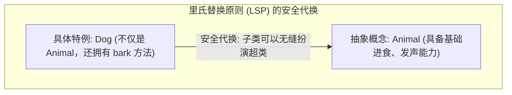
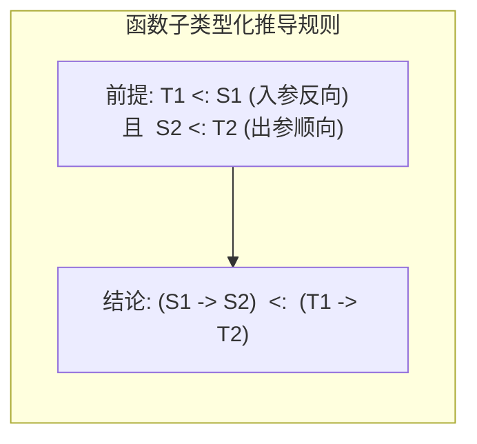
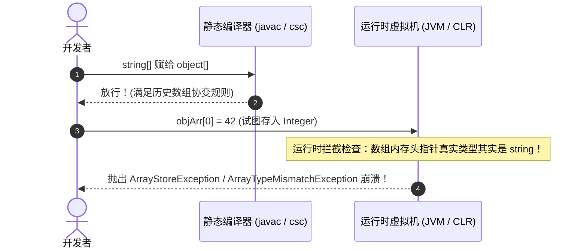

import SubtypingVarianceDiagram from "../../../components/diagrams/SubtypingVarianceDiagram";
import CodePlayground from "../../../components/framework/CodePlayground";

export const subtypingTsFnSnippet = `// TypeScript 函数子类型化：入参逆变与出参协变实战
interface Animal {
  name: string;
  eat(): void;
}

interface Dog extends Animal {
  bark(): void;
}

interface Corgi extends Dog {
  shortLegs: boolean;
}

// 模拟实例构造
const makeAnimal = (name: string): Animal => ({ name, eat: () => console.log(\`\${name} 在进食\`) });
const makeDog = (name: string): Dog => ({ name, eat: () => console.log(\`\${name} 进食\`), bark: () => console.log("汪汪!") });
const makeCorgi = (name: string): Corgi => ({ name, eat: () => console.log(\`\${name} 进食\`), bark: () => console.log("汪汪!"), shortLegs: true });

// 槽位契约：接收 Dog，返回 Animal
type DogHandler = (d: Dog) => Animal;

// 候选函数 1：(a: Animal) => Dog
// 入参 Animal 是 Dog 的超类（逆变安全：能处理所有动物，当然能处理狗）
// 出参 Dog 是 Animal 的子类（协变安全：承诺返回狗，完全满足动物契约）
const safeFn: (a: Animal) => Dog = (a: Animal) => {
  console.log("safeFn 成功处理动物:", a.name);
  return makeDog(\`狗版_\${a.name}\`);
};

// 赋值完全合法：(Animal -> Dog) <: (Dog -> Animal)
const handler: DogHandler = safeFn;

const dog = makeDog("旺财");
const result = handler(dog);
console.log("处理结果动物:", result.name);
result.eat();
`;

export const subtypingRustLifetimeSnippet = `// Rust 生命周期子类型化与协变实战
// 'a: 'b (生命周期 'a 长于 'b，则 'a 是 'b 的子类型：'a <: 'b)

fn choose_longer<'a, 'b: 'c, 'c>(x: &'b str, y: &'c str) -> &'c str {
    if x.len() > y.len() {
        x // &'b str 协变转换为 &'c str 返回！
    } else {
        y
    }
}

fn main() {
    let static_str: &'static str = "全局长寿命字符串 ('static)";
    {
        let local_string = String::from("局部块作用域短寿命字符串 ('local)");
        let local_ref: &str = &local_string;

        // 'static 生命周期远长于局部作用域，发生生命周期协变收窄
        let chosen = choose_longer(static_str, local_ref);
        println!("选出的较长字符串是: {}", chosen);
    }
    println!("主程序安全结束，生命周期严格捍卫内存安全！");
}
`;

在现代编程语言的类型系统中，<strong>多态（Polymorphism）</strong>呈现出三种截然不同的哲学形态：
1. <strong>参数多态（Parametric Polymorphism / System F）</strong>：通过类型参数（如泛型 `T`）实现“对所有类型一视同仁”的通用算法；
2. <strong>特设多态（Ad-hoc Polymorphism）</strong>：通过重载或类型类（Type Classes / Traits）为不同类型分派具体实现；
3. <strong>包含多态（Inclusion Polymorphism / 子类型化 Subtyping）</strong>：允许在期待抽象类型的上下文中，安全接纳更具体、更丰富的实体。

子类型化是面向对象与现代工程框架中最无处不在的机制：它让调用方能够“以少御多”，编写出高度可扩展的代码。然而，当子类型关系跨越复合类型构造器 —— 特别是<strong>函数（Function）</strong>、<strong>可变容器（Mutable Container）</strong>以及<strong>生命周期指针（Rust Lifetime）</strong>时，初学者的直觉往往会轰然倒塌：

- <strong>协变（Covariance）</strong>：为什么只读容器和函数返回值可以顺应子类型方向安全传递？
- <strong>逆变（Contravariance）</strong>：为什么函数入参和事件监听器必须将子类型方向彻底反转？
- <strong>不变（Invariance）</strong>：为什么可读可写的数组绝不能被允许协变？Java 和 C# 早期为什么都犯了同一个被称为“百万美元级别”的数组协变失误？
- <strong>双向协变（Bivariance）</strong>：为什么 TypeScript 故意为对象方法保留了在数学上并不健全的双变特权？
- <strong>生命周期型变</strong>：Rust 既没有类也没有继承，为什么却拥有世界上最严苛的生命周期型变？如果可变引用 `&mut T` 允许协变，为什么会导致致命的栈逃逸与 Use-After-Free 悬垂指针？

本文将从最直观的集合代换哲学出发，剖析型变理论的数学基石与极性代数，并横向穿梭于 <strong>C++、Rust、C# 与 TypeScript</strong> 的真实工业实现，为你彻底解开协变、逆变与不变背后的数学对称与物理内存安全底色。

---

## 一、直觉引入：面向对象与“宽进严出”的代换哲学

在简单类型 $\lambda$ 演算（STLC）中，类型系统具有<strong>绝对刚性</strong>：如果函数签名标注为接收类型 $T$，传入的实参就必须在语法上丝毫不差地等同于 $T$。

然而在真实世界与大型软件建模中，概念天然具备“具体”与“宽泛”的包含层级。

### 1.1 里氏替换原则（LSP）与软件契约

1987 年，图灵奖得主芭芭拉·利斯科夫（Barbara Liskov）在演讲中给出了面向对象历史上最著名的基石准则 —— <strong>里氏替换原则（Liskov Substitution Principle, LSP）</strong>。形式化定义可能拗口，但其工程核心极其朴素：

> <strong>软件调用契约中的“宽进严出”</strong>：如果代码模块期待一份抽象契约（如 `Animal`），任何更具体的特例（如 `Dog`）都必须能够直接顶替上去，并且整个系统的行为不会发生崩溃、非法违约或逻辑失常。



这种代换的基础在于：`Dog` 提供的能力是 `Animal` 的<strong>超集</strong>，它只会满足并超出超类的承诺，绝不削减既有保证。

### 1.2 名义子类型 vs 结构子类型（鸭子类型）

在主流编程语言中，判定“$S$ 是否是 $T$ 的子类型”存在两种分道扬镳的流派：

1. <strong>名义子类型（Nominal Subtyping）—— 认证血统（C++、C#、Java、Rust）</strong>：
   必须显式声明继承或实现关系。即使两个结构体或类的内存布局、字段名称、方法签名百分之百相同，只要没有写出 `class Dog : public Animal` 或 `implements Trait`，编译器就绝不承认它们之间存在子类型关联。
2. <strong>结构子类型（Structural Subtyping）—— 鸭子类型（TypeScript、Go、OCaml）</strong>：
   “如果一只鸟走起来像鸭子、叫起来像鸭子，那它就是鸭子”。TypeScript 不关心类名或血缘，只比较形状（Shape）：

```typescript
interface Point2D {
    x: number;
    y: number;
}

// 没有任何 extends 声明，纯粹字面量对象
const point3D = { x: 10, y: 20, z: 30, color: "red" };

// 编译完全合法！因为 point3D 的结构完全包含了 Point2D 要求的字段
const p: Point2D = point3D;
```

无论名义还是结构，它们的底层数学本质都是相通的：<strong>子类型包含的信息更具体，所施加的约束更严格。</strong>

### 1.3 记录子类型化：宽度子类型（Width）与深度子类型（Depth）

在面向对象与结构化语言中，最普遍的数据载体是<strong>记录类型（Record Types / 结构体与类）</strong>。记录类型上的子类型判定，形式化为两条正交公理：

#### 1. 宽度子类型（Width Subtyping）
<strong>公理</strong>：若记录类型 $S$ 包含了记录类型 $T$ 的所有字段，并且还拥有额外的字段，则 $S$ 是 $T$ 的子类型：
$$
\{ x_1: T_1, \dots, x_n: T_n, x_{n+1}: T_{n+1} \} <: \{ x_1: T_1, \dots, x_n: T_n \} \quad (\text{Sub-Width})
$$

初学者常有一大直觉误区：“字段越多，对象不是‘更大’吗？为什么反而是子类型？”
<strong>破除误区的关键在于外延集合（Extension）</strong>：类型在语义上是<strong>所有满足该形状约束的值的集合</strong>。施加的字段要求越多，能够满足条件的实例反而越少（约束越严，集合越窄）。
例如：
- `{ x: number, y: number }` 代表平面上所有 2D 点；
- `{ x: number, y: number, z: number }` 代表额外要求拥有 $z$ 轴的三维点。
所有三维点在遗忘 $z$ 轴后都可以安全扮演二维点，但二维点绝不能胜任三维点。因此，<strong>字段越宽，类型越窄（$S <: T$）</strong>。
在 C++ 中，单继承的派生类在物理内存布局上直接将自身字段追加在基类字段之后，天然对应了宽度子类型的内存延续。

#### 2. 深度子类型（Depth Subtyping）
<strong>公理</strong>：若记录类型的某个字段本身的类型是超类型对应字段的子类型（在只读/不可变语义下），则整体也是子类型：
$$
\frac{S_i <: T_i}{\{ x_i: S_i \} <: \{ x_i: T_i \}} \quad (\text{Sub-Depth})
$$
例如 `{ pet: Dog } <: { pet: Animal }`。调用方从记录中读取 `pet`，拿到的是更具体的 `Dog`，完全满足对 `Animal` 的期待。<strong>注意</strong>：深度子类型要求该字段在语义上是只读的；一旦字段允许就地写回，为了防止写入其它动物导致类型混淆，深度子类型必须退化为严格不变（参见后文可变容器的读写铁律）。

### 1.4 包含规则、有界格与联合/交叉类型

类型理论用数学符号 $<:$ 表达子类型关系。记号 $S <: T$ 读作“$S$ 是 $T$ 的子类型（Subtype）”，亦即“$T$ 是 $S$ 的超类型（Supertype）”。在类型系统公理中，子类型是一个<strong>预序（Preorder）</strong>，满足自反性与传递性。

连接子类型与表达式推导的核心桥梁，是著名的<strong>包含规则（The Subsumption Rule）</strong>：

$$
\frac{\Gamma \vdash t : S \quad \vdash S <: T}{\Gamma \vdash t : T} \quad (\text{T-Sub})
$$

包含规则的核心含义在于：如果表达式 $t$ 本身拥有具体类型 $S$，且已知 $S <: T$，那么在当前上下文环境中，表达式 $t$ 可以被安全当作超类型 $T$ 的值使用。

若在子类型偏序集中引入极值元，整个类型系统便形成了一个优美的<strong>有界格（Bounded Lattice）</strong>：
1. <strong>顶类型（Top Type / $\top$）</strong>：所有类型的终极超类型（$\forall T, T <: \top$）。代表“任何值，但未做任何操作假设”。在 Java 中对应 `Object`，在 C# 中对应 `object?`，在 TypeScript 中对应 `unknown`；
2. <strong>底类型（Bottom Type / $\bot$）</strong>：所有类型的终极子类型（$\forall T, \bot <: T$）。由于空集不存在合法值，代表“绝不可能正常完成的运算”（如死循环、抛出异常崩溃、程序退出）。在 TypeScript 中对应 `never`，在 Rust 中对应发散类型 `!`。
3. <strong>类型安全逃生门（Any）</strong>：TypeScript 中的 `any` 既是 Top 又是 Bottom，导致静态类型格被短路击穿，属于实用主义工程妥协，在严密类型论中并不健全。

#### 格的二元对偶：联合类型与交叉类型

在有界格中，任意两个类型 $A$ 与 $B$ 均可定义它们的最小上界（Join, $\vee$）与最大下界（Meet, $\wedge$）：

1. <strong>联合类型（Union Type / 最小上界 $A \cup B$）</strong>：
   $$
   A <: A \cup B \quad \text{且} \quad B <: A \cup B
   $$
   只要一个值是 $A$ 或 $B$，它就属于 $A \cup B$。作为消费者，外部调用方只能假定它具备 $A$ 与 $B$ 的<strong>公共交集能力</strong>；若要调用 $A$ 或 $B$ 的专属成员，必须通过模式匹配或类型收窄（Type Narrowing）。在 TypeScript 中记为 `A | B`，在 C++ 中通过 `std::variant<A, B>` 表达。
2. <strong>交叉类型（Intersection Type / 最大下界 $A \cap B$）</strong>：
   $$
   A \cap B <: A \quad \text{且} \quad A \cap B <: B
   $$
   交叉类型的值必须<strong>同时满足</strong> $A$ 与 $B$ 的所有规范。因为施加的约束最多，它的值集合最小，在子类型格中处于两者的下方。正因如此，它兼具 $A$ 与 $B$ 的<strong>全部能力并集</strong>。在 TypeScript 中使用 `A & B` 组合接口与 Mixin；在 C++ 中，多重继承 `class Derived : public A, public B` 在名义类型体系中正是扮演了 $A \cap B$ 的角色。

### 1.5 可空子类型化与“十亿美元级错误”

空值（Null）与子类型化的纠缠，是编程语言演进史上最震撼的一幕。

#### 1. 历史原罪：隐式可空（$\text{null} <: T$）
1965 年图灵奖得主托尼·霍尔（Tony Hoare）在设计 ALGOL W 时引入了 `null` 引用。多年后他公开忏悔道：
> <strong>“我把发明 null 引用称为我价值十亿美元的错误（The Billion-Dollar Mistake）。”</strong>

在传统 Java、早期 C# 与 C/C++ 指针中，`null` 被隐式赋予了所有引用类型的子类型地位：
$$
\forall T_{\text{ref}}, \quad \text{null} <: T_{\text{ref}} \quad (\text{隐式可空公理})
$$
这意味着任何声明为 `Person`、`String` 的变量，其真实值都可能是一个致命的地雷 —— `null`。静态类型检查器对其视而不见，直到运行时触发灾难性的 `NullPointerException`（NPE）或段错误。

#### 2. 现代安全可空子类型体系（$T <: T\ ?$）
现代语言（TypeScript 的 `strictNullChecks`、Kotlin、C# 8+ 可空引用类型）彻底颠覆了旧秩序，将可空性显式纳入类型包含格：

- <strong>非空类型是可空类型的子类型</strong>：
  $$
  T <: T \mid \text{null} \quad (\text{即 } T <: T\ ?)
  $$
- <strong>逆向严格非法</strong>：$T\ ? \not<: T$。如果函数期待非空的 `string`，传入 `string | null` 会在编译期被当场驳回；
- <strong>契约安全</strong>：拥有非空类型 `T` 的值可以安全代换可空类型 `T?`，因为它的非空承诺比可空更加严格；解引用 `T?` 前，必须通过控制流收窄（如 `if (val != null)`）或空安全操作符（`?.`、`??`）将类型显式收窄为 `T`。

```typescript
function printName(name: string) {
    console.log(name.toUpperCase()); // 绝对安全！编译器保证 name 绝不为 null
}

let maybeName: string | null = getOptionalName();
// printName(maybeName); // 💥 编译报错：Type 'null' is not assignable to type 'string'

if (maybeName !== null) {
    printName(maybeName); // ✅ 编译通过！TypeScript 自动将类型收窄为 string
}
```

#### 3. Rust 与现代 C++ 的路线：告别子类型，拥抱 ADT
与将 `null` 融入子类型层次的路线不同，Rust 和现代 C++ 选择了更纯粹的哲学 —— <strong>完全不引入空引用的子类型化</strong>：
- Rust 彻底移除了 `null` 引用，使用和类型（Sum Type）`Option<T>`（`Some(T) | None`）；
- 现代 C++ 引入 `std::optional<T>`。

`Option<T>` 与 `T` 之间没有任何子类型包含关系，开发者必须显式模式匹配或通过单子操作解构。在底层，Rust 编译器运用<strong>空指针优化（Null Pointer Optimization, NPO）</strong>，当检测到内部类型为非空指针（如 `&T` 或 `NonNull<T>`）时，自动利用全 0 位表示 `None`，在完全杜绝空指针异常的同时，实现零内存开销与零运行时惩罚。

---

## 二、型变的三态全景：协变（+）、逆变（-）与不变（*）

当我们将已知的子类型关系 $S <: T$ 放入一个<strong>复合泛型类型构造器 $F$</strong>（例如列表容器 $F[T] = \text{List}[T]$、函数类型 $F[T] = T \to \text{Int}$）中时，复合后的类型之间到底具有怎样的关系？

这就是<strong>型变理论（Variance）</strong>要解答的终极命题。

### 2.1 什么是型变？

型变描述的是：<strong>“类型构造器 $F$ 如何伴随其类型参数的子类型化关系而演进”</strong>。

对于任意类型构造器 $F$ 以及已知子类型关系 $S <: T$，根据 $F[S]$ 与 $F[T]$ 之间的关联，在数学上严格划分为四种形态：

| 型变分类 (Variance) | 极性标记 | 严格形式化定义 | 核心工程角色 | 经典直觉范例 |
| :--- | :---: | :--- | :--- | :--- |
| <strong>协变 (Covariant)</strong> | $+$ | $S <: T \implies F[S] <: F[T]$ | <strong>生产者（Producer）</strong>：只向外界输出数据 | 只读集合 `IEnumerable<out T>`、函数返回值 |
| <strong>逆变 (Contravariant)</strong> | $-$ | $S <: T \implies F[T] <: F[S]$ | <strong>消费者（Consumer）</strong>：只从外界接收数据 | 比较器 `IComparable<in T>`、函数形参 |
| <strong>不变 (Invariant)</strong> | $\star$ | $F[S] <: F[T] \iff S = T$ | <strong>读写双向（Read-Write）</strong>：既输入又输出 | 可读写数组 `T[]`、可变引用 `&mut T` |
| <strong>双变 (Bivariant)</strong> | $\pm$ | $S <: T \implies (F[S] <: F[T]) \land (F[T] <: F[S])$ | 实用主义妥协（极罕见且数学不健全） | TypeScript 对象方法形参（默认历史配置） |

### 2.2 协变（Covariance, +）：顺应方向的生产者

如果子类型的方向在经过类型构造器包装后<strong>保持同向不变</strong>，即为<strong>协变</strong>：
$$
\text{Dog} <: \text{Animal} \implies F[\text{Dog}] <: F[\text{Animal}]
$$
<strong>黄金法则</strong>：<strong>只要泛型容器只作为“数据生产者”（只读出，不写入），它就可以安全地协变！</strong>
例如一个只读列表 `ReadOnlyList<Dog>`。调用方期望从列表中取出一只只 `Animal` 来观察；而列表中存储的全是 `Dog`。每一次取出来的狗都能完美胜任 `Animal` 的一切职责。因此，将 `ReadOnlyList<Dog>` 当作 `ReadOnlyList<Animal>` 使用在类型上是绝对安全的。

### 2.3 逆变（Contravariance, -）：反转方向的消费者

如果子类型的方向在经过类型构造器包装后<strong>被彻底颠倒反转</strong>，即为<strong>逆变</strong>：
$$
\text{Dog} <: \text{Animal} \implies F[\text{Animal}] <: F[\text{Dog}]
$$
初学者往往在此感到无比困惑：为什么包含更少信息的父类，包装后反而成了包含更多信息的子类？

<strong>黄金法则</strong>：<strong>只要泛型容器只作为“数据消费者”（只输入，不输出），它就必须反向逆变！</strong>
考虑一个动物比较器接口 `Comparator<T>`，包含方法 `compare(a: T, b: T): int`。
- 假设我们有一个“通用动物比较器” `animalComp: Comparator<Animal>`，它能比较任何动物的体重；
- 现在，某个算法需要一个“专门比较狗的比较器” `dogComp: Comparator<Dog>`；
- 我们能否把通用比较器 `animalComp` 传给这个算法？
- <strong>完全可以！</strong>算法只会传两只狗给它，而通用比较器连任何动物都能从容比较，比较两只狗自然游刃有余！
- 因此：`Comparator<Animal>` 能够完美顶替 `Comparator<Dog>`！
- 根据 LSP 原则：`Comparator<Animal> <: Comparator<Dog>`！子类型的继承箭头被奇迹般地反转了！

### 2.4 不变（Invariance, *）：双向读写的严苛铁律

如果容器既要允许调用者读取数据，又要允许调用者写入数据，那么它<strong>绝不能发生任何型变</strong>，必须保持严格的不变（Invariant）：
$$
F[S] <: F[T] \iff S = T
$$
如果允许可读写容器协变，调用方就会把装有拉布拉多的狗箱子当作动物箱子，并偷偷往里面塞进一只猫，导致后续原本期望拿到狗的代码在运行时瞬间崩溃。

这就是著名的<strong>只读-写-读写铁律（The Read-Write Law / PECS 根基）</strong>：
> <strong>输出顺向协变，输入逆向逆变，读写兼具严格不变！</strong>

### 2.5 极性代数符号法则（Polarity Multiplication）

在大型系统和高阶函数式编程中，泛型往往层层嵌套。类型论使用<strong>极性微积分（Polarity Calculus）</strong>，把型变当作实数乘法中的代数正负号相乘：
- 协变位置赋予正号 $+$；
- 逆变位置赋予负号 $-$；
- 不变位置赋予标记 $\star$；
- 复合嵌套类型的型变等于<strong>从根节点到该叶子节点路径上所有符号的乘积</strong>。

极性乘法表如下：
$$
(+) \times (+) = +, \quad (+) \times (-) = -, \quad (-) \times (-) = +, \quad (\text{任何极性}) \times \star = \star
$$

考虑高阶函数类型：
$$
F = (A \to B) \to C
$$
我们来分析类型参数 $A$ 在整体类型 $F$ 中的综合型变：
1. $F$ 的参数是 $(A \to B)$。由于函数入参处于逆变位置，第一层赋予负号：$-_1$；
2. 在该参数内部，$A$ 又是函数 $(A \to B)$ 的入参，第二层再次赋予负号：$-_2$；
3. 符号相乘：
   $$
   \text{Polarity}(A) = (-_1) \times (-_2) = +
   $$

<strong>负负得正！在高阶函数中，作为参数的回调函数的参数，在整体签名中竟然奇迹般地翻转回了协变（Covariant）！</strong>

---

## 三、交互式沙盒：协变、逆变与不变时序推演与四大语言矩阵

为了将里氏替换原则、函数入参反转、极性符号代数以及真实语言的物理内存沙盒直观呈现，下方提供了一个动态交互式验证探针。

你可以在四大典型预设（函数子类型、可变数组灾难、Rust 生命周期防线、PECS 准则）之间切换，不仅能单步检验类型替换是否合法，更能直接切入<strong>四大语言型变矩阵全景</strong>，比对 C++、Rust、C# 与 TypeScript 在型变设计上的不同抉择。

<SubtypingVarianceDiagram client:load />

---

## 四、函数子类型化：反直觉的“入参逆变，出参协变”

在掌握了极性代数后，我们可以严格审视计算机科学中最经典的复合构造器 —— <strong>函数类型构造器（$\to$）</strong>。

### 4.1 形式化公理推导与思想实验

函数类型的形式化子类型判定公理如下：

$$
\frac{T_1 <: S_1 \quad S_2 <: T_2}{S_1 \to S_2 <: T_1 \to T_2} \quad (\text{Sub-Arrow})
$$

请仔细观察上式的前提条件：
- <strong>出参（返回值）方向顺向保持</strong>：$S_2 <: T_2$（协变 Covariance）；
- <strong>入参（参数）方向被彻底反转</strong>：$T_1 <: S_1$（逆变 Contravariance）！



让我们通过一个极度具象的工程场景来理解这背后的安全铁律。

假设调用方声明了一个回调函数槽位：
```typescript
let handler: (d: Dog) => Animal;
```
手握这个函数槽位，调用方在未来的业务逻辑中只保证两件事：
1. 它只会向该函数传入 `Dog`（或狗的子类柯基）；
2. 它只需要函数返回一个合法的 `Animal` 供其展示。

现在，我们有两个候选函数：
- <strong>候选函数 A</strong>：`fnA = (a: Animal): Dog => ...`
- <strong>候选函数 B</strong>（危险！）：`fnB = (c: Corgi): Dog => ...`

我们将<strong>候选函数 A</strong>赋给 `handler`：
- 调用方传入一只普通的 `Dog`（甚至哈士奇）；
- 函数 A 的入参是 `Animal`，它能从容处理任何动物。面对一只具体的狗，输入<strong>绝对安全</strong>！
- 函数 A 执行完成，返回了一只纯种 `Dog`；
- 调用方只要一个抽象的 `Animal`。拿到一只狗，输出<strong>绝对安全</strong>！

结论成立：
$$
(\text{Animal} \to \text{Dog}) <: (\text{Dog} \to \text{Animal})
$$

<CodePlayground
  client:visible
  lang="ts"
  title="TypeScript 函数子类型化：入参逆变与出参协变验证"
  description="验证 (Animal -> Dog) <: (Dog -> Animal) 赋值与安全调用"
  initialCode={subtypingTsFnSnippet}
/>

### 4.2 为什么入参不能协变？

如果把<strong>候选函数 B</strong>（期待接收短腿柯基 `Corgi`）强行赋给期待 `Dog` 的槽位：
- 调用方按照契约，兴高采烈地传入了一只拉布拉多（属于 `Dog`，但不是 `Corgi`）；
- 函数 B 内部假设实参必是柯基，直接调用专属方法 `corgi.shortLegsShake()`；
- <strong>运行时灾难立即降临：拉布拉多没有该方法，抛出 `TypeError: undefined is not a function` 或段错误崩溃！</strong>

这就是面向对象系统架构中至高无上的准则：<strong>对输入的要求越宽松（逆变），代码兼容能力越强；对输出的承诺越具体（协变），调用方用起来越安全！</strong>

---

## 五、容器可变性悲剧：Java 与 C# 的数组协变原罪

在编程语言设计史上有过一段极其惨痛的教训：<strong>任何兼具读取与原位写入的可变容器，必须严格保持不变（Invariant）！</strong>违背这一规律会导致语言付出长达数十年的惨重代价。

### 5.1 读写双向冲突的数学证明

设某容器类型为 $\text{Box}[T]$，它对外暴露两个基本方法：
1. <strong>读操作（Get）</strong>：$() \to T$。元素作为返回值输出，根据函数出参规则，要求 $T$ 处于<strong>协变（$+$）</strong>位置；
2. <strong>写操作（Set）</strong>：$T \to ()$。元素作为参数输入，根据函数入参规则，要求 $T$ 处于<strong>逆变（$-$）</strong>位置。

如果一个容器既能读、又能写，它若想成为子类型，必须同时满足：
$$
\text{Box}[S] <: \text{Box}[T] \iff (S <: T) \land (T <: S)
$$
根据偏序关系的反对称性（Antisymmetry），唯一解为：
$$
S = T
$$
<strong>定理：可变可读写的容器，在数学上只能是不变的（Invariant）！</strong>

### 5.2 爪哇与微软共同踩坑：原生数组协变引发运行时崩溃

在 1995 年 Java 诞生和 2000 年 C# 1.0 发布时，两门语言尚未引入泛型机制（Generics）。为了编写通用的排序算法（如对任意对象数组排序 `Array.Sort(object[])`），两门语言的设计者不约而同地做出了同一个历史性妥协：<strong>强行规定原生数组是协变的！</strong>

$$
S <: T \implies S[] <: T[] \quad (\text{致命历史失误})
$$

这个妥协撕裂了静态类型系统的防线。看下方这段在 Java 和 C# 中完全平行的崩溃代码：

#### Java 阵营代码
```java
String[] strArr = new String[2];
Object[] objArr = strArr; // 静态编译器放行了！(数组协变)

// 向原本是 String 数组的堆空间写入了一个整数 Integer！
objArr[0] = Integer.valueOf(42); // 💥 运行时抛出 ArrayStoreException
```

#### C# 阵营代码
```csharp
string[] strArr = new string[2];
object[] objArr = strArr; // 同样通过编译！

// 试图将整数塞入 string 数组：
objArr[0] = 42; // 💥 运行时抛出 ArrayTypeMismatchException
```



为了防御类型系统被击穿后引发更底层的 C/C++ 内存段错误（若将整数当作指针解引用会导致机器崩溃），JVM 和 CLR 虚拟机不得不为<strong>每一次数组赋值操作</strong>注入额外的运行时类型检查（Array Store Check）！这成为了编程语言历史上因违背型变代数规律而付出惨重运行时代价的经典标本。

### 5.3 声明点型变 vs 使用点型变（PECS 原则）

为了在泛型时代彻底修复这一漏洞，现代语言衍生出了两条路线：

1. <strong>Java 的使用点型变（Use-site Variance / PECS 原则）</strong>：
   Java 将泛型集合（如 `List<T>`）默认设为严格不变，但允许调用者在消费时使用通配符标注：
   - `List<? extends T>`（Producer Extends）：<strong>协变只读</strong>。只能取元素，编译器禁止向其中写入任何非 null 值；
   - `List<? super T>`（Consumer Super）：<strong>逆变只写</strong>。只能存元素，读取出来的对象全被抹平为 `Object`。
2. <strong>C# 的声明点型变（Declaration-site Variance）</strong>：
   在接口定义处一次性用 `out`（协变）或 `in`（逆变）锁定极性，调用者使用时保持零心智负担。

---

## 六、四大工业语言型变深度剖析与横向对决

### 6.1 C#：优雅的声明点型变与值类型不变性

C# 4.0 引入的声明点型变堪称面向对象工业界的典范设计：

```csharp
// 生产者接口：使用 out 关键字标注协变（只读输出）
public interface IEnumerable<out T> : IEnumerable {
    IEnumerator<T> GetEnumerator();
}

// 消费者委托：使用 in 关键字标注逆变（只写输入）
public delegate void Action<in T>(T obj);
```

有了声明点标注，C# 开发者在编写业务代码时完全自然流畅：`IEnumerable<string>` 能够直接自动赋值给 `IEnumerable<object>`。

#### 为什么 C# 值类型（struct）严禁参与型变？
即使声明了 `out T`，下面的代码在 C# 中依然被编译器坚决驳回：
```csharp
IEnumerable<int> intList = new List<int>();
// 编译报错！无法将 IEnumerable<int> 转换为 IEnumerable<object>
IEnumerable<object> objList = intList; 
```
<strong>物理底层原因</strong>：`int` 是栈上 4 字节的纯粹连续值，而 `object` 是指向堆上托管对象的 8 字节指针。如果允许型变，调用方解引用指针时将直接把数值当内存地址解引用导致程序崩溃！值类型由于缺乏统一的指针表示且涉及装箱（Boxing），绝不能参与托管型变。

### 6.2 TypeScript：实用主义妥协与双向协变历史包袱

在 TypeScript 中，默认开启 `--strictFunctionTypes` 时，普通的函数指针赋值严格遵守<strong>入参逆变</strong>。但有一个广为人知的例外：<strong>对象字面量与接口中的方法简写（Method Shorthand）依然是双变（Bivariant）的！</strong>

```typescript
interface AnimalComparer {
    // 方法简写：参数保持双变（兼容历史 DOM 事件体系）
    compare(a: Animal): number;
    // 属性箭头函数：严格遵循入参逆变！
    compareStrict: (a: Animal) => number;
}
```

TypeScript 团队为了让现存庞大的前端 DOM 事件库（如向 `addEventListener("click", (e: MouseEvent) => ...)` 传递特化事件）平滑运行，在方法语法上保留了双变豁免权，这是工程实用主义在学术理论面前的典型权衡。

### 6.3 Rust：无继承下的终极型变 —— 生命周期与 `&mut T` 严格不变

作为没有传统类继承的现代系统级语言，Rust 却将型变理论应用到了令人叹为观止的极致：<strong>生命周期子类型化（Lifetime Subtyping）</strong>。

#### 1. 生命周期包含关系 `'a: 'b`
在 Rust 中，如果生命周期 `'a` 的存活范围包含了 `'b`（`'a` 比 `'b` 活得更久），则称 `'a` 是 `'b` 的子类型，记作：
$$
'a : 'b \iff 'a <: 'b
$$
因为活得更久的引用，完全能够安全顶替活得更短的引用的所有生命周期承诺！

#### 2. 共享引用 `&'a T` 与独占引用 `&'a mut T` 的型变分野
- <strong>`&'a T`（共享不可变引用）</strong>：对 `'a` 协变，对 `T` 也<strong>协变</strong>！长寿命可以顺应缩短，子类型对象也可以安全读取；
- <strong>`&'a mut T`（独占可变引用）</strong>：对 `'a` 协变，但对 `T` <strong>严格不变（Invariant）！</strong>

<CodePlayground
  client:visible
  lang="rust"
  title="Rust 生命周期子类型化与协变实战"
  description="验证长生命周期 &'static str 向短生命周期 &'a str 的协变收窄与安全调用"
  initialCode={subtypingRustLifetimeSnippet}
/>

#### 3. 惊心动魄的安全证明：如果 `&mut T` 协变会发生什么？
假设 Rust 允许 `&'a mut T` 对 `T` 发生协变，考察下方代码：

```rust
// 🚨 假设编译器允许 &mut T 协变！
fn trigger_use_after_free<'a>(r_longer: &'a mut &'static str) {
    let local_short: String = String::from("dangling local string");
    let short_str: &'a str = &local_short; // 生命周期受限于当前函数栈帧！

    // 💥 假设协变成立：&mut &'static str 可以作为 &mut &'a str 使用！
    // 于是我们将栈上短寿命的 short_str 写入了原本期待 'static 字符串的外层指针！
    *r_longer = short_str; 
} // local_short 在此处被析构释放！堆内存灰飞烟灭！

fn main() {
    let mut global_str: &'static str = "I am immortal";
    trigger_use_after_free(&mut global_str);

    // 💥 灾难降临：global_str 现在指向了一个已经被回收销毁的局部栈内存！
    // 经典的 Use-After-Free 悬垂指针漏洞诞生！
    println!("{}", global_str);
}
```

正因为 Rust 编译器强制规定 `&'a mut T` 对 `T` <strong>绝对不变</strong>，上述代码在编译阶段就会被编译器无情击毙！不变性（Invariance）在 Rust 中成为了守护现代操作系统物理内存安全的定海神针。

#### 4. `PhantomData<T>` 的型变标记魔法
在编写底层 unsafe 代码和自定义智能指针时，Rust 提供了 `PhantomData` 让开发者向编译器显式声明结构体字段的型变属性：
- `PhantomData<T>`：声明拥有所有权，对 `T` <strong>协变</strong>；
- `PhantomData<fn(T)>`：模拟函数入参，对 `T` <strong>逆变</strong>；
- `PhantomData<fn() -> T>`：模拟函数出参，对 `T` <strong>协变</strong>；
- `PhantomData<*mut T>` 或 `PhantomData<Cell<T>>`：模拟可读写裸指针，对 `T` <strong>严格不变</strong>。

### 6.4 C++：物理内存视角 —— 模板不变与虚函数协变

在 C++ 这门紧贴底层物理内存布局的语言中：

1. <strong>对象切片（Object Slicing）</strong>：按值传递子类实例会导致专属派生字段被生生截断，虚表指针被重置，多态彻底丧失。因此子类型化在 C++ 中只能通过指针（`T*`）或引用（`T&`）存活；
2. <strong>虚函数出参协变返回</strong>：派生类重写虚函数时，允许返回更具体的派生类指针（`Derived* clone() override`）；
3. <strong>虚函数入参拒绝逆变</strong>：派生类若改写参数类型，直接被判定为<strong>方法重载隐藏（Method Hiding）</strong>而非虚函数覆盖，因为在 C++ 单一虚表偏移机制下，入参逆变无法在零开销汇编分派中完成；
4. <strong>模板严格不变</strong>：`std::vector<Dog*>` 与 `std::vector<Animal*>` 在类型系统上毫无继承关联。智能指针 `std::unique_ptr<Base>` 是依靠<strong>受约束的泛型移动转换构造函数（Converting Constructor）</strong>在库代码层面模拟出了协变体验。

---

## 七、全景总结：四大语言型变决策对比与工程启示

### 7.1 四大主力语言型变能力全景横向对照表

| 语言体系 | 核心型变机制 | 协变（+）支持场景 | 逆变（-）支持场景 | 不变（*）保障机制 | 核心工程设计哲学 |
| :--- | :--- | :--- | :--- | :--- | :--- |
| <strong>C#</strong> | <strong>声明点型变</strong>为主<br/>(`out` / `in`) | 标注 `out` 的接口与委托（如 `IEnumerable<out T>`）；原生数组（历史包袱） | 标注 `in` 的接口与委托（如 `Action<in T>`、`IComparable<in T>`） | 普通类、结构体、读写接口严格不变；值类型（struct）严禁参与型变 | 工业级托管工程规范，平衡类型纯净度与开发者便利 |
| <strong>TypeScript</strong> | <strong>结构化推导</strong>与实用主义妥协 | 只读对象属性、函数出参、数组与元组读取 | 开启 `--strictFunctionTypes` 后的函数调用签名形参 | 可变属性（读写兼备）推导为不变 | 拥抱 Web 遗留生态，在完全健全性与极高开发体验间做出妥协 |
| <strong>Rust</strong> | <strong>生命周期子类型化</strong><br/>(`'a: 'b`) | 共享不可变引用 `&'a T`（对 `'a` 和 `T` 均协变）；长生命周期收窄 | 函数指针 `fn(T)` 对入参 `T` 逆变；`PhantomData<fn(T)>` | <strong>独占可变引用 `&'a mut T` 对 `T` 严格不变</strong>；裸指针 `*mut T` 不变 | 零运行时开销，以绝对不变性封杀 Use-After-Free 内存悬垂漏洞 |
| <strong>C++</strong> | <strong>模板严格不变</strong>与转换构造模拟 | 虚函数重写允许<strong>协变返回类型</strong>（`Derived*` 替代 `Base*`） | <strong>语法拒绝</strong>：入参改写直接判定为方法隐藏（Method Hiding） | 所有类模板实例化（`vector<T>`）在类型系统层面一律严格不变 | 极致追求零运行时开销与直接内存布局匹配，依赖泛型转换构造模拟型变 |

### 7.2 总结：掌控型变，洞悉类型系统的安全边界

从里氏替换原则的朴素契约，到函数入参的反直觉逆变；从 Java/C# 数组协变的百万美元级惨痛教训，到 Rust 利用不变性守护物理内存的惊艳神技，我们见证了型变理论在整个计算机科学史上的壮阔演进：

1. <strong>只读是协变的底气</strong>：只要你只承诺生产数据，你的类型就可以随着子类型的具体化而优雅放宽；
2. <strong>接收是逆变的胸怀</strong>：只要你负责消费数据，你对输入越宽容，你的适用面就越辽阔；
3. <strong>读写是不变的戒律</strong>：可变内存永远是类型安全最脆弱的关口，任何试图在可变读写容器上做型变妥协的尝试，最终都会被现实世界的 Bug 狠狠惩罚。

深入理解协变、逆变与不变，将帮助你彻底摆脱“类型不匹配”的盲目试错，从更高维度的极性代数视角，从容写出兼具极致泛化与绝对类型安全的工业级健壮代码。
