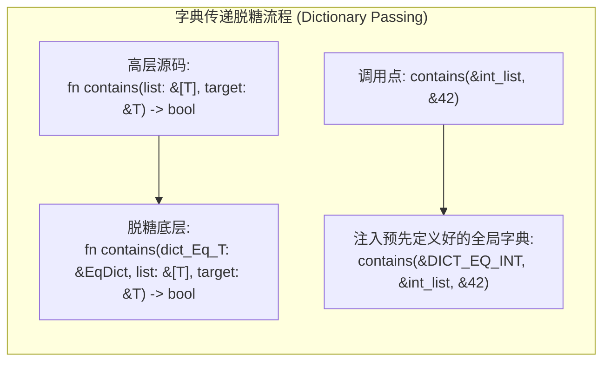
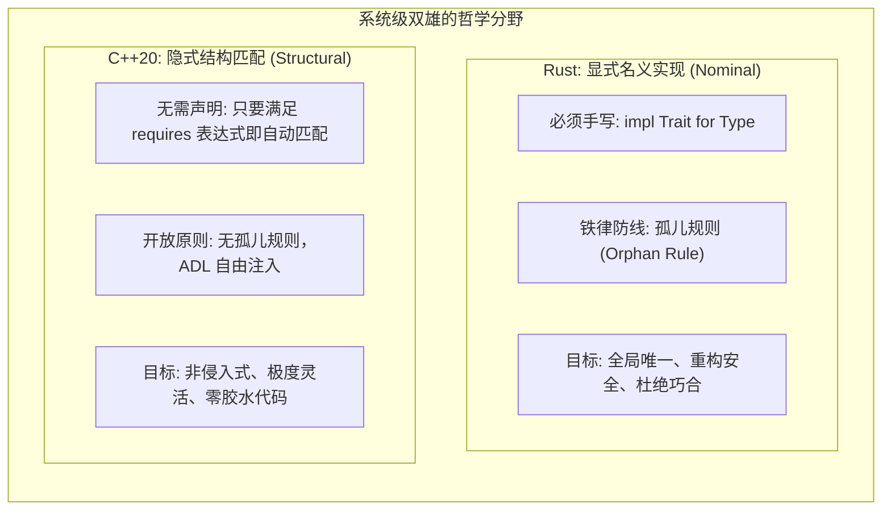

import TypeClassesTraitsDiagram from "../../../components/diagrams/TypeClassesTraitsDiagram";
import CodePlayground from "../../../components/framework/CodePlayground";

export const typeClassesRustSnippet = `// Rust Trait 与 Newtype 模式实战：跨越孤儿规则
use std::fmt;

// 假设我们想为标准库 Vec<i32> 实现自定义的 Display
// 直接写 impl fmt::Display for Vec<i32> 会触发 E0117 孤儿规则报错！

// 解决方案：Newtype 模式重夺本地所有权
struct PrettyIntList(Vec<i32>);

impl fmt::Display for PrettyIntList {
    fn fmt(&self, f: &mut fmt::Formatter<'_>) -> fmt::Result {
        write!(f, "[")?;
        for (i, val) in self.0.iter().enumerate() {
            if i > 0 {
                write!(f, " -> ")?;
            }
            write!(f, "#{}:{}", i + 1, val)?;
        }
        write!(f, "]")
    }
}

fn print_with_trait<T: fmt::Display>(item: &T) {
    println!("Trait 约束打印结果: {}", item);
}

fn main() {
    let raw_data = vec![10, 25, 42, 99];
    let pretty = PrettyIntList(raw_data);
    print_with_trait(&pretty);
}
`;

export const typeClassesTsDictSnippet = `// TypeScript 显式字典传递 (Dictionary Passing) 模式实战
// 1. 类型类字典接口 (Type Class Interface)
interface SemiGroup<T> {
  combine: (a: T, b: T) => T;
}

interface Monoid<T> extends SemiGroup<T> {
  empty: () => T;
}

// 2. 全局字典单例 (Instance Dictionaries)
const numberAdditionMonoid: Monoid<number> = {
  combine: (a, b) => a + b,
  empty: () => 0,
};

const stringConcatMonoid: Monoid<string> = {
  combine: (a, b) => a + b,
  empty: () => "",
};

// 3. 泛型高阶折叠函数 (接收隐式字典)
function foldAll<T>(items: T[], M: Monoid<T>): T {
  return items.reduce((acc, curr) => M.combine(acc, curr), M.empty());
}

// 运行测试
const nums = [10, 20, 30, 40];
console.log("数值加法 Monoid 聚合:", foldAll(nums, numberAdditionMonoid));

const words = ["Type ", "Classes ", "in ", "TypeScript"];
console.log("字符串拼接 Monoid 聚合:", foldAll(words, stringConcatMonoid));
`;

在编程语言漫长的演化史中，<strong>多态（Polymorphism）</strong>的实现方式曾经历过极其混乱的蛮荒时期。

最原始的多态形式是<strong>特设多态（Ad-hoc Polymorphism，即函数与操作符重载 Overloading）</strong>：允许同一个函数名称（如 `print` 或 `+`）在不同参数类型下拥有截然不同的物理实现。然而在早期语言中，重载的机制极其粗糙，不仅缺乏规范的类型理论约束，更会随着隐式类型转换（Implicit Coercion）引发令人抓狂的重载决议二义性（Ambiguity）。

直到 1989 年，菲利普·瓦德勒（Philip Wadler）与斯蒂芬·布洛特（Stephen Blott）发表了划时代的论文《How to make ad-hoc polymorphism less ad hoc》，为函数式语言引入了<strong>类型类（Type Classes）</strong>。这一机制宣告了特设多态从“随意的语法糖”升格为“严谨、可推导、类型安全的数学体系”。

三十年后的今天，类型类思想已如水银泻地般重塑了现代主流工业语言：
- <strong>Rust</strong> 直接将其脱胎为系统的核心支柱 —— <strong>Trait（特质）</strong>与著名的<strong>孤儿规则（Orphan Rules）</strong>；
- <strong>C++20</strong> 历经二十年模板演进，终于用 <strong>Concepts（概念）</strong>终结了长达数百行的 SFINAE 报错地狱；
- <strong>C# 11</strong> 引入<strong>静态抽象接口成员（`static abstract`）</strong>，一举攻克了困扰面向对象泛型二十年的数学计算难题；
- <strong>TypeScript</strong> 开发者则通过<strong>字典传递模式（Dictionary Passing）</strong>在前端工程中构建起高阶函数式抽象。

本文将从重载的失控痛点出发，拆解类型类背后的<strong>字典传递脱糖机理</strong>；深入聚焦 <strong>Rust 显式名义实现</strong>与 <strong>C++20 隐式结构匹配</strong>之间的巅峰哲学对决；并横向对比四大主力语言在工程实践中的深层抉择。

---

## 一、直觉引入：特设多态的失控与驯服

要理解为什么类型类如此革命性，我们需要先看看没有类型类时，程序员面临的绝望处境。

### 1.1 泛型与判等相撞：为什么不能写 `x == y`？

在纯粹的参数多态（Parametric Polymorphism / 简单泛型）中，函数对泛型类型 `T` 必须“一视同仁”：
```text
function are_equal<T>(x: T, y: T): boolean {
    return x == y; // 💥 编译报错！编译器根本不知道任意类型 T 能否判等！
}
```
因为 `T` 可能是整数（直接比较寄存器数值）、可能是字符串（需要逐字节对比）、也可能是无从判等的函数闭包（停机问题不可判定）。编译器不能假设任何操作。

早期的解决方案是<strong>继承多态（Subtyping）</strong>：定义一个顶层基类 `Object`，并在其中塞入虚函数 `virtual bool equals(Object other)`。然而面向对象继承带来了三大沉重代价：
1. <strong>类型安全性倒退</strong>：入参被迫退化为宽泛的 `Object`，内部必须做危险的向下强制转型（Downcasting），一旦类型不符，运行时立即抛出崩溃；
2. <strong>无法处理静态与二元操作</strong>：像加法 `+`、乘法 `*` 这种对称的二元操作，或者零元构造器 `Zero`，根本无法在面向对象动态实例分发中自然表达；
3. <strong>侵入式血统绑定</strong>：如果想让第三方库中的一个结构体支持排序，你无法给它强行补上基类继承。

### 1.2 Wadler-Blott 的顿悟：类型属于类型类

1989 年，瓦德勒与布洛特提出了破局方案：<strong>不要把操作塞进类型里，而是把类型归入一个“能力集合”（Type Class）中！</strong>

```haskell
-- 声明一个类型类：如果某个类型 a 拥有 (==) 操作，它就属于 Eq 族群
class Eq a where
    (==) :: a -> a -> Bool

-- 为具体类型实现该类型类
instance Eq Int where
    (==) = primitiveIntEq
```

当函数需要使用判等时，只需声明<strong>类型类约束（Type Class Constraint）</strong>：
```haskell
elem :: Eq a => a -> [a] -> Bool
```
这句话的大白话意思是：“`elem` 适用于<strong>任何</strong>类型 `a`，但<strong>前提条件（Constraint）</strong>是：类型 `a` 必须拥有被系统承认的 `Eq` 实例！”

---

## 二、形式化极简基石：字典传递脱糖机理

类型类在语法上看似高深莫测，但在底层编译器内部，它的实现机制惊人地质朴与优雅 —— <strong>字典传递转换（Dictionary Passing Translation）</strong>。

### 2.1 什么是字典传递？

在编译期，编译器会将每一个类型类 `class C a` 偷偷转换为一个<strong>包含函数指针的数据结构体 —— 字典（Dictionary）</strong>：

```text
// 编译器自动生成的等价字典结构体
struct EqDict<T> {
    eq: fn(&T, &T) -> bool,
}
```

随后，任何带有类型类约束 `T: Eq` 的泛型函数，都会被编译器在 AST 层悄悄塞入一个额外的参数 —— <strong>隐式字典指针</strong>！



在调用点，编译器会根据传入的实参类型（例如 `i32`），在符号表中查找对应类型的全局字典静态实例（`DICT_EQ_INT`），并自动作为第一个参数隐式传入。

<strong>核心顿悟</strong>：所谓的类型类多态，本质上就是<strong>由编译器代劳的高阶函数参数传递</strong>！程序员无需手写回调函数，类型检查器在编译期自动推导出正确的虚表字典。

### 2.2 全局一致性（Coherence）：为什么一个类型只能有一个实例？

在类型类体系中，有一条必须坚守的铁律 —— <strong>全局一致性（Coherence）</strong>：

$$
\forall T, \; \text{Trait}. \quad |\{ \text{impl Trait for } T \}| \le 1
$$

即：<strong>给定任意类型 $T$ 和任意类型类 $\text{Trait}$，在整个程序的全局命名空间中，最多只能存在唯一一个合法实现！</strong>

#### 为什么一致性不可动摇？
设想如果允许一个类型拥有两个不同的 `Ord`（排序）实例（比如一个按自然升序，另一个按逆序）：
1. 程序员在模块 A 中创建了一个二叉搜索树（BST），使用的是升序规则插入节点；
2. 模块 A 将这个树作为黑盒传给了模块 B；
3. 模块 B 在其作用域内使用了逆序规则执行 `tree.contains(x)`；
4. <strong>灾难发生：二叉搜索树的左小右大不变量被彻底破坏，查表算法永远迷路！</strong>

为了杜绝这种静默的数据结构腐化，类型系统的设计者必须在“全局唯一确定（Coherence）”与“局部临时特化（Local Instances）”之间做出根本性的取舍。

---

## 三、交互式沙盒：类型类与特质动态探针

为了让字典传递脱糖机理、Rust 孤儿规则与一致性防线，以及 Rust 显式 `impl` vs C++20 Concepts 隐式结构匹配的哲学对决变得生动直观，下方提供了一个多维度动态交互探针。

<TypeClassesTraitsDiagram client:load />

---

## 四、系统级双雄的哲学分野：Rust Trait 对决 C++20 Concepts

在当代系统级编程中，Rust 与 C++ 都追求“零运行时开销抽象（Zero-cost Abstractions）”。但在如何实现特设多态上，两门语言走向了截然不同的终极哲学道路。



### 4.1 Rust Trait：强一致性与孤儿规则（Orphan Rule）的生态护盾

Rust 的 `trait` 是名义系统（Nominal System）在类型类上的最忠实继承者。在 Rust 中，类型要想具备某种能力，必须显式书写 `impl Trait for Type` 块。

为了彻底保卫前文提到的<strong>全局一致性（Coherence）</strong>，Rust 编译器在代码架构中设下了一道铁闸 —— <strong>孤儿规则（The Orphan Rule）</strong>：

> <strong>孤儿规则</strong>：当且仅当 `Trait` 或 `Type` 至少有一个是在<strong>当前本地 Crate（包）</strong>内定义时，才允许书写 `impl Trait for Type`。

如果你试图为一个来自标准库的外部类型（如 `Vec<T>`），实现一个同样来自外部库的 Trait（如 `Display`）：
```rust
// 编译遭到无情拦截！
// error[E0117]: only traits defined in the current crate can be implemented for types defined outside
impl<T> std::fmt::Display for Vec<T> { ... }
```

#### 为什么孤儿规则是生态的护甲？
假设没有孤儿规则：
1. 社区中的 `crate_alpha` 觉得 `Vec<T>` 没有 `Display` 很不爽，随手写了一个 `impl Display for Vec<T>`；
2. 另一个独立的 `crate_beta` 也出于完全相同的需求，在自己包里写了一个格式稍有不同的 `impl Display for Vec<T>`；
3. 你的应用程序同时引用了 `alpha` 和 `beta`。当你在 `main.rs` 里调用 `println!("{}", my_vec)` 时，<strong>编译器将当场陷入二义性死锁！或者更糟糕 —— 静默采用了其中一个版本导致逻辑失常！</strong>

为了安全解绑，Rust 推荐使用 <strong>Newtype 模式</strong>（声明一个局部元组结构体 `struct MyVec<T>(Vec<T>)`），通过重夺类型的本地所有权，在维护全局一致性的前提下优雅化解冲突：

<CodePlayground
  client:visible
  lang="rust"
  title="Rust Trait 与 Newtype 模式跨越孤儿规则实战"
  description="以元组结构体包装外部类型并实现自定义 Display 特质"
  initialCode={typeClassesRustSnippet}
/>

### 4.2 C++20 Concepts：鸭子类型的纯编译期巅峰

在 C++20 之前，C++ 模板的约束依靠 SFINAE（替换失败并非错误）与 `std::enable_if`，其报错信息如同长篇乱码天书。

C++20 引入的 <strong>Concepts（概念）</strong>从根本上改变了游戏规则：
```cpp
template <typename T>
concept Summable = requires(T a, T b) {
    { a + b } -> std::convertible_to<T>;
};

template <Summable T>
T add_together(T a, T b) {
    return a + b;
}
```

请仔细对比 C++ Concepts 与 Rust Trait 的本质分歧：
- <strong>C++ 完全不需要显式的 `impl` 块！</strong>
- 如果你手写了一个结构体 `struct Vector3D { ... }`，只要你在它上面重载了 `operator+`，它就会<strong>自动、隐式地</strong>满足 `Summable` 概念！

#### 概念包含与自动偏特化（Subsumption）
C++20 Concepts 允许按照原子谓词的逻辑包含度自动选择最高效的算法实现：
```cpp
// 基础概念
template<typename T>
concept Bidirectional = ...;

// 更严格的派生概念 (自动包含 Bidirectional)
template<typename T>
concept RandomAccess = Bidirectional<T> && requires(T it, int n) { it + n; };

// 编译器自动偏特化选择：面对 vector 自动调用 RandomAccess 版本 (O(1))
// 面对 list 自动调用 Bidirectional 版本 (O(N))
void advance(Bidirectional auto& it, int n);
void advance(RandomAccess auto& it, int n);
```

### 4.3 终极对决：谁更胜一筹？

| 评价维度 | Rust Trait（显式名义契约） | C++20 Concepts（隐式结构谓词） |
| :--- | :--- | :--- |
| <strong>实现声明方式</strong> | <strong>必须显式声明</strong>（`impl Trait for Type`） | <strong>纯隐式满足</strong>（鸭子类型：签名吻合即匹配） |
| <strong>重构与安全性</strong> | 极高：杜绝任何方法名偶然相同导致的误匹配 | 灵活但有隐患：偶然匹配可能引发非预期的概念命中 |
| <strong>生态冲突防御</strong> | <strong>孤儿规则</strong>守卫全局唯一一致性（Coherence） | 无孤儿规则：依靠 ADL（参数依赖查找），允许多重重载 |
| <strong>第三方库适配</strong> | 较繁琐：对双外部类型需套用 Newtype 包装层 | <strong>极度轻盈</strong>：非侵入式，第三方类型直接接入算法 |
| <strong>错误提示位置</strong> | 在 `impl` 处或函数定义处立即精准报错 | 在模板实例化点依据概念失败精准回溯短报错 |

---

## 五、工业级延伸：C# 11 静态抽象与 TypeScript 显式字典

### 5.1 C# 11 静态抽象接口成员：泛型数学计算攻坚战

长久以来，面向对象语言都有一个巨大的尴尬：
```csharp
// 早期 C# 梦碎现场：
public static T Add<T>(T a, T b) {
    return a + b; // 💥 编译报错：运算符 '+' 无法应用于 'T' 和 'T'
}
```
因为在传统的面向对象设计中，接口方法只能通过对象实例调用（`a.Method()`），而操作符 `+` 是挂载在类上的<strong>静态方法（`static method`）</strong>，接口根本管不到静态成员！

在 2022 年发布的 C# 11 中，微软运行时团队引入了革命性的<strong>静态抽象接口成员（Static Abstract Members in Interfaces）</strong>：

```csharp
// C# 11 INumber 核心定义：
public interface IAdditionOperators<TSelf, TOther, TResult> 
    where TSelf : IAdditionOperators<TSelf, TOther, TResult> 
{
    static abstract TResult operator +(TSelf left, TOther right);
}

// 现在的通用加法算法：
public static T Add<T>(T a, T b) where T : INumber<T> {
    return a + b; // ✅ 完全合法！运行时 JIT 直接特化为极速 CPU 加法指令！
}
```

通过这一演进，C# 终于补齐了类型类最关键的一块拼图 —— <strong>在无需对象实例的前提下，对类型本身的静态行为建立特设多态契约！</strong>

### 5.2 TypeScript 中的显式字典传递模式

虽然 TypeScript 既没有 Rust 的 `trait`，也没有 Haskell 的类型类，但在函数式前端开发（如 `fp-ts`、`Effect`）中，工程师们直接使用<strong>纯正的字典传递模式</strong>手工实现类型类：

<CodePlayground
  client:visible
  lang="ts"
  title="TypeScript 显式字典传递（Dictionary Passing）模式实战"
  description="以 Monoid 接口与实例字典实现通用的泛型高阶折叠聚合函数"
  initialCode={typeClassesTsDictSnippet}
/>

这种模式生动地印证了类型论的核心真理：<strong>语言特性的尽头往往是底层数据结构的显式投影。</strong>编译器不提供的功能，程序员完全可以用字典结构体手工编织。

---

## 六、四大语言特设多态横向全景对照与全篇总结

下表综合梳理了 C++、Rust、C# 与 TypeScript 在特设多态与 Trait 机制上的全景特征：

| 特性维度 | Rust | C++20 | C# 11 | TypeScript |
| :--- | :--- | :--- | :--- | :--- |
| <strong>核心抽象机制</strong> | <strong>Trait</strong> | <strong>Concepts</strong> | <strong>静态抽象接口成员</strong> | 显式字典传递模式 |
| <strong>类型匹配模式</strong> | <strong>显式名义绑定</strong>（`impl`） | <strong>隐式结构匹配</strong>（谓词） | 显式名义绑定（`interface`） | 显式手工传参 / 结构子类型 |
| <strong>代码生成方式</strong> | 编译期静态单态化 / `dyn` 胖指针 | 纯编译期模板单态化 | 运行时 CLR JIT 单态化特化 | 编译后完全擦除为 JS 函数 |
| <strong>一致性防御</strong> | <strong>孤儿规则</strong>拦截 E0117 | 无孤儿规则，依靠作用域重载 | 命名空间唯一性约束 | 无运行时保护，调用方自理 |
| <strong>操作符重载支持</strong> | 极为完善（通过标准库 Trait） | 浑然天成（原生操作符重载） | 完善（`static abstract` 操作符） | 不支持原生操作符重载 |

### 全篇总结

从上世纪六十年代随意的函数重载，到 1989 年 Wadler-Blott 提出类型类，再到今天 Rust、C++、C# 与 TypeScript 的全面开花，特设多态的演化历程展现了类型系统驯服复杂性的伟大智慧：

1. <strong>字典传递是类型类的灵魂</strong>：类型类约束并非深不可测的黑魔法，它在底层数学和工程实现上就是由编译器自动寻找并隐式传递的函数指针字典；
2. <strong>全局一致性是生态的压舱石</strong>：Rust 孤儿规则以看似繁琐的限制，杜绝了海量依赖包相互碰撞的二义性灾难，为现代软件工程的超大规模重用奠定了坚实防线；
3. <strong>名义与结构的永恒交响</strong>：Rust 选择了显式 `impl` 的秩序与严谨，C++20 选择了 Concepts 隐式匹配的自由与非侵入。理解了这两条路径的分歧，你就真正握有了洞悉现代系统级程序语言架构的密钥。
