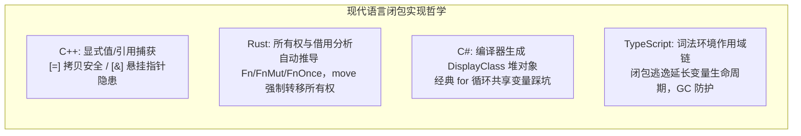
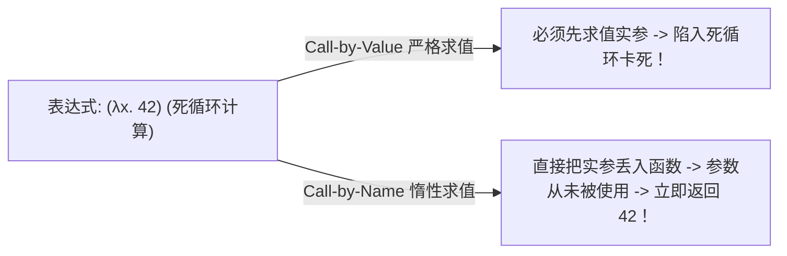
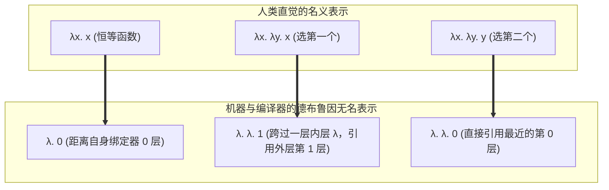

import LambdaReductionDiagram from "../../../components/diagrams/LambdaReductionDiagram";

在 1930 年代，数理逻辑学界发生了一场深刻的思想地震。为了回答希尔伯特提出的判定性问题（Entscheidungsproblem），两位年轻的数学家各自给出了划时代的解答：

- 阿兰·图灵（Alan Turing）提出了<strong>图灵机（Turing Machine）</strong>，以无限纸带、读写磁头与离散内部状态为物理直觉，开创了现代计算机硬件体系的<strong>机械状态隐喻</strong>；
- 阿隆佐·邱奇（Alonzo Church）提出了 <strong>$\lambda$ 演算（Lambda Calculus）</strong>，完全摒弃了硬件、磁带与时间的概念，以纯粹的<strong>符号替换、函数抽象与参数代换</strong>为数学基底，开创了现代编程语言理论（PLT）与函数式编程的<strong>逻辑符号隐喻</strong>。

随后图灵证明了两者是等价的，这就是著名的<strong>丘奇-图灵论题（Church-Turing Thesis）</strong>。

如果说图灵机是工程实体的蓝图，那么<strong>无类型 $\lambda$ 演算（Untyped Lambda Calculus, 简称 UTLC）</strong>就是计算科学宇宙中最为纯粹、轻盈且震撼人心的数学奇迹：<strong>整个语言没有内置数字、没有布尔值、没有运算符、没有循环、没有条件分支，仅仅由三个极简的生成式构成，却拥有模拟整个人类已知计算能力的图灵完备性（Turing Completeness）</strong>。

今天我们每天在 C++、Rust、C# 和 TypeScript 中随手写下的 Lambda 表达式、闭包捕获与高阶函数，其灵魂全部源于这套 90 年前的极简符号系统。本文将卸下枯燥晦涩的学术公式，以现代程序员最亲切的视角，重温这场从虚无中建立计算宇宙的壮丽冒险。

---

## 一、极简语法与抽象：万物皆函数的现代映射

### 1.1 三个生成式统治一切

在现代编程语言中，我们习惯了繁多的语法关键字：`class`、`function`、`if`、`for`、`int`。但在无类型 $\lambda$ 演算的纯粹世界中，不存在任何基元数据（Primitive Data），一切既是数据，又是函数。形式化项集合 $\mathcal{T}$ 仅由三个规则构成：

$$
t ::= x \mid \lambda x.\, t \mid t_1 \; t_2
$$

整个语言的骨架仅有三类实体：

1. <strong>变量（Variable，记作 $x$）</strong>：一个名字，代表形式参数或外部输入；
2. <strong>抽象（Abstraction，记作 $\lambda x.\, t$）</strong>：定义一个匿名函数，接收参数 $x$，执行体为 $t$；
3. <strong>应用（Application，记作 $t_1 \; t_2$）</strong>：调用函数，将实参 $t_2$ 喂给函数 $t_1$。

### 1.2 为什么只有单参数：柯里化（Currying）与现代语言映射

初学者常常困惑：如果只能接收一个参数，我们怎么写 `add(a, b)` 这样接收多个参数的函数？

逻辑学家哈斯凯尔·柯里（Haskell Curry）给出的解法是：<strong>让函数返回另一个函数！</strong>

$$
\lambda x.\, \lambda y.\, t
$$

这就是著名的<strong>柯里化（Currying）</strong>：外层函数接收第一个参数 $x$，返回一个接收参数 $y$ 的新函数。当我们调用 $(\text{add} \; 1) \; 2$ 时，先将 $1$ 绑定给 $x$，得到“加 1 函数”，再把 $2$ 传进去算出结果。

我们来看看现代主流语言如何表达这一概念：

```typescript
// TypeScript: 箭头函数原生表达单参柯里化
const curriedAdd = (x: number) => (y: number) => x + y;
const addFive = curriedAdd(5); // 生成加 5 特化函数
console.log(addFive(3)); // 8
```

```cpp
// C++14: 泛型 Lambda 完美映射柯里化抽象
auto curriedAdd = [](auto x) {
    return [x](auto y) { return x + y; };
};
auto addFive = curriedAdd(5);
std::cout << addFive(3) << std::endl; // 8
```

```rust
// Rust: 闭包链式返回
let curried_add = |x: i32| move |y: i32| x + y;
let add_five = curried_add(5);
println!("{}", add_five(3)); // 8
```

```csharp
// C#: 委托链式嵌套
Func<int, Func<int, int>> curriedAdd = x => y => x + y;
var addFive = curriedAdd(5);
Console.WriteLine(addFive(3)); // 8
```

在语法书写上，我们通常采用两条通行的简写规则以省去括号：
- <strong>应用左结合</strong>：$f \; a \; b \; c$ 等价于 $(((f \; a) \; b) \; c)$；
- <strong>函数体贪婪向右延展</strong>：$\lambda x.\, x \; y$ 等价于 $\lambda x.\, (x \; y)$。

---

## 二、变量作用域与捕获陷阱：从数学代换到闭包内存模型

### 2.1 自由变量与约束变量

在表达式 $\lambda x.\, x \; y$ 中：
- 参数 $x$ 紧随 $\lambda$ 之后，被称为<strong>约束变量（Bound Variable）</strong>，它的生死完全由这个函数掌控；
- 变量 $y$ 并不在这个函数的形参列表中，它来自外部更宽广的环境，被称为<strong>自由变量（Free Variable）</strong>。

如果一个函数内部没有任何自由变量（所有用到的变量都在自身形参中被约束），它就被称为<strong>闭合项（Closed Term）</strong>，在计算机科学中也叫<strong>组合子（Combinator）</strong>。例如恒等函数 $I \triangleq \lambda x.\, x$。

### 2.2 为什么不能搞简单的“文本查找替换”：变量捕获陷阱

计算的本质就是<strong>把实参代入到函数体中</strong>。假设我们要把实参 $y$ 代入到函数 $\lambda y.\, x$ 中替换变量 $x$：

- 在原函数 $\lambda y.\, x$ 中，$x$ 是自由的（外部决定的），而 $y$ 是函数内部的局部形参；
- 如果我们天真地用文本替换把 $x$ 换成 $y$，表达式将变成 $\lambda y.\, y$；
- <strong>灾难发生</strong>：外部传入的有意义的数据 $y$，被目标函数内部同名的形参给“截胡”绑定了！原本恒定返回外来变量的函数，退化成了一个不管给什么都原样返回的恒等函数。

这种错误被称为<strong>变量捕获（Variable Capture）</strong>。为了解决这个问题，数学上规定必须使用<strong>捕获规避代换（Capture-Avoiding Substitution）</strong>：如果发现名字冲突，必须先将内部形参重命名为全新的名字（如将 $\lambda y.\, x$ 改名为 $\lambda z.\, x$），然后再进行代换。这种仅仅改变形参名字的操作被称为 <strong>$\alpha$-转换（$\alpha$-Conversion）</strong>。

### 2.3 现代工业语言中的闭包捕获与内存深渊

当理论上的“自由变量引用”落地为现代工业语言的<strong>闭包（Closure = 代码 + 引用的外部环境）</strong>时，四门主流语言给出了截然不同、却同样惊心动魄的内存设计：



#### C++：自由与悬挂指针的刀尖起舞
C++ 赋予了程序员最高的控制权，允许在 `[]` 中精确指定如何捕获外部变量：
- `[=]`：按值拷贝外部变量；
- `[&]`：按引用捕获外部变量。

但这埋下了著名的<strong>悬挂引用（Dangling Reference）</strong>隐患：
```cpp
auto makeFunction() {
    int local_val = 42;
    // 危险：按引用捕获了局部栈变量！
    return [&local_val]() { return local_val; };
} // local_val 随栈帧弹出被销毁！

auto fn = makeFunction();
fn(); // 崩溃或未定义行为 (Undefined Behavior)！
```

#### Rust：编译期借用检查器与所有权转移
Rust 决不允许悬挂引用发生。编译器会自动分析闭包体内部的操作，将闭包脱糖为一个<strong>编译器生成的匿名结构体</strong>，并根据需要实现 `Fn`（共享只读借用）、`FnMut`（独占可变借用）或 `FnOnce`（消耗所有权）。若需要闭包跨越当前函数作用域，必须使用 `move` 关键字将外部变量的所有权彻底打包带走：
```rust
fn make_function() -> impl Fn() -> i32 {
    let local_val = 42;
    // move 将 local_val 移入闭包结构体内部，生命周期随闭包转移
    move || local_val
}
```

#### C#：经典的 for 循环闭包共享变量踩坑
在 C# 5.0 之前，无数初学者都曾被下面这段代码折磨过：
```csharp
var actions = new List<Action>();
for (int i = 0; i < 3; i++) {
    actions.Add(() => Console.WriteLine(i));
}
foreach (var a in actions) a(); // 居然输出了 3, 3, 3！
```
为什么？因为 C# 编译器将捕获的环境打包成了一个叫 `DisplayClass` 的隐藏类对象，整个 `for` 循环<strong>共享了同一个 `DisplayClass` 实例和同一个 `i` 字段</strong>！循环结束时 `i` 变成了 3，所有闭包读取的都是这同一个字段。为了修复这个直觉陷阱，C# 5.0 专门修改了规范，为 `foreach` 的迭代变量分配独立的闭包实例。

#### TypeScript：作用域链与垃圾回收
在 JavaScript / TypeScript 中，所有函数天然是闭包。引擎（如 V8）会在堆上创建环境记录（Environment Record）。即使外部函数已经执行完毕，只要内部闭包依然存活，外部变量就不会被垃圾回收（GC）。这保证了绝对的内存安全，但如果闭包被长期持有，也可能导致意料之外的内存泄漏。

---

## 三、归约与求值策略：为什么你的代码默认不是惰性的？

### 3.1 $\beta$-归约：函数调用的数学本质

在 $\lambda$ 演算中，计算的唯一手段是 <strong>$\beta$-归约（$\beta$-Reduction）</strong>：

$$
(\lambda x.\, t_1) \; t_2 \quad \longrightarrow_\beta \quad [x \mapsto t_2] t_1
$$

一个形如 $(\lambda x.\, t_1) \; t_2$ 的可化简结构被称为一个 <strong>$\text{Redex}$（Reducible Expression，可归约项）</strong>。不断化简直到表达式内部没有任何 $\text{Redex}$ 为止，最终得到的不可再简化的结构称为<strong>正规型（Normal Form）</strong>，在程序里就是“最终算出来的返回值”。

### 3.2 严格求值 vs 惰性求值

如果一个复杂的表达式内部同时有好几个地方可以化简，我们应该先化简哪一个？这引出了程序语言设计中两条最重要的道路：

1. <strong>应用序 / 严格求值（Call-by-Value / CBV）</strong>：
   - 规则：<strong>先将实参算成最终结果，再传进函数体</strong>；
   - 代表：C++、Rust、C#、TypeScript、Go 等绝大多数工业语言。
2. <strong>正常序 / 惰性求值（Call-by-Name / CBN）</strong>：
   - 规则：<strong>不管实参算没算完，直接原样代入函数体；只有当这个实参真正被用到时才计算</strong>；
   - 代表：Haskell（进一步优化为记忆化的 Call-by-Need）。



#### 为什么工业语言几乎全部选择 Call-by-Value？
既然惰性求值能避免无意义的死循环和多余计算，为什么主流语言没有采纳？
核心原因在于：<strong>副作用（Side Effects）与内存物理模型</strong>！
在现实编程中，我们经常需要在函数调用中打印日志、发起网络请求、修改全局变量。如果求值是惰性的，你就根本无法预测日志会在哪一秒被打印、或者它是否会被执行。此外，严格求值与 CPU 栈帧模型的对应最直观紧凑，性能开销最为可控。

#### 现代语言中的惰性求值模拟
虽然默认严格，但四大语言都提供了强大的手段来享受惰性带来的流式计算红利：

```csharp
// C# LINQ: 基于 yield return 的惰性流
IEnumerable<int> InfiniteNumbers() {
    int i = 0;
    while (true) yield return i++; // 无限流不会卡死！
}
// 只有 Take(5) 需要消费时，前面的生成逻辑才会按需运行 5 次
var firstFive = InfiniteNumbers().Take(5).ToList();
```

```rust
// Rust Iterator: 纯零成本惰性适配器链
let numbers = 0..; // 无限区间
let evens = numbers.filter(|x| x % 2 == 0).take(5); // 此时什么计算都没发生！
let result: Vec<_> = evens.collect(); // collect 触发实际消费驱动
```

而在 TypeScript 与 C++ 中，逻辑运算符 `&&` 与 `||` 就是局部的惰性求值（短路求值）；想要实现更通用的惰性，通常将表达式包装为一个无参函数（称为 <strong>Thunk</strong>）：`const lazyVal = () => heavyCalculation();`，直到调用 `lazyVal()` 时才真正计算。

### 3.3 丘奇-罗斯定理（Church-Rosser）：条条大路通罗马

既然化简的路径有千万条，不同的人按照不同的顺序化简同一个表达式，最终会不会得到互相矛盾的计算结果？

阿隆佐·邱奇和罗斯在 1936 年证明了著名的<strong>汇流定理（Confluence Theorem）</strong>：

> <strong>Church-Rosser 汇流定理</strong>：
> 只要一个 $\lambda$ 表达式能够化简到最终的正规型，那么<strong>无论你采用何种化简顺序，最终达成的正规型在改名（$\alpha$-等价）意义下绝对唯一！</strong>

这为整个计算机科学奠定了信心：计算不是任性的玄学，不同的执行策略（甚至并发执行）只要汇聚，答案必然归一。

---

## 四、交互探针：λ 演算单步归约与策略模拟器

通过下方交互图表，你可以直观调试与单步观察 $\lambda$ 表达式的每一步 $\beta$-归约过程。探针会高亮显示当前处于活动状态的 $\text{Redex}$，并实时对比正常序（Call-by-Name）与应用序（Call-by-Value）在处理死循环参数时的生死差异：

<LambdaReductionDiagram client:load />

---

## 五、丘奇编码（Church Encoding）：过程即数据的魔法

在没有任何内置数字、字符串或布尔值的纯 $\lambda$ 演算中，我们如何表达数据？

丘奇的天才创举在于：<strong>过程即数据！数据不是一个被动的存储块，而是一段能够根据外部需求执行调度的行为逻辑。</strong>

### 5.1 布尔值就是“二选一选择器”

日常编程中的布尔值用来干什么？在 `if-else` 分支中二选一！
因此，丘奇把布尔值直接定义为一个<strong>接收两个备选分支的高阶函数</strong>：
- $\text{TRUE}$：接收两个参数，永远返回第一个；
- $\text{FALSE}$：接收两个参数，永远返回第二个。

$$
\begin{aligned}
\text{TRUE} &\triangleq \lambda x.\, \lambda y.\, x \\
\text{FALSE} &\triangleq \lambda x.\, \lambda y.\, y
\end{aligned}
$$

那么条件判断 $\text{IF}$ 该怎么实现？甚至根本不需要写 `if`，直接把条件本身当函数调用：
$$
\text{IF} \triangleq \lambda b.\, \lambda t.\, \lambda f.\, b \; t \; f
$$

让我们用 TypeScript 纯闭包代码来亲身体验这种魔力：

```typescript
// 完全不使用 JS 内置的 true / false / if
type ChurchBool = <T>(thenBranch: T) => (elseBranch: T) => T;

const TRUE: ChurchBool = (t) => (f) => t;
const FALSE: ChurchBool = (t) => (f) => f;

// 逻辑非 NOT：把传入的两个分支倒过来喂给 b
const NOT = (b: ChurchBool): ChurchBool => (t) => (f) => b(f)(t);

// 逻辑与 AND：若 p 为真则结果取决于 q，若 p 为假则直接为假
const AND = (p: ChurchBool) => (q: ChurchBool): ChurchBool => p(q)(p);

// 测试：NOT TRUE 会返回什么？
const result = NOT(TRUE)("我是真")("我是假");
console.log(result); // 输出了 "我是假"！
```

### 5.2 自然数就是“函数复合的次数”

在没有数字的荒原上，数字 $n$ 意味着什么？
丘奇说：<strong>数字 $n$ 就是把一个变换函数 $f$ 连续作用在初值 $x$ 上的次数！</strong>
- $0$：把函数应用 $0$ 次，直接返回初值 $x$：$\lambda f.\, \lambda x.\, x$（请注意，这和 $\text{FALSE}$ 的定义一模一样！）；
- $1$：把函数应用 $1$ 次：$\lambda f.\, \lambda x.\, f \; x$；
- $2$：把函数应用 $2$ 次：$\lambda f.\, \lambda x.\, f \; (f \; x)$；
- $n$：把函数连续嵌套应用 $n$ 次。

加法函数 $\text{PLUS}$ 的本质是<strong>调用的级联</strong>：先应用 $n$ 次 $f$，再在此基础上应用 $m$ 次 $f$：
$$
\text{PLUS} \triangleq \lambda m.\, \lambda n.\, \lambda f.\, \lambda x.\, m \; f \; (n \; f \; x)
$$

看！我们用纯 TypeScript 闭包在不依赖原生数字的前提下，验证 $1 + 1 = 2$：

```typescript
type ChurchNum = <T>(f: (x: T) => T) => (x: T) => T;

const ZERO: ChurchNum = (f) => (x) => x;
const ONE: ChurchNum = (f) => (x) => f(x);
const SUCC = (n: ChurchNum): ChurchNum => (f) => (x) => f(n(f)(x));
const PLUS = (m: ChurchNum) => (n: ChurchNum): ChurchNum => (f) => (x) => m(f)(n(f)(x));

// 将 Church 自然数解码为原生 JS 数字以便打印验证
const toInt = (n: ChurchNum) => n((x: number) => x + 1)(0);

const two = PLUS(ONE)(ONE);
console.log(toInt(two)); // 惊奇地打印出了：2！
```

### 5.3 二元组与克莱尼拔牙时的减法难题

如何用函数构造复合数据结构（如 Pair / 元组）？
$$
\text{PAIR} \triangleq \lambda x.\, \lambda y.\, \lambda f.\, f \; x \; y
$$
把 $x$ 和 $y$ 锁在一个闭包内部，谁想访问它们，就必须传入一个访问者函数 $f$。取出第一项就是传入 $\text{TRUE}$，取出第二项就是传入 $\text{FALSE}$。

#### 传奇的克莱尼前驱难题
在加法和乘法轻松攻克后，<strong>如何实现“减一”（$\text{PRED}$，求前驱数）</strong>曾困扰了丘奇学派数年之久。在一个只能单向嵌套调用的纯函数体系里，你怎么把 $f(f(f(x)))$ 倒剥掉一层皮，变回 $f(f(x))$？

著名逻辑学家斯蒂芬·克莱尼（Stephen Kleene）在牙医诊所拔牙注射麻醉剂时，灵光一现想出了<strong>滑动窗口（Sliding Window）</strong>的解法：
- 既然不能后退，那我们就从原点 $(0, 0)$ 开始并排行走；
- 每一步变换，都把二元组 $(a, b)$ 演进为 $(b, b+1)$：
  $$
  (0, 0) \longrightarrow (0, 1) \longrightarrow (1, 2) \longrightarrow (2, 3) \dots \longrightarrow (n-1, n)
  $$
- 只要走完 $n$ 步，二元组左边的数字 $n-1$ 恰好就是我们要的前驱！

这种以空间状态平移换取时间倒退的思想，展现了程序理论早期先驱们无与伦比的数学巧思。

---

## 六、图灵完备的终极引擎：匿名自指困境与 Y/Z 组合子

### 6.1 匿名函数的自指困境

在现代编程中，写递归函数是家常便饭：
```rust
fn factorial(n: u64) -> u64 {
    if n == 0 { 1 } else { n * factorial(n - 1) }
}
```
但上面的代码能递归，是因为函数在全局作用域拥有一个明确的名字 `factorial`，函数体内部可以通过这个名字找到自己。

然而在纯粹的 $\lambda$ 演算中：<strong>所有的函数都是没有名字的匿名抽象，语言里也没有全局符号表！</strong>
一个匿名函数，如何在自己的身体内部调用自己？

### 6.2 现代编程语言面对“匿名自指”的挣扎与进化

这个 90 年前的理论困境，直到今天依然在深刻影响着每一门主流语言的设计：

#### C#：未赋值局部变量报错
在 C# 中如果你想直接把一个递归 lambda 赋给变量：
```csharp
// 编译报错！CS0165: 使用了未赋值的局部变量 'fact'
Func<int, int> fact = n => n <= 1 ? 1 : n * fact(n - 1);
```
因为在 lambda 表达式内部试图引用 `fact` 时，等号右侧还没计算完毕，`fact` 还未完成初始化！C# 程序员被迫写出丑陋的防御代码：必须先给变量赋一个 `null`：
```csharp
Func<int, int> fact = null!; // 先声明并占位
fact = n => n <= 1 ? 1 : n * fact(n - 1); // 此时才能引用
```

#### C++：从 std::function 堆分配到 C++23 deducing this
在早期 C++ 中，匿名 lambda 要想自指，必须付出巨大的运行时代价包装进 `std::function`（带来虚拟函数调用与潜在堆分配开销）。
经过几十年的探索，<strong>C++23 终于引入了“显式对象形参”（deducing this）</strong>，在语法层面上原生终结了自指难题：
```cpp
// C++23: 通过显式 this 形参，匿名闭包优雅自指，完全零开销！
auto fact = [](this auto self, int n) -> int {
    return n <= 1 ? 1 : n * self(n - 1);
};
std::cout << fact(5); // 120
```

#### Rust：闭包唯一匿名类型造成的结构自指死锁
在 Rust 中，每个闭包在编译期都会生成一个独一无二的未命名结构体类型。如果闭包内部试图将自己作为字段存下来，这个类型的大小就会变成无限大（`Size = Size + Size`），直接被编译器拒之门外。因此 Rust 中要实现匿名递归，必须引入显式参数传递自身或者使用 `Box<dyn Fn>` 间接指针。

### 6.3 柯里不动点与 Y 组合子

在没有 C++23 `deducing this`、也没有名字的纯数学世界中，数学家哈斯凯尔·柯里给出了石破天惊的答案 —— <strong>不动点组合子（Fixed-Point Combinator，著名的 $Y$ 组合子）</strong>：

$$
\boxed{ Y \triangleq \lambda f.\, (\lambda x.\, f \; (x \; x)) \; (\lambda x.\, f \; (x \; x)) }
$$

#### 为什么它能召唤自指？
令 $W \triangleq \lambda x.\, f \; (x \; x)$，则 $Y \; f$ 等价于 $W \; W$。我们进行一步 $\beta$-归约：
$$
Y \; f = (\lambda x.\, f \; (x \; x)) \; W \longrightarrow_\beta f \; (W \; W) = f \; (Y \; f)
$$
看到了吗？<strong>$Y$ 组合子在一步化简后，像细胞分裂一样，在头部复制出了一个函数 $f$，同时把 $Y \; f$ 本身再次喂回给了 $f$！</strong>

$$
Y \; f \longrightarrow f \; (Y \; f) \longrightarrow f \; (f \; (Y \; f)) \longrightarrow \dots
$$
它源源不断地生成下一层的调用能力，将一个本不具备递归能力的单步函数，凭空拓展出了无限递归的生命。

### 6.4 工业严格求值语言中的救星：Z 组合子

但是，$Y$ 组合子在正常序（Call-by-Name）下运转完美，若在 TypeScript、C++ 或 Python 这种<strong>严格求值（Call-by-Value）</strong>语言中直接运行，会因为提前求值内部的 $Y \; f$ 实参而<strong>瞬间爆栈</strong>。

为了在现代严格求值语言中实现安全递归，我们需要利用一个多余的参数（$\lambda v.$）进行“惰性包裹”（Thunking），这就是严格求值版的 <strong>$Z$ 组合子</strong>：

$$
\boxed{ Z \triangleq \lambda f.\, (\lambda x.\, f \; (\lambda v.\, x \; x \; v)) \; (\lambda x.\, f \; (\lambda v.\, x \; x \; v)) }
$$

让我们在 TypeScript 中直接写出这段代码，见证奇迹：

```typescript
// 在完全不给函数起名字、不使用任何原生递归语法的前提下实现递归！
const Z = (f: any) =>
  ((x: any) => f((v: any) => x(x)(v)))
  ((x: any) => f((v: any) => x(x)(v)));

// 定义单步阶乘逻辑：接收一个“未来的自己”（recurse）作为参数
const factorialStep = (recurse: any) => (n: number): number => {
  return n <= 1 ? 1 : n * recurse(n - 1);
};

// 用 Z 组合子一键点化为真正的递归函数！
const factorial = Z(factorialStep);

console.log(factorial(5)); // 输出：120！
console.log(factorial(6)); // 输出：720！
```

无需全局变量、无需函数命名、无需环境篡改，一段纯粹由括号与参数拼装起来的表达式，完成了向图灵完备性的伟大登顶！

---

## 七、编译器如何看待变量名：德布鲁因索引与栈帧偏移

在纸面阅读公式时，变量名（$x, y, z$）符合人类的直觉。但对于现代编译器（如 V8、Rust rustc、GHC Core）而言，<strong>字符串变量名是效率的死敌</strong>：
1. 比对两个函数是否等价，需要进行繁琐的字符串遍历与重命名比对；
2. 每次函数内联展开，都需要费尽周折地检查是否存在变量捕获重名；
3. 符号表占用大量内存，不利于生成紧凑的中间代码（IR）。

荷兰数学家尼古拉·德·布鲁因（Nicolaas de Bruijn）在 1972 年提出了革命性的<strong>德布鲁因索引（De Bruijn Index）</strong>：<strong>彻底抹去所有形参的名字，只用一个整数表示该变量距离它的外层定义之间隔了多少层函数！</strong>



这和现代 CPU 执行汇编代码时的<strong>栈帧相对偏移（Stack Frame Offset）</strong>何其相似！
- 访问当前函数的局部变量：`[ebp - 4]`（相当于索引 0）；
- 访问上一层外层闭包的变量：通过静态链（Static Link）回溯一个栈指针 `[ebp_parent - 8]`（相当于索引 1）。

在德布鲁因索引的视角下，所有 $\alpha$-等价的代码其在内存中的无名树表示<strong>完全逐字相同</strong>，使得编译器进行模式匹配、公共子表达式消除和死代码剪枝时快如闪电。

---

## 八、总结与思考：为什么我们需要“类型”？

无类型 $\lambda$ 演算以无与伦比的纯粹性，向世人证明了一件事：<strong>计算不需要齿轮，也不需要晶体管，它只是一套自洽严密的符号置换规则。</strong>

然而，正是由于它的极度自由，也带来了深重的混乱：
1. <strong>停机发散</strong>：像自复制项 $\Omega = (\lambda x.\, x \; x) \; (\lambda x.\, x \; x)$ 会陷入无休止的死循环，没有任何机制能在静态编译期拦截它；
2. <strong>无意义调用</strong>：你可以把一个代表布尔值的函数，强行当成数字加法喂给另一个函数；
3. <strong>缺乏语义契约</strong>：调用方完全无法预知一个黑盒函数到底需要什么样的输入，唯有运行时真正踩坑崩溃才能察觉。

为了给这片野性生长的纯函数旷野套上缰绳，逻辑学家们在表达式之上构建了严谨的戒律与契约 —— 这就是<strong>类型系统（Type Systems）</strong>。

在接下来的篇章中，我们将进入<strong>简单类型 $\lambda$ 演算（Simply Typed Lambda Calculus, STLC）</strong>的世界，见证类型标注如何以一己之力铲除死循环发散、达成神圣的<strong>强规范化（Strong Normalization）</strong>，并揭开 <strong>Curry-Howard 同构</strong>将“程序代码”与“数学定理证明”完美融为一体的宇宙级奥秘。

---

### 相关延伸阅读

- 探讨现代系统级语言如何用生命周期规避指针悬挂，可参阅：[《Rust 借用检查器的形式化模型：生命周期、类型系统与代数全景》](/posts/type-systems/formal-model-of-rust-borrow-checker)；
- 探查代数多项式与不动点求值，可参阅：[《代数数据类型（ADT）与递归类型：从类型半环到多项式不动点》](/posts/type-systems/algebraic-data-types-and-recursive-types)；
- 探索集合与等价关系的离散数学基石，可参阅：[《集合论基础：从元素公理、二元关系到商集与划分》](/posts/discrete-math/set-theory-relations-and-partitions)。
