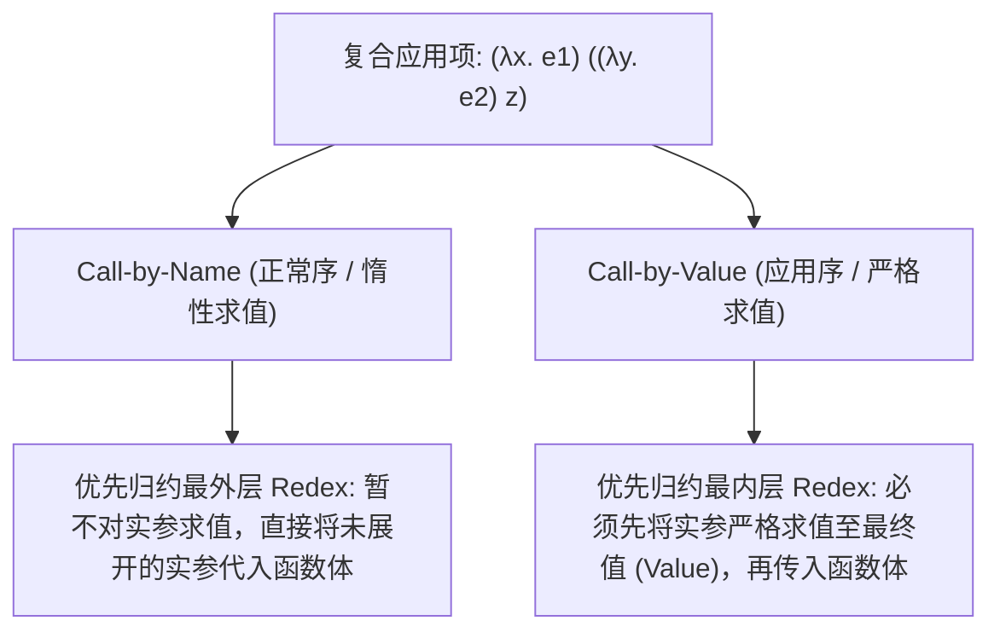
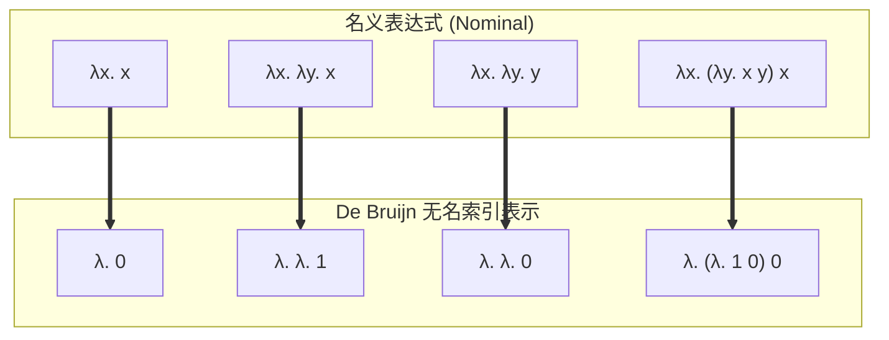

import LambdaReductionDiagram from "../../../components/diagrams/LambdaReductionDiagram";

在 1930 年代，数理逻辑学界发生了一场深刻的思想地震。为了回答希尔伯特提出的判定性问题（Entscheidungsproblem），两位年轻的数学家各自给出了划时代的解答：

- 阿兰·图灵（Alan Turing）提出了<strong>图灵机（Turing Machine）</strong>，以无限纸带、读写磁头与离散内部状态为物理直觉，开创了现代计算机硬件体系的<strong>机械状态隐喻</strong>；
- 阿隆佐·邱奇（Alonzo Church）提出了 <strong>$\lambda$ 演算（Lambda Calculus）</strong>，完全摒弃了硬件、磁带与时间的概念，以纯粹的<strong>符号替换、函数抽象与参数代换</strong>为数学基底，开创了现代编程语言理论（PLT）与函数式编程的<strong>逻辑符号隐喻</strong>。

随后图灵证明了两者是等价的，这就是著名的<strong>丘奇-图灵论题（Church-Turing Thesis）</strong>。

如果说图灵机是工程实体的蓝图，那么<strong>无类型 $\lambda$ 演算（Untyped Lambda Calculus, 简称 UTLC）</strong>就是计算科学宇宙中最为纯粹、轻盈且震撼人心的数学奇迹：<strong>整个语言没有内置数字、没有布尔值、没有运算符、没有循环、没有条件分支，仅仅由三个极简的生成式构成，却拥有模拟整个人类已知计算能力的图灵完备性（Turing Completeness）</strong>。

本文将以 Benjamin C. Pierce 经典著作《Types and Programming Languages》（TAPL）为理论脉络，系统揭开这门极简语言的内生力量。

---

## 一、语法与形式公理体系

### 1.1 BNF 范式与核心生成式

在无类型 $\lambda$ 演算的纯粹世界中，不存在基元数据（Primitive Data），一切既是数据，又是函数。形式化项集合 $\mathcal{T}$ 由如下巴科斯范式（BNF）归纳定义：

$$
t ::= x \mid \lambda x.\, t \mid t_1 \; t_2
$$

整个语言的骨架仅有三类语法实体：

1. <strong>变量（Variable，简记 $x$）</strong>：表示一个原子标识符，可以是形参名或自由符号；
2. <strong>抽象（Abstraction，简记 $\lambda x.\, t$）</strong>：表示一个匿名函数，其形式参数为 $x$，函数体为 $t$（符号 $\lambda$ 充当参数的作用域绑定器 Binder）；
3. <strong>应用（Application，简记 $t_1 \; t_2$）</strong>：表示将函数 $t_1$ 作用于实参 $t_2$（即函数调用）。

### 1.2 书写惯例与结合律

为了避免无穷无尽的冗余括号，逻辑学界制定了三项通行的简写缩写惯例：

1. <strong>应用左结合（Left-Associative）</strong>：
   $$
   e_1 \; e_2 \; e_3 \; e_4 \quad \equiv \quad (((e_1 \; e_2) \; e_3) \; e_4)
   $$
   这体现了柯里化（Currying）的多参数求值过程：每个函数只接收一个参数并返回一个新函数。
2. <strong>抽象作用域右延展至最大（Greedy Scope）</strong>：
   $$
   \lambda x.\, e_1 \; e_2 \quad \equiv \quad \lambda x.\, (e_1 \; e_2)
   $$
   点号 $\lambda x.$ 后面的整个子树都是该函数体的作用范围，除非被显式外层括号截断。
3. <strong>多参数级联抽象缩写</strong>：
   $$
   \lambda x y z.\, t \quad \equiv \quad \lambda x.\, (\lambda y.\, (\lambda z.\, t))
   $$

---

## 二、作用域、自由变量与捕获规避代换

### 2.1 绑定变量与自由变量集 $FV(t)$

在项 $\lambda x.\, t$ 中，前置的 $x$ 被称为<strong>绑定变量（Bound Variable）</strong>，它在表达式体 $t$ 的有效范围内引入了一个局部作用域。如果一个变量的出现没有被外层的任何 $\lambda$ 抽象所绑定，它就被称为<strong>自由变量（Free Variable）</strong>。

我们通过结构归纳法严格定义一个项 $t$ 的自由变量集合 $FV(t)$：

$$
\begin{aligned}
FV(x) &= \{x\} \\
FV(\lambda x.\, t_1) &= FV(t_1) \setminus \{x\} \\
FV(t_1 \; t_2) &= FV(t_1) \cup FV(t_2)
\end{aligned}
$$

若 $FV(t) = \emptyset$，则称项 $t$ 是一个<strong>闭合项（Closed Term）</strong>，在程序理论中闭合项通常被称为<strong>组合子（Combinator）</strong>。

### 2.2 经典陷阱：变量捕获（Variable Capture）

直觉上，“求值”就是将函数的实参代入函数体中的形参。然而，<strong>朴素的文本字面量替换是极其危险且错误的</strong>。

考虑下述代换示例：将项 $s = y$ 代入到项 $t = \lambda y.\, x$ 中替换变量 $x$（记作 $[x \mapsto y] t$）：

- 在原项 $t = \lambda y.\, x$ 中，$x$ 是一个自由变量，受外层调用者支配；$y$ 是函数局部的形式参数；
- 如果朴素地替换文字 $x$ 为 $y$，表达式将变成 $\lambda y.\, y$；
- <strong>语义崩溃</strong>：原本具有自由外延意义的变量 $y$，被目标函数内部的绑定器 $\lambda y.$ 强行“劫持”成了局部形参！这在编译理论中被称为<strong>变量捕获（Variable Capture）</strong>。

### 2.3 捕获规避代换（Capture-Avoiding Substitution）形式公理

为了保证语义的绝对纯洁性，代换操作 $[x \mapsto s] t$（意为“在项 $t$ 中，将所有自由出现的 $x$ 替换为项 $s$”）必须满足严格的形式化归纳公理：

$$
\begin{aligned}
[x \mapsto s] x &= s \\
[x \mapsto s] y &= y \quad (x \ne y) \\
[x \mapsto s] (t_1 \; t_2) &= ([x \mapsto s] t_1) \; ([x \mapsto s] t_2) \\
[x \mapsto s] (\lambda x.\, t_1) &= \lambda x.\, t_1 \quad (\text{形参遮蔽，代换终止}) \\
[x \mapsto s] (\lambda y.\, t_1) &= \lambda y.\, [x \mapsto s] t_1 \quad (x \ne y \text{ 且 } y \notin FV(s)) \\
[x \mapsto s] (\lambda y.\, t_1) &= \lambda z.\, [x \mapsto s] ([y \mapsto z] t_1) \quad (x \ne y \text{ 且 } y \in FV(s), \text{其中 } z \notin FV(s) \cup FV(t_1))
\end{aligned}
$$

最后一条规则是全套系统的灵魂：当形参 $y$ 恰好在被代入项 $s$ 中自由出现时，我们必须先挑选一个全新的自由变量 $z$，将函数形参彻底<strong>重命名</strong>为 $z$，从而规避捕获危险。

这种仅仅改变约束变量名称而不改变项本质语义的操作，被称为 <strong>$\alpha$-转换（$\alpha$-Conversion / $\alpha$-Equivalence）</strong>：

$$
\lambda x.\, t \quad \equiv_\alpha \quad \lambda y.\, [x \mapsto y] t \quad (y \notin FV(t))
$$

在现代语义学中，两个 $\alpha$-等价的项被视作<strong>完全同一的数学对象</strong>。

---

## 三、归约语义、外延性与求值策略

### 3.1 $\beta$-归约与 Redex

$\lambda$ 演算执行计算的唯一内在机制是 <strong>$\beta$-归约（$\beta$-Reduction）</strong>。它形式化了函数调用的核心逻辑：

$$
(\lambda x.\, t_1) \; t_2 \quad \longrightarrow_\beta \quad [x \mapsto t_2] t_1
$$

- 具有形如 $(\lambda x.\, t_1) \; t_2$ 的子项被称为一个<strong>可归约项（Redex, Reducible Expression）</strong>；
- 若一个项内部再无任何可供归约的 Redex，则称该项达到了<strong>正规型（Normal Form）</strong>，在程序视角下即为“计算完毕的最终返回值”。

### 3.2 $\eta$-归约与外延性公理

除了 $\beta$-归约，$\lambda$ 演算还包含一条关于函数外延相等性的核心法则 —— <strong>$\eta$-归约（$\eta$-Reduction）</strong>：

$$
\lambda x.\, (f \; x) \quad \longrightarrow_\eta \quad f \quad (x \notin FV(f))
$$

$\eta$-归约断言：如果两个函数对所有输入产生完全相同的输出，则这两个函数本身完全相等（即 $f = g \iff \forall x, f(x) = g(x)$）。这不仅是纯数学外延公理（Extensionality）的体现，更是现代函数式编程语言（如 Haskell、Rust 闭包）中<strong>无点风格（Point-Free / Tacit Programming）</strong>的理论根基。

### 3.3 确定性求值策略（Evaluation Strategies）

一个复杂的 $\lambda$ 表达式内部可能同时包含多个不同的 Redex。选择优先归约哪一个，构成了编程语言运行时求值策略的本质差异：



| 求值策略名称                          | 优先归约位置        | 实参求值时机                     | 现代工业语言代表                 | 核心优势与代价                             |
| :------------------------------------ | :------------------ | :------------------------------- | :------------------------------- | :----------------------------------------- |
| <strong>Call-by-Name (CBN)</strong>  | 最外层（Outermost） | 仅在被使用时求值（惰性）         | Haskell（进阶为 Call-by-Need）   | 绝不陷入未使用的死循环；可能导致重复计算   |
| <strong>Call-by-Value (CBV)</strong> | 最内层（Innermost） | 调用前必须先求值至值（严格）     | Rust, C, Java, JavaScript, OCaml | 内存模型紧凑可预测；遇到发散实参会直接卡死 |
| <strong>Full $\beta$</strong>         | 任意 Redex          | 非确定性搜索（包含深入函数体内部） | 理论证明系统, Coq, Lean          | 最大化化简；编译器开销巨大                 |

### 3.4 丘奇-罗斯汇流定理（Church-Rosser Theorem）

既然求值路径可以千差万别，不同的归约顺序会不会导致计算得到完全矛盾的不同最终结果？

阿隆佐·邱奇与约翰·巴克利·罗斯（J. Barkley Rosser）于 1936 年证明了著名的<strong>汇流定理（Confluence Theorem）</strong>：

> <strong>Church-Rosser 汇流定理（菱形性质 Diamond Property）</strong>：
>
> 设项 $t$ 沿不同路径分别经过多步归约得到 $t \longrightarrow^* t_1$ 与 $t \longrightarrow^* t_2$，则必然存在一个共同后继项 $t'$，使得：
> $$
> t_1 \longrightarrow^* t' \quad \text{且} \quad t_2 \longrightarrow^* t'
> $$

汇流定理给整个计算理论注入了一剂强心针：<strong>只要一个 $\lambda$ 表达式存在正规型，无论你采用何种归约路径，其达成的最终正规型在 $\alpha$-等价意义下是全局唯一的</strong>！同时，正常序归约保证了：若一个项存在正规型，正常序归约必定能够找到它。

---

## 四、交互探针：λ 演算单步归约与策略模拟器

通过下方交互图表，你可以直观调试与单步观察 $\lambda$ 表达式的每一步 $\beta$-归约过程。探针会高亮显示当前处于活动状态的 $\text{Redex}$，并实时对比正常序（Call-by-Name）与应用序（Call-by-Value）在处理死循环参数时的生死差异：

<LambdaReductionDiagram client:load />

---

## 五、丘奇编码（Church Encoding）：从虚无中创造万物

在没有任何原生数据类型支持的 $\lambda$ 演算中，我们如何表达布尔真假、算术数字与集合数据？

丘奇的天才构想在于：<strong>以过程（函数调度与选择行为）代替静态数据！数据并不是某种被动的容器，而是一段能够根据外部环境主动执行分支调度的函数逻辑</strong>。

### 5.1 Church 布尔值与条件选择

布尔值的核心功能是“二选一”。因此，我们将 $\text{TRUE}$ 定义为“接受两个参数并返回第一个参数”的函数；将 $\text{FALSE}$ 定义为“接受两个参数并返回第二个参数”的函数：

$$
\begin{aligned}
\text{TRUE} &\triangleq \lambda x.\, \lambda y.\, x \\
\text{FALSE} &\triangleq \lambda x.\, \lambda y.\, y
\end{aligned}
$$

条件分支 $\text{IF}$ 的实现因此水到渠成：

$$
\text{IF} \triangleq \lambda b.\, \lambda t.\, \lambda f.\, b \; t \; f
$$

如果 $b$ 是 $\text{TRUE}$，执行 $(\lambda x y.\, x) \; t \; f$ 自然得到分支 $t$；若为 $\text{FALSE}$ 则返回分支 $f$。

基于此调度哲学，经典逻辑门直接由纯函数复合推导：

$$
\begin{aligned}
\text{AND} &\triangleq \lambda p.\, \lambda q.\, p \; q \; p \\
\text{OR} &\triangleq \lambda p.\, \lambda q.\, p \; p \; q \\
\text{NOT} &\triangleq \lambda p.\, \lambda x.\, \lambda y.\, p \; y \; x
\end{aligned}
$$

我们验证 $\text{AND} \; \text{TRUE} \; \text{FALSE}$：
$$
\text{AND} \; \text{TRUE} \; \text{FALSE} \longrightarrow (\text{TRUE}) \; (\text{FALSE}) \; (\text{TRUE}) \longrightarrow \text{FALSE}
$$
完全符合数理逻辑布尔真值表！

### 5.2 Church 自然数与算术体系

一个自然数 $n$ 在纯函数世界里意味着什么？丘奇给出的答案是：<strong>高阶函数调用的“复合次数”！自然数 $n$ 接收一个变换函数 $f$ 和一个基底初值 $x$，并将 $f$ 连续作用于 $x$ 上 $n$ 次</strong>：

$$
\begin{aligned}
0 &\triangleq \lambda f.\, \lambda x.\, x \\
1 &\triangleq \lambda f.\, \lambda x.\, f \; x \\
2 &\triangleq \lambda f.\, \lambda x.\, f \; (f \; x) \\
3 &\triangleq \lambda f.\, \lambda x.\, f \; (f \; (f \; x)) \\
n &\triangleq \lambda f.\, \lambda x.\, f^n(x)
\end{aligned}
$$

#### 算术基本算子：后继、加法与乘法

- <strong>后继函数 $\text{SUCC}$</strong>：在原函数作用 $n$ 次的基础上，外层再包裹一次 $f$：
  $$
  \text{SUCC} \triangleq \lambda n.\, \lambda f.\, \lambda x.\, f \; (n \; f \; x)
  $$
- <strong>加法函数 $\text{PLUS}$</strong>：将“作用 $m$ 次”与“作用 $n$ 次”链式拼接：
  $$
  \text{PLUS} \triangleq \lambda m.\, \lambda n.\, \lambda f.\, \lambda x.\, m \; f \; (n \; f \; x)
  $$
- <strong>乘法函数 $\text{MULT}$</strong>：函数的复合！将“连续应用 $f$ 达 $n$ 次的算子”本身作为输入，传递给 $m$ 次生成器：
  $$
  \text{MULT} \triangleq \lambda m.\, \lambda n.\, \lambda f.\, m \; (n \; f)
  $$
- <strong>乘幂函数 $\text{POW}$</strong>：极致的简洁与优雅，直接利用高阶项应用：
  $$
  \text{POW} \triangleq \lambda m.\, \lambda n.\, n \; m
  $$

### 5.3 减法与前驱算子 $\text{PRED}$ 的滚动窗口难题

加法与乘法直观自然，但<strong>前驱减一算子 $\text{PRED}$ 曾是困扰早期逻辑学家的巨大难题</strong>：在只能单向应用函数的体系中，如何将 $f(f(f(x)))$ “倒退”一步抹去最外层的 $f$？

著名逻辑学家斯蒂芬·克莱尼（Stephen Kleene）在看牙医拔牙注射麻醉药的恍惚瞬间灵光闪现，发明了<strong>二元组滑动窗口（Pair Sliding Window）</strong>技巧：

1. 先定义纯函数<strong>二元组（Church Pair）</strong>：
   $$
   \begin{aligned}
   \text{PAIR} &\triangleq \lambda x.\, \lambda y.\, \lambda f.\, f \; x \; y \\
   \text{FIRST} &\triangleq \lambda p.\, p \; (\lambda x.\, \lambda y.\, x) \\
   \text{SECOND} &\triangleq \lambda p.\, p \; (\lambda x.\, \lambda y.\, y)
   \end{aligned}
   $$
2. 构造一个变换函数 $\Phi$，它接受一个有序对 $(a, b)$，并返回滑动后的有序对 $(b, b+1)$：
   $$
   \Phi \triangleq \lambda p.\, \text{PAIR} \; (\text{SECOND} \; p) \; (\text{SUCC} \; (\text{SECOND} \; p))
   $$
3. 从初始二元组 $(0, 0)$ 开始，连续迭代应用 $\Phi$ 达 $n$ 次，有序对的状态演化序列为：
   $$
   (0, 0) \overset{\Phi}{\longrightarrow} (0, 1) \overset{\Phi}{\longrightarrow} (1, 2) \overset{\Phi}{\longrightarrow} (2, 3) \cdots \overset{\Phi}{\longrightarrow} (n-1, n)
   $$
4. 最终取出有序对的第一项 $\text{FIRST}$，即可神奇地斩获前驱 $n-1$！
   $$
   \text{PRED} \triangleq \lambda n.\, \text{FIRST} \; (n \; \Phi \; (\text{PAIR} \; 0 \; 0))
   $$

一旦拥有了 $\text{PRED}$，减法 $\text{SUB} \triangleq \lambda m.\, \lambda n.\, n \; \text{PRED} \; m$ 以及判断等于零 $\text{ISZERO} \triangleq \lambda n.\, n \; (\lambda x.\, \text{FALSE}) \; \text{TRUE}$ 迎刃而解！

---

## 六、图灵完备的终极引擎：不动点组合子与递归

### 6.1 匿名函数的自指困境

在现代编程语言中，写递归函数是极其稀疏平常的操作：
```rust
fn factorial(n: u64) -> u64 {
    if n == 0 { 1 } else { n * factorial(n - 1) }
}
```
但请注意：上面的代码之所以成立，是因为函数在作用域中拥有一个显式的名字 `factorial`，函数体内部可以通过这个全局/局部名字递归寻址到自己。

而在纯粹的无类型 $\lambda$ 演算中：
- <strong>所有函数都是没有名字的匿名抽象</strong>；
- 语言内没有全局符号表，也没有 `let rec` 语法绑定；
- 一个匿名函数如何跨越虚无，在自己的内部调用自己？

### 6.2 自复制子 $\omega$ 与发散震荡 $\Omega$

递归的火种源于<strong>自复制（Self-Replication）</strong>。考虑最简单的一个高阶自调用项：

$$
\omega \triangleq \lambda x.\, x \; x
$$

当我们将 $\omega$ 作用于自身时，便得到了理论计算机科学中最著名的发散组合子 $\Omega$：

$$
\Omega \triangleq \omega \; \omega = (\lambda x.\, x \; x) \; (\lambda x.\, x \; x)
$$

对其尝试执行一次 $\beta$-归约：
$$
\Omega = (\lambda x.\, x \; x) \; (\lambda x.\, x \; x) \quad \longrightarrow_\beta \quad [x \mapsto (\lambda x.\, x \; x)](x \; x) = (\lambda x.\, x \; x) \; (\lambda x.\, x \; x) = \Omega
$$

它在单步归约后完完全全变回了自身！$\Omega$ 是一个永不终止、不断自我复制的动态循环，它构成了停机问题不可判定性的理论起点。

### 6.3 不动点定理与 Curry $Y$ 组合子

我们如何将这种无休止的死循环驯化为“受控的递归调用”？

数学上，一个函数 $F$ 的<strong>不动点（Fixed Point）</strong>是指满足如下等式的点 $x$：

$$
F(x) = x
$$

哈斯凯尔·柯里（Haskell Curry）发现，在无类型 $\lambda$ 演算中，<strong>任意一个项 $F$ 都存在一个能够算出其不动点的高阶组合子 —— $Y$ 组合子（Curry's Paradoxical Combinator）</strong>：

$$
\boxed{ Y \triangleq \lambda f.\, (\lambda x.\, f \; (x \; x)) \; (\lambda x.\, f \; (x \; x)) }
$$

#### 严格代数推导验证 $Y$ 的不动点性质

令 $W = \lambda x.\, f \; (x \; x)$，则 $Y \; f = W \; W$。我们展开 $Y \; f$ 的单步 $\beta$-归约：

$$
\begin{aligned}
Y \; f &= (\lambda x.\, f \; (x \; x)) \; W \\
&\longrightarrow_\beta f \; (W \; W) \\
&= f \; (Y \; f)
\end{aligned}
$$

这展现了震撼的代数美感：<strong>$Y \; f$ 在一步规约后，在头部吐出了一个 $f$，并将 $Y \; f$ 本身作为实参再次馈赠给 $f$</strong>！

$$
Y \; f \longrightarrow f \; (Y \; f) \longrightarrow f \; (f \; (Y \; f)) \longrightarrow \dots \longrightarrow f^k \; (Y \; f)
$$

### 6.4 严格求值（Call-by-Value）下的死锁与 $Z$ 组合子

$Y$ 组合子在正常序（Call-by-Name）下能够完美工作，但在主流编程语言采用的应用序（Call-by-Value）下会瞬间遭遇灾难：

- 在应用序下，计算 $f \; (Y \; f)$ 时，解释器会强迫先求值实参 $Y \; f$；
- 求值 $Y \; f$ 又会生成 $f \; (Y \; f)$ 并再次求值实参；
- <strong>无限展开，瞬间栈溢出（Stack Overflow）</strong>！

为了在严格求值语言中实现安全递归，我们需要利用 $\eta$-展开对自复制项进行“惰性封包”（Thunking），这就是 <strong>$Z$ 组合子（Strict Fixed-Point Combinator）</strong>：

$$
\boxed{ Z \triangleq \lambda f.\, (\lambda x.\, f \; (\lambda v.\, x \; x \; v)) \; (\lambda x.\, f \; (\lambda v.\, x \; x \; v)) }
$$

通过在内部嵌套一个额外的形参 $\lambda v.$，将求值过程推迟到真正接收到具体数值时才发生，完美阻断了未成熟展开引发的无限递归陷阱。

至此，分支判断有了、数字与运算有了、受控递归有了 —— <strong>无类型 $\lambda$ 演算以无与伦比的优雅正式跨入图灵完备的殿堂</strong>！

---

## 七、工业级与机器语义进阶：De Bruijn 无名索引

在黑板推导数学公式时，名义变量名（Nominal Variables，如 $x, y, z$）符合人类直觉。然而，在工业级编译器（如 GHC Core）、交互式定理证明器（如 Coq、Lean、Agda）的内核中，<strong>字符串变量名是一场灾难</strong>：

1. 每次判断两个项是否等价，都需要进行极为繁重的 $\alpha$-等价比对；
2. 每次函数内联或代换，都需要全局扫描自由变量并动态生成全新随机变量名以防捕获；
3. 变量名污染符号表，难以建立紧凑的规范唯一表示（Canonical Form）。

荷兰数学家尼古拉·德·布鲁因（Nicolaas Govert de Bruijn）于 1972 年提出了革命性的<strong>无名表示法 —— 德布鲁因索引（De Bruijn Indices）</strong>。

### 7.1 De Bruijn 索引核心思想

De Bruijn 的洞见极其纯粹：<strong>抛弃所有参数名字，用一个自然数 $n \in \mathbb{N}$ 来表示一个变量！这个数字表示该变量从被引用的位置向外回溯，距离绑定它的那个 $\lambda$ 抽象之间隔了多少层其他抽象</strong>。



- 恒等函数 $\lambda x.\, x$：变量 $x$ 距离绑定它的 $\lambda$ 隔了 0 层，因此写作 $\lambda.\, 0$；
- 选择第一个 $\text{TRUE} = \lambda x.\, \lambda y.\, x$：变量 $x$ 越过了内层的 $\lambda y.$（1 层），因此写作 $\lambda.\, \lambda.\, 1$；
- 选择第二个 $\text{FALSE} = \lambda x.\, \lambda y.\, y$：变量 $y$ 紧贴着它的绑定器，因此写作 $\lambda.\, \lambda.\, 0$。

在 De Bruijn 记号下：<strong>所有 $\alpha$-等价的项拥有完全相同的唯一字符串表示！两项是否等价退化为了平凡的内存字节逐字比对</strong>。

### 7.2 索引移位（Shifting）与无名代换算法

虽然消除了变量名，但当我们将一个项嵌入到另一层新的抽象内部，或者从某层抽象中剥离出来时，其内部自由变量的“相对层级深度”发生了改变。因此必须引入严谨的<strong>移位操作（Shifting）</strong>：

定义移位函数 $\uparrow^d_c(t)$，表示将项 $t$ 中所有大于等于截断阈值（Cutoff）$c$ 的自由变量索引增加 $d$：

$$
\begin{aligned}
\uparrow^d_c(k) &= \begin{cases} k & \text{若 } k < c \\ k + d & \text{若 } k \ge c \end{cases} \\
\uparrow^d_c(\lambda.\, t_1) &= \lambda.\, \uparrow^d_{c+1}(t_1) \\
\uparrow^d_c(t_1 \; t_2) &= (\uparrow^d_c(t_1)) \; (\uparrow^d_c(t_2))
\end{aligned}
$$

在此基础上，无名代换函数 $[j \mapsto s] t$（在项 $t$ 中，将第 $j$ 层变量替换为项 $s$）的形式归纳推导为：

$$
\begin{aligned}
[j \mapsto s] k &= \begin{cases} s & \text{若 } k = j \\ k & \text{若 } k \ne j \end{cases} \\
[j \mapsto s] (\lambda.\, t_1) &= \lambda.\, [j+1 \mapsto \uparrow^1_0(s)] t_1 \\
[j \mapsto s] (t_1 \; t_2) &= ([j \mapsto s] t_1) \; ([j \mapsto s] t_2)
\end{aligned}
$$

于是，无名体系下的 $\beta$-归约一步被优美地形式化为：

$$
(\lambda.\, t_1) \; t_2 \quad \longrightarrow_\beta \quad \uparrow^{-1}_0 ([0 \mapsto \uparrow^1_0(t_2)] t_1)
$$

这套形式化机制极其严密、绝无歧义，成为了现代证明助手与编译优化器的标准中间表示（IR）。

---

## 八、总结与全站知识网络关联

无类型 $\lambda$ 演算以三个极其俭朴的语法符号，向人类展示了计算的终极本质 —— <strong>计算不是机器物理齿轮的转动，而是数学逻辑的代换展开</strong>。

随着计算复杂度的提升，无类型系统也暴露出了它的致命弱点：项可能陷入死循环发散、可能发生非预期的无意义调用、没有任何编译期安全边界。为了规避这些问题，逻辑学家向表达式中注入了“类型的纪律”，开启了后续波澜壮阔的类型论新纪元：

- 在后续进阶篇章中，我们将引入类型标注，构建<strong>简单类型 $\lambda$ 演算（Simply Typed Lambda Calculus, STLC）</strong>，见证图灵完备性被安全收束为<strong>强正规化（Strong Normalization）</strong>，并揭开 <strong>Curry-Howard 同构</strong>将程序直接映射为数学定理证明的终极奥秘；
- 探讨基于生命周期与区域的访问控制模型，可参阅关于 Rust 借用检查器的形式化论述：[《Rust 借用检查器的形式化模型：生命周期、类型系统与代数全景》](/posts/type-systems/formal-model-of-rust-borrow-checker)；
- 探查二元关系划分与商空间数学几何直觉，可参阅：[《集合论基础：从元素公理、二元关系到商集与划分》](/posts/discrete-math/set-theory-relations-and-partitions) 与 [《抽象向量空间与线性映射》](/posts/linear-algebra/abstract-vector-spaces-and-linear-maps)。
